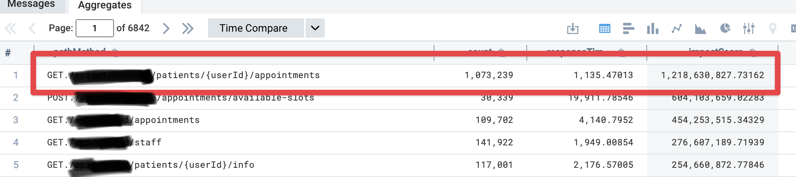
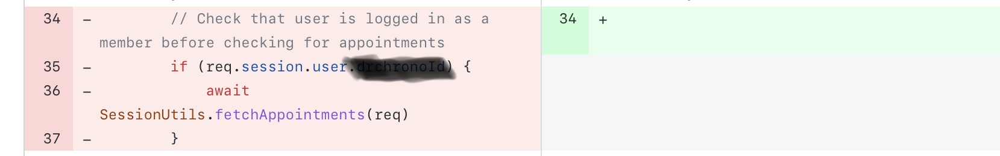
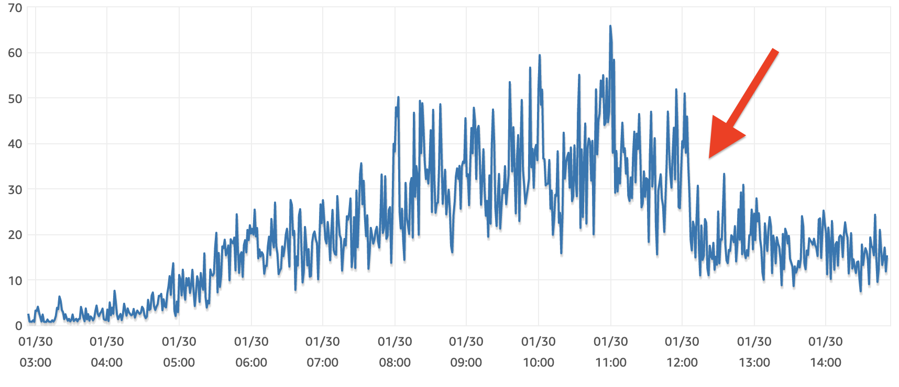

Yesterday I shipped my biggest ever React App performance improvement. You'll never guess what the tiny change was 😛

https://twitter.com/Swizec/status/1620195579149287424

After [working on a React app for 2.5 years](https://swizec.com/blog/how-to-rewrite-your-app-while-growing-to-a-dollar100000000-series-b/), it was starting to feel clunky. Nothing obvious, just a general sense of clunky slowness.

But hey, at almost 40,000 lines of code and hundreds of unique components, maybe that's expected? We _are_ running a lot of code and throwing around many re-renders.

Users were starting to notice. My girlfriend uses our app and she always tells me _"Your thing is slow as shit"_. But user metrics looked good so this wasn't prioritized.

Until last week our platform team raised the alarm.

## To the metrics!

_"Emergency meeting! Wtf are you people doing with our server?"_

Our server was struggling. Had been for months. The platform team fixed all they could, now they needed help from us product teams. What the hell are our clients doing to this thing?

We run a single server with _one_ Node process for reasons too long to explain. When a request takes its time, the whole server slows down. Even other unrelated requests. The single-threaded nature of JavaScript means requests can impact each other.

Here's a good article, if you wanna read more about [the details of Node's event-loop model and how it impacts performance](https://snyk.io/blog/nodejs-how-even-quick-async-functions-can-block-the-event-loop-starve-io/).

The team constructed an API impact chart for us. Number of requests per week \* p95 latency.

We are fetching a patient's appointments 1,000,000+ times per week and 95% of those requests "take less than 1.1 seconds". We have a few thousand users 🤨

Impact: over one billion.

## An old sin

At this point I got a tingle in the back of my brain. _"Aren't we always joking that our backend-for-the-frontend loads appointments on every request?"_

Oral tradition is important. Those little jokes, japes, and anecdotes are your lore. They survive when teams evolve and they hold a nugget of truth. Like a myth based on reality.

We dug in and yep, deep in our session middleware, a line of code that pre-fetches appointments from the data server. On every request.

A 4 year old performance optimization nobody needs. A backlog ticket from 2021 when someone found this, but couldn't remove.

## The one line fix

We looked and the code was dead. Anything that used session data had been moved to React by now and would load its own data when needed.

The fix was simple:

Sometimes the best fix is a smöl change after a long investigation.

My coworker left a pull request comment that I will frame and put on the wall in my office ❤️

> &lt;3 honestly, this is probably the most impactful removal of a single line of code in Tia's history. And it was entirely enabled by the transition to React. Great job :)

## Did performance improve?

Yes!

Preliminary estimates show we went from calling that endpoint 150,000x/day to about 1,000x/day. p95 latency dropped by half. Server's less busy 😅

You can even see when the fix went live on a chart of database CPU usage.

And yes, the app feels subjectively snappier. Or I'm imagining it. It's hard to tell. But I can tell you this: _every_ API request the app makes is faster. Up to 1 second faster. Because it doesn't pre-load appointments.

✌️

Cheers,
~Swizec

PS: for another fun story about following metrics to the unlikeliest of places, check out [Immutability isn't free](https://swizec.com/blog/immutability-isnt-free/)

[sparkjoy|]
