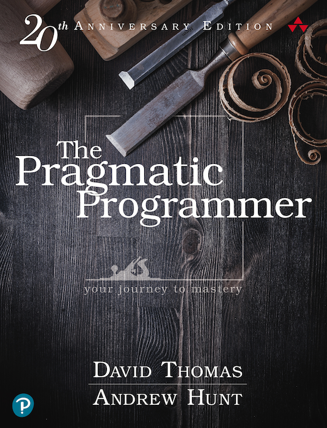
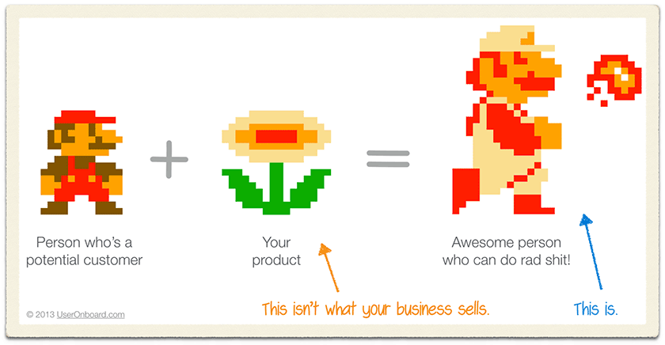

Pragmatic Programmer is a book everyone should read at the start of their career. The earlier the better.

Don't be like me and wait until every lesson is a _"Oh yeah, learned that the hard way"_ ... _"Hah yes! That was a fun and painful lesson"_ ... _"ooo good one! I remember a project just like that. Fuck that hurt"_

And if you _are_ like me, I suggest reading Pragmatic Programmer anyway.

David Thomas and Andrew Hunt put into words a lot of those little feelings inside your gut that you can't quite verbalize.

When you say _"No, we shouldn't do it that way."_ and someone asks why and you're like _"I don't know. It just doesn't feel right."_

"it doesn't feel right" is no argument, so your team does it _that_ way anyway. 6 months later the codebase goes to shit and you're like _"See! That's why"_.

But now it's too late.

## The Cat Ate My Source Code

> “Don’t blame someone or something else, or make up an excuse. Don’t blame all the problems on a vendor, a programming language, management, or your coworkers. Any and all of these may play a role, but it is up to _you_ to provide solutions, not excuses.”

## Good-Enough Software

Building software is about trade-offs. Perfect software doesn't exist and the more you chase perfection, the more off target you'll be.

Good enough doesn't mean "sloppy". It means good enough to fulfill _all_ requirements, but no better.

Don't waste time and effort on things nobody needs.

## DRY—The Evils of Duplication

DRY – do not repeat yourself, is a maxim of the software industry. Touted as a basic wisdom, it's caused more harm than good over the years.

The beginner thinks DRY and bends over backwards to avoid duplicating her code.

The expert thinks DRY and copy pastes code to avoid duplicating the architecture.

Duplicate your code, not your intent. Just because it looks the same doesn't mean it is the same.

## Tracer Bullets

It's hard to hit your target. Especially when you can't see the target.

That's why machine gunners use tracer bullets – glow-in-the-dark bullets loaded as every 5th on the reel. They help you see where you're shooting.

The same works for software.

Build a working happy path version of your program first. That's your tracer bullet.

Users see if you're going the right way, you and your team get a skeleton to hang edge cases off of. This is not a prototype. This is part of your real code.

## Prototypes and Post-it Notes

Prototypes are throwaway. You build them to explore a new idea, technology, or architecture.

Do not refactor a prototype into production code. Stay away from shipping a prototype _as_ production code. Despite the business folks protestations of _"But it already works!"_

Best build your prototypes with post-it notes instead of code. Removes temptation.

## Engineering Daybooks

[When you code, write down everything](https://swizec.com/blog/when-you-code-write-down-everything/)

Keep a notebook. Write down your thoughts and ideas. When you get distracted, you can look it up. When you come back to some code 2 weeks later, you can look it up.

As the old proverb from the balkans says: _Budala pamti, pametan piše_. The fool remembers, the clever one writes.

## Don't Outrun Your Headlights

Build only as much as you can test. Run your code early, run it often.

Don't code for 2 hours then see if it works. You'll find it's hard to tell which change broke your program.

Test your code after every significant change.

What's significant depends on many factors. When you're new to a codebase you'll make smaller steps than when it all fits in your head.

## Transforming Programming

> “All programs transform data, converting an input into an output.”

When you think of code as a series of transformations, your life will be easier. Small discrete steps, rather than large objects and codebases.

Spend an afternoon learning about functional programming.

## Inheritance Tax

Inheritance is a trap, often misused, rarely understood.

Are you using inheritance to share code? Try mixins or traits.

Are you using inheritance to build types? The real world never fits a clean taxonomy. Try interfaces instead.

"Can do X" trumps "Is a X".

## Shared State Is Incorrect State

Modern computing is full of concurrency and parallelism. Anything you build has to deal with this reality.

Shared state is your enemy.

Immutable shared state and mutable local state are your friends. Avoid relying on state others may have changed.

## Programming by Coincidence

Do you know _why_ your code works?

If not, it might be a coincidence. Code that works for the wrong reason is worse than code that doesn't work.

Verify until you're certain.

## Coconuts Don't Cut It

Do what works, not what's fashionable.

You are not Google. You are not Facebook, Amazon, Netflix, Apple, or Spotify either. What works for them will not work for you.

Listen to the trends, try their ideas, judge for yourself.

What works for Google in 2020 wouldn't work for Google in 2010. Every team is different. Find what works for you now. Change when it stops working.

## Delight Your Users

> “Your users are not particularly motivated by code. They have a business problem that needs solving within the context of their objectives and budget.”

Find what your users need, not just what they ask.

The biggest danger to a software team is a client that limits their ask based on perceived software limitations. Encourage clients to ask for their wildest dream. Work together to find a solution.

Their goal is not the tool, their goal is what your tool enables them to do.

---

And remember, programming is not meant to be safe. It's a life-long lesson in building wisdom and tradeoffs.

Cheers,  
~Swizec
