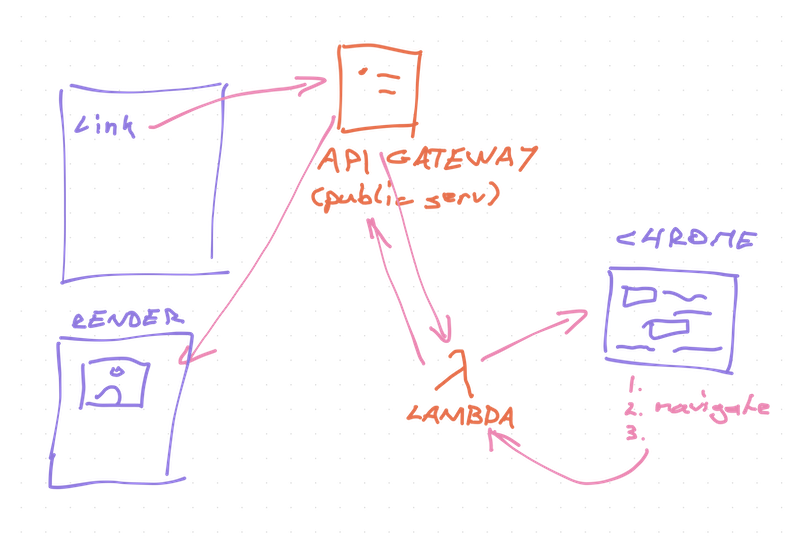

When's the last time your first project in a new technology was also your favorite? Doesn't happen very often ...🤔

It happened to me in November 2018.

Pat Walls of [Starter Story](https://www.starterstory.com) fame posed a challenge: Build a startup in 24 hours.

Absolute mad man. There's no way.

Is there ... what if? No, no that's crazy. But maybe ... no hell no. Unless ...

I _have_ been paying someone $500/mo to do a boring task 👉 take my markdown, put images on imgur, screenshot tweets, code snippets, and youtube embeds, export to HTML and paste into a newsletter.

That sounds automatable ...

Fuck it, Pat Walls you're on!

https://www.youtube.com/watch?v=sqlC1zNYG4M

12 hours later, [TechLetter.App](https://techletter.app) was born. You see its output every time you read my email.

And every day it feels like magic. 🧙‍♂️

## 😍

Write email in markdown. Paste into box on the left, get rendered HTML on the right. Basic markdown parsing and rendering. There's libraries for that.

Here's where it gets cool 👇

TechLetter.App uses an AWS Lambda to spin up a Chrome browser and take screenshots. Tweets, Youtube thumbnails, Instagram, code snippets, CodeSandbox, and a few more.

Think about it – every time you paste a link, a few dozen steps go just right in a dance of magic:

1.  Markdown plugin recognizes a link
2.  Matches link to Regex of screenshottable stuffs
3.  Renders a `<Screenshot >` React component
4.  Component uses `useEffect` to make an API request
5.  DNS config maps request to my API Gateway
6.  API Gateway says _"Oh, \_that_ lambda"\_
7.  AWS Lambda spins up a whole new server
8.  That server runs my JavaScript function
9.  Function starts a Chrome browser
10. Browser loads the link (another magical dance)
11. My code uses browser JavaScript to find the correct DOM node to use
12. Tells browser to take a screenshot of that node
13. Uploads screenshot to S3 as a file
14. Returns the URL as an API response
15. `<Screenshot>` component renders image

All this in 3 seconds for $0. 😳

The future boggles the mind my friend. You can try it at this URL 👉 [link to my AWS Lambda](https://pifc233qp6.execute-api.us-east-1.amazonaws.com/dev/embed?url=https://twitter.com/Swizec/status/1063847466196328448)

Before you ask: Yes, a lot has happened to this Lambda over the years. Fixes to how Chrome works, tweaks to screenshots, new features, cleaned up the codebase recently. It's been a fun project.

Even got [91 stars on GitHub](https://github.com/Swizec/lambda-screenshot-as-a-service) despite being hardcoded for my usecase and with a Readme so out of date it's hilarious. I should fix that 😅

## Why I love this project

Sometimes you love things just because they're cool. You don't need an excuse to be a nerd.

And it's saved me countless hours and almost $10,000 in outsourcing cost. So that's nice. 😇

Not bad for a few hours of hacking and $0 in hosting cost huh?

What would you build, if running server code was a breeze? Hit reply

Cheers,
~Swizec

PS: want to learn serverless in a focused setting without investing 2 years of pain and reading random blogposts? Join my [Serverless Workshop](https://gum.co/pEmTq), sales close tomorrow. [Also available in installments](https://gum.co/wYpbg)

PPS: the distributed serverless data processing pipeline chomping through millions of events per day that I built at work sounds impressive on a resume, but it isn't _cool_
