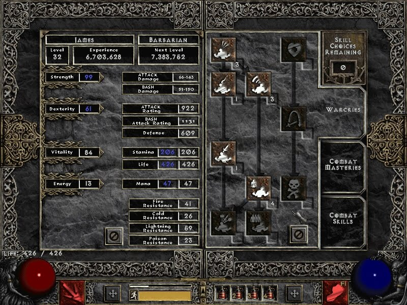

****

## Oh glorious Diablo 3

Luckily Diablo 3 works on a Mac and I have one of those Mac laptop thingies. I've heard people have huge problems trying to run the beta on Wine. This is one of those times I'm super happy I don't religiously go for open source stuff. :P  Unfortunately my poor laptop is a bit old and while the game runs mostly fine, the physics are a bit ... slow. Despite what I used to think in primary school, no this does not give you more time to think about your actions. In a word, Diablo 3 is _**FUN!**_ And when I say fun, I mean vomiting rainbows and farting daisies fun. My favorite new feature is definitely that you can _use the dungeon itself_ to kill monsters. Pull a lever and a chandelier falls down on a group. Marvelous! The experience is in fact so awesome I will probably buy this game. Then crawl into a hole for a week and shut everything down. No Twitter. No facebook. No school. Nothing. Just Diablo 3. Hell, I've never even bought a game before if it wasn't by an indie developer. And even that I only ever bought [World of Goo](http://www.worldofgoo.com "World of Goo") and [Machinarium](http://en.wikipedia.org/wiki/Machinarium "Machinarium").

## Not all is perfect :(

****

###### Related articles

- [Diablo 3 beta throws open doors, this weekend only](http://www.csmonitor.com/Innovation/Horizons/2012/0420/Diablo-3-beta-throws-open-doors-this-weekend-only) (csmonitor.com)
- [Diablo 3 Open Beta Weekend](http://noobtard.wordpress.com/2012/04/21/diablo-3-open-beta-weekend/) (noobtard.wordpress.com)
- [Diablo 3: Took Long Enough!](http://rantsandrage.com/2012/04/21/diablo-3-took-long-enough/) (rantsandrage.com)
- [Diablo 3 Beta Appears To Be Opening Up?](http://www.rockpapershotgun.com/2012/04/18/diablo-3-beta-appears-to-be-public/) (rockpapershotgun.com)

