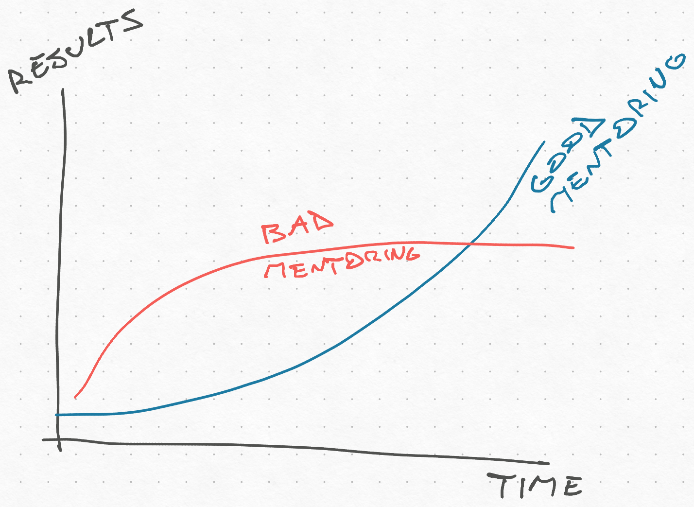

Yesterday I had lunch with a newly promoted lead and realized I have opinions on mentoring engineers. Here they are.

The goal of mentoring is to build engineers that you can trust to take on bigger and bigger tasks, projects, and even products. It might feel like a constant level of support, but the results get bigger over time.

This is how you scale a team superlinearly.

Without training, every new member adds less and less. With training, you have a chance. Every mentee will help you train future additions to the team.

## My approach

1. **Engineering is a tacit skill**. To learn you have to do. You need to get your hands dirty and build a bunch. Reading and talking about it solidifies the learnings.
2. **Work together**. The best way to learn tacit skills is to work alongside an expert. Pairing shows you those little things the expert wouldn't even think to mention because they're so ingrained.
3. **Explain your reasoning**. When you give feedback, explain how you got there. What factors did you consider? Why this feedback in this situation? What spidey senses are tingling? This later helps your mentee make the same decision without consulting you.
4. **If you don't know, say so**. Always say when you don't know the answer. Go on a journey together to figure it out. Seeing how you navigate ambiguity is a great skill to learn.
5. **Warn but don't block**. Your job is to point out the rakes. But they need to step on some rakes to internalize the lessons. Make sure it's not dangerous and let them get smacked.
6. **They own the mess**. Your mentee should clean up their messes. Don't jump in to rescue the situation. Point out the bug or the bad code, help them go faster, sit and pair through a fire, but they own the work. It's the best way to learn about the rakes.
7. **Make them king (or queen)**. A piece of code under your full control is a wonderful thing. Nothing teaches you that software engineering is programming over time as much as dealing with your own stupid decisions 5 months later when it's time to add new functionality.
8. **You advise, they decide**. They'll do things differently than you would. It's fine. Make your suggestions, explain how you'd do it and why, then let them do their thing. Reserve blocking demands for big problems (data consistency, security, money bugs, unrecoverable prod issues)
9. **Use just-in-time teaching**. Focus on the problem at hand and teach by example. Your philosophical treatise on the one true way to build software will wash right off. Your _"ah I see you got smacked by a rake, here's why"_ will stick forever.
10. **Don't overload with feedback**. You get 1 or 2 core lessons per code review. Let the small things slide. This saves time and makes your feedback feel helpful. Don't beat them over the head for trying :)
11. **Discuss architecture early**. The best time to discuss architecture is _before the work starts_. That 10min system design exercise before they start coding is your highest point of leverage.

As a lead you build software through others. The better they are, the better your software will be.

Cheers, 
\~Swizec
