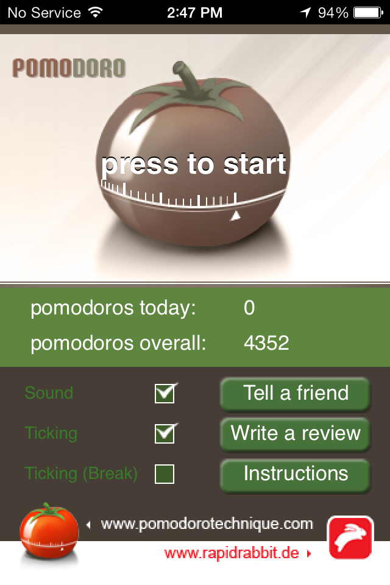
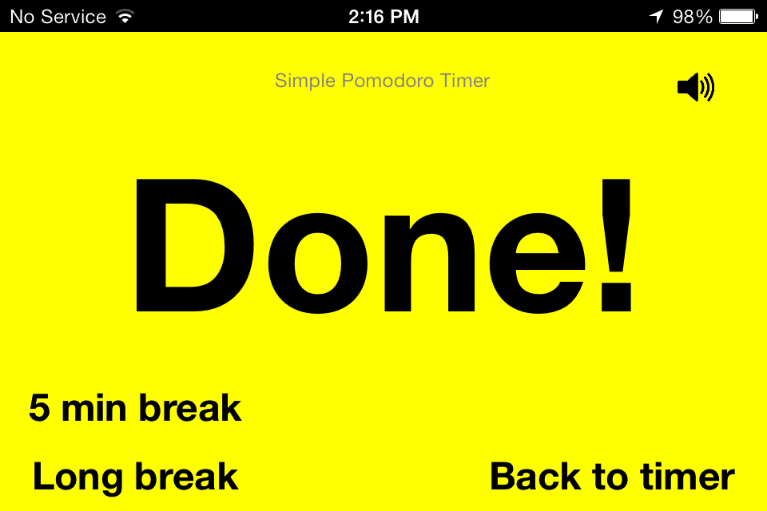
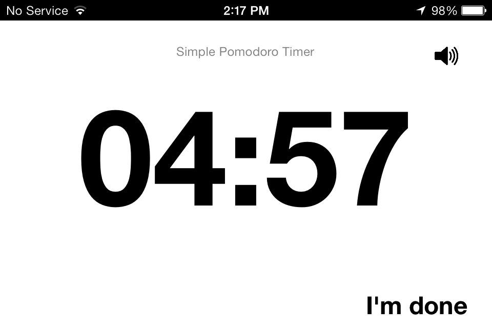

\[caption id=&quot;&quot; align=&quot;alignnone&quot; width=&quot;614&quot;] Simple Pomodoro Timer\[/caption] It&#x27;s been over two years since [I started living life in 25 minute increments](http://swizec.com/blog/living-life-in-25min-increments/swizec/1859). Since then I have done 4352 pomodoros - 1813 hours of pure focused productivity - and it&#x27;s been amazing. Starting out I took Pomodoro very seriously and would do everything into 25 minute blocks with 5 minute breaks. I would stop reading articles midword if my break was over, cut off conversations midsentence and be very very annoyed when I had to pee but Pomodoro hasn&#x27;t said it&#x27;s break time yet. I even did dishes and sweeping the floor in a pomodoro block. These days I&#x27;m more relaxed about it. Sometimes, when I&#x27;m writing, I even work off the clock and don&#x27;t turn the timer on. It&#x27;s usually a mistake because I get dragged onto the internet, but at least I don&#x27;t break my writing flow once I do actually get into it. All this time I&#x27;ve been using the first Pomodoro app I downloaded. Partly because it was the only real option at the time, partly because it was good enough and I didn&#x27;t care to check for others. \[caption id=&quot;&quot; align=&quot;alignnone&quot; width=&quot;410&quot;] My old pomodoro timer\[/caption] Just like a real timer. It ticks, it looks like a tomato. The ticking gave a cadence to my work and the tomatoness ... well it&#x27;s kinda neat. But it was time for a change. Something simpler to go with the simplified iOS7. [Simple Pomodoro Timer](https://itunes.apple.com/us/app/simple-pomodoro-timer/id496191025?mt=8) by SourcePad. It&#x27;s a timer. It counts down 25 minutes. Then it counts down a break. Then it tells you break is over. That&#x27;s it. \[caption id=&quot;&quot; align=&quot;alignnone&quot; width=&quot;614&quot;] Done!\[/caption] It doesn&#x27;t mandate anything. After every pomodoro you can opt for a short break (5min) or a long break (20min). The old timer was more like a hover mum _&quot;Oh you haven&#x27;t done four pomodoros yet in this session have you! No long break for you!&quot;_ And it&#x27;s quiet! While I might like the ticking, people working in the same room always found it obnoxious. If you do turn on the sound the timer will ding when it&#x27;s done. Which sounds exactly the same as my IRC notifications. It gets confusing. \[caption id=&quot;&quot; align=&quot;alignnone&quot; width=&quot;614&quot;] Break timer\[/caption] One of the best features is that it takes up the whole screen. You can see what you&#x27;re supposed to be doing at a glance. Black screen == work time. White screen == break time. The old one used less than half the screen for this feedback - red or green tomato - and you had to squint at the timer to see the numbers. The only thing I don&#x27;t like about the new timer is that there is too much clicking. Work done, click for a break. Break done, click to go to timer, then click to start the clock. Sometimes you forget and suddenly it&#x27;s been a ten minute break or you&#x27;ve been working for forty minutes straight. But it&#x27;s super encouraging! \[caption id=&quot;&quot; align=&quot;alignnone&quot; width=&quot;614&quot;] Back to work!\[/caption] Green means go! Work, right now. Do it. You know you want to!

