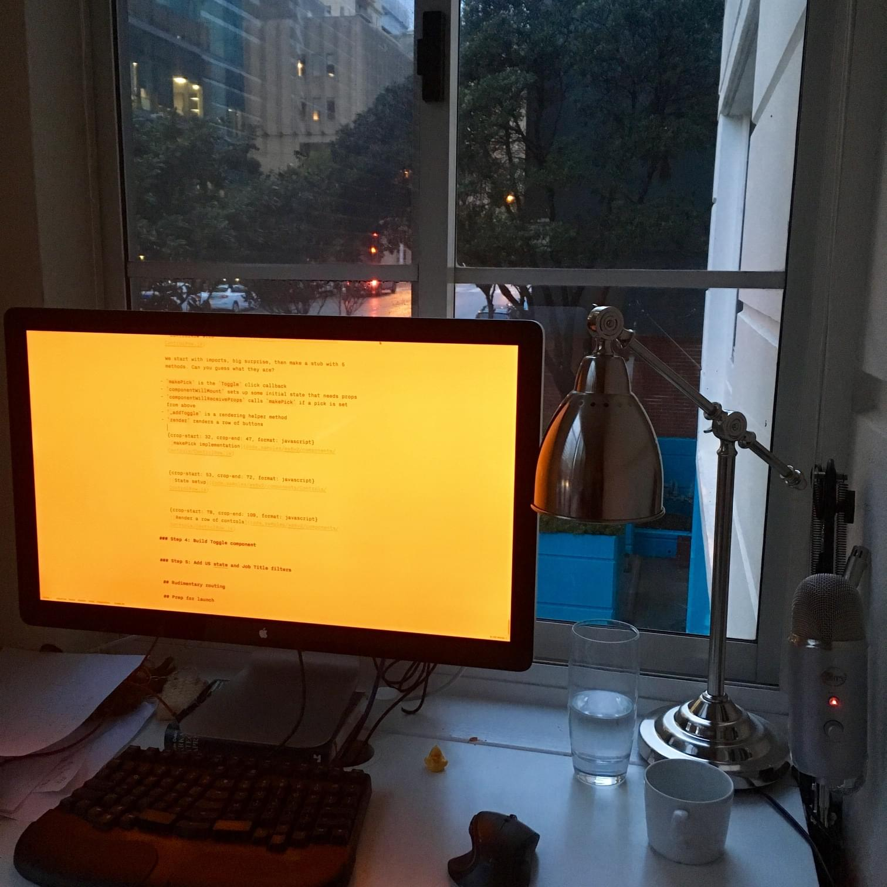

I was listening to an Anthony Bourdain podcast yesterday, and he said something like: _&quot;You can&#x27;t make a living with writing. I kept my job. I think that&#x27;s why _Kitchen Confidential_ sounds the way it does. I didn&#x27;t have the luxury of time. I couldn&#x27;t pontificate on the mysteries of the universe. I woke up at 5am every morning, wrote for an hour and a half, then I went to work – to my real job.&quot;_

It struck me.

Damn, 5am? That&#x27;s impressive. I can&#x27;t get up at 5am.

Amy Hoy calls this [Buffy Time](https://unicornfree.com/bootstrapping-series-8-special-bonus-guide-inside-make-a-million-bucks-or-watch-buffy). That 1 extra hour per day that you carve out to do your thing.

* * *

I tried to get up at 6am today, but I couldn&#x27;t get out of bed until 7am. It&#x27;s hard. I guess it&#x27;s easier if you don&#x27;t go to bed at 2am every morning… that&#x27;s when _I_ write. In the evenings.

The problem with writing in the evenings is that you&#x27;re fuzzy. Your brain is burdened with the day&#x27;s challenges, and it&#x27;s hard to put them away and clear your mind so that you can write.

I likened it once to pulling barbed wire through your brain. Since then, I&#x27;ve discovered that an energy drink with dinner makes the barbed wire go away. But it doesn&#x27;t dispel the lure of social media.

You have to block that shit.

Writing… I don&#x27;t know what it is about writing. Having to write makes you want to do anything _except_ write. Hands reach for the phone, browser tabs open on their own, eyes look around the room for anyone to talk to. It&#x27;s weird.

It&#x27;s easier to write in the morning. You get up, you make tea, you sit down. If you resist the urge to check your phone and your email and your social media and ignore the girlfriend getting ready for her grownup job in a big corporation, you’re golden. Then the writing is magic. Your brain is focused and fresh and nothing could get you away from the page.

If you open something, anything, you could get emotionally involved and then you&#x27;re fucked.

Mornings are great, but hard to pull off.

Evenings are okay, but easy to pull off.

Weekends, though. What about weekends?

Weekends _look_ great. Two days of nothing else to do but to focus on your writing and your sidehustle.

It turns out, however, that weekends are the worst. That&#x27;s when being a grown up happens.

You get your groceries, you do the laundry, you run the errands you didn&#x27;t run during the week. Sometimes you tidy the apartment or clean out a closet. Often you meet up with friends.

It&#x27;s the only time both you and your girlfriend have time to hang out. So you hang out. Because that&#x27;s what responsible people in relationships do – _be_ in relationships. This part is important.

If you have kids, you&#x27;re fucked. Weekends are when you build your tiny humans into real humans.

Maybe the problem is being an adult.

Everyone makes demands on your time and your emotional involvement. If they smell a free moment, a single care about what they have to say, the tiniest wane in your focus, they latch on. They grab you by the arm and take you into their world.

It&#x27;s easier, too, than it is to focus. It&#x27;s easy to let go and visit somebody else&#x27;s world. It&#x27;s easy to do the busywork and avoid important work.

The alternative is to be nasty.

To protect your time viciously, to lash out at anyone who oversteps the invisible line on the calendar that says &quot;Writing now&quot;, to say mean things to people who schedule you into things you don&#x27;t want to do but have to because you&#x27;re a member of a group. To make friends and family feel like time with them is &quot;scheduled&quot;.

I don&#x27;t like to be nasty, and I try not to make people feel like they&#x27;re scheduled. My solution is to whine and complain and hope they get the hint. I don&#x27;t have very many friends.

* * *

All of that to say, it&#x27;s not hard to carve out the time; it&#x27;s hard to isolate the time. To make it quality time.

Even when you do carve out the time and isolate the time, there are so many things to do: articles to write, projects to push ahead, emails to answer, meetings to have, business deals to arrange, marketing to perform.

They&#x27;re all important. They all have to get done.

It would be easier to do just one thing. To work from dusk till dawn on The One Big Project™ and ignore all else.

I started working on [React+D3v4](https://gumroad.com/l/mTWg) on September 5th, 2016. On Jan 23rd, 2017, it&#x27;s still not done. You know how much time I&#x27;ve spent on it?

55 hours. A week of full-time focused work. A month or two of nights and evenings focused work.

And that&#x27;s sad. Disappointing even. But can I really go 2 months without opening my inbox? Without publishing an article? Falling off the face of the world only to come back in a glorious **I&#x27;M BACK FUCKERS** moment with all eyes waiting for my new masterpiece?

Maybe. Probably not.

It would definitely be a less useful book if I did. Things change. Knowledge increases. Outside influence helps.

I don&#x27;t know if this made sense to you, but it felt good to write. Thanks for reading.