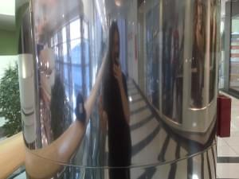

It&#x27;s not often that I go buy a new set of hair, actually I only do it once every two years or so. I don&#x27;t really mind going, in fact I kind of like the type of pampering my hair can only get at a [hair salon](http://en.wikipedia.org/wiki/Beauty_salon "Beauty salon"). And the girls there are always so nice and chatty. It&#x27;s pretty cool. But I&#x27;m lazy. And I like longish hair. The good thing about [long hair](http://en.wikipedia.org/wiki/Long_hair "Long hair") is that it just sort of happens on its own, you don&#x27;t have to really think too much. Once you get used to the mop it doesn&#x27;t even take that long to wash, certainly not as long as some girls will have you think to get out of a date they don&#x27;t want. Nope, nothing like having long hair. Who wants to be forced into going to the hairdresser&#x27;s once a month to keep their &#x27;do just the way they want it? Pffft. So anyway, today I went to CityPark because I wanted to try some new hair salon I&#x27;d never been to and the few times I passed this one it looked intriguing enough. Probably because of all the girls of Just The Right Age (tm) working in there. First thing I did was step up to a random pillar and take a Before photo: If you look carefully you&#x27;ll see the hair was pretty long. It was actually about two centimeters beyond nipple-length. Definitely time to get a [haircut](http://en.wikipedia.org/wiki/Hairstyle "Hairstyle") because making a tail was getting annoying. The whole salon experience was pretty fun. The lass complained a lot about having to cut so much hair ... apparently it&#x27;s a sin for people who want long hair but can&#x27;t get them to make long hair short ... or something like that. There was also some complaining from the other girls about why they didn&#x27;t get to cut me ... but since I don&#x27;t know what that was about I&#x27;ll just pretend they found me cute and wanted to touch my awesomeness :P Anyway, the hairdresser chick took the After photo and this is what my mop looks like now: I actually quite like it. Turned out nice.

