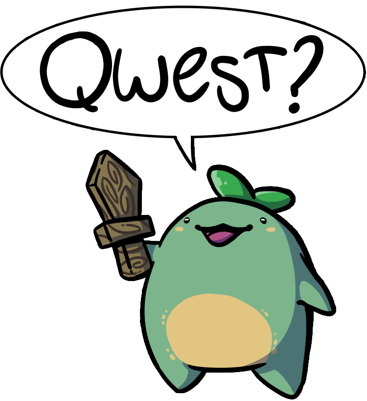

Joining a new team wrong can set you up to fail for years to come. Here's an algorithm I learned from a book that makes the process downright enjoyable.

## For context

I joined a new team at work 2 weeks ago. We're about to do our first sprint retro together. This was an internal transfer which means I can shorten the algorithm, but have to be careful not to cut too many corners.

My quest is the same as when I first joined the company, but for a different product 👉 our product sways on creaky foundation and we can't ship fast. Lessons were learned but we can't implement them. Please modernize the stack and get everyone comfortable using it. Incorporate product lessons in the new version.

If you'd like to read more about how to lead/champion a multi-year effort like this, hit reply.

## How to join a new team

My algorithm comes from a great book – [The First 90 Days](https://hbr.org/books/watkins) – and a sprinkle of personal experience. I try to re-read the book on every major transition.

The most important thing you have to remember is this:

Your new team is working and achieving results. No matter what you think of their code and their processes, it's been working for them.

From there it's a 3 step algorithm – learn, change, results.

### Learn

Start in learning mode. Have a plan for how you'll learn about the team, scope, processes, products they own, users they serve. Everything.

Try to reserve judgement and observe. Ask a lot of questions. Be the dumbest person in the room. Instead of _"Wow that's a dumb way of doing it"_ say _"Huh that's not how I've done it in the past, what constraints led you to this design?"_

**Going in too strong will set you up to fail**. You'll build resentment that acts as a headwind on your progress for years.

Remember to ask every team member where they think the problems are. And what they like.

### Change

Once you've learned about your new environment and established that you're here to help, it's time to start making changes.

It's okay if things you wanted to change on Day 1 no longer feel pressing or you've even realized your approach would've been wrong. Expected even!

All that weird code? Might be weird for a good reason :)

Regular retrospectives are the best place for process changes. Suggest a new way of doing things, highlight difficulties and friction points you've noticed, champion the gripes other team members shared in private.

If there are no retros, I'd start by making those happen first. Nothing big, just a regular chance for the team to discuss what went well and what could go better.

For code changes, getting into early conversations on feature design and asking lots of questions in pull requests works best. Remember to nurture instead of judge.

### Results

After change, come the results. You want to show early wins so leadership knows they've made the right choice.

Make sure you don't overcommit in the beginning. Achieving 80% of an ambitious goal looks worse than 100% of something reasonable. Even if the 80% is bigger in absolute terms than the 100%.

Early wins also galvanize the team around you. They'll trust your ideas more, if they look like they're working.

Measurable results with hard numbers are best. Work with your boss to define these ahead of time.

## Conclusion

Don't go into a new team guns blazing. Learn, show patience, achieve results.

\~Swizec
