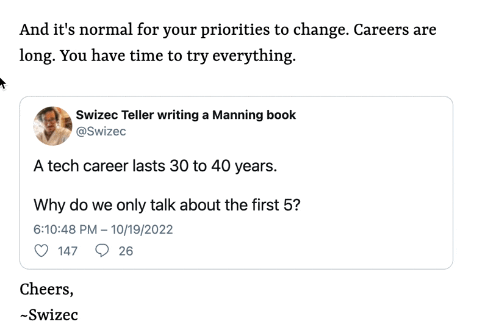
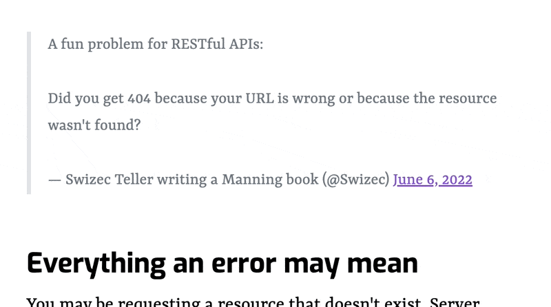

Here's something fun I've been fiddling with for over a year – fast privacy-focused tweet embeds. Because where's the fun in using a plugin with Twitter's native embed widget like a normal person?

And the default embed has ... problems. As I wrote in [Build privacy-focused blazing fast tweet embeds](https://swizec.com/blog/build-privacy-focused-blazing-fast-tweet-embeds-codewithswiz-30/), the default embed:

- loads 1.2MB of JavaScript
- makes 20+ HTTP requests
- renders 100+ DOM nodes

Exact numbers may have changed but I'm guessing in the wrong direction 🙃

My home-grown edition is _tiny_ by comparison:

https://twitter.com/Swizec/status/1584608060483387392

- 9kB of JavaScript
- 2 HTTP requests
- 35 DOM nodes

## Why a web component

The [blazing fast tweet embeds](https://swizec.com/blog/build-privacy-focused-blazing-fast-tweet-embeds-codewithswiz-30/) from a year ago worked fine. Why the need for a web component?

Last year's version relied purely on build time rendering (SSG), which has several advantages:

- no client-side JavaScript
- super fast for the reader
- no user-facing delay for Twitter's API

But there's a big problem: swizec.com contains 867 tweets. More when this article lands. Twitter's free tier API limit gives you 400 tweet lookups per 15 minute period.

That means at every deploy more than half the tweets would fail to fetch and would render as a plain link. Looked terrible and there was no telling which would fail.

I tried solving this with [deferred static generation (DSG)](https://www.gatsbyjs.com/docs/how-to/rendering-options/using-deferred-static-generation/) for old articles, but that doesn't impact when the data loads. Gatsby tries to gather all the data it needs at build time and defer only the rendering of each page.

Solution: re-fetch data in the browser. Live.

## Web component + SSG is magic

```html
<twitter-lite url="https://twitter.com/Swizec/status/1584608060483387392">
  <blockquote>
    I generally find it odd how obsessed with rendering performance people are
    for regular webapps
  </blockquote>
</twitter-lite>
```

The `<twitter-lite>` web component starts by displaying any pre-rendered HTML as a preview, re-fetches tweet data in the background, and replaces the preview with a full render. It can work on its own or supported by server side rendering of any kind.

With a full pre-render, the component looks like this:



Not sure what causes the content flash yet, but notice how the stats update? That's the data re-fetch.

When server fails to fetch full data, it can fallback on the Twitter's [oEmbed API](https://developer.twitter.com/en/docs/twitter-for-websites/timelines/guides/oembed-api) to render a simple preview:



Here the in-browser fetch gives `<twitter-lite>` the full info it needs to render a tweet, but even clients without JavaScript can read the main content. Somewhere I CSS'd wrong and there's a double border ... 🙃

With zero server rendering, the component handles everything client-side:


## How the `<twitter-lite>` web component works

The full machinery comes in 3 parts:

1.  A server-side plugin that converts twitter links into previews wrapped with `<twitter-lite>`
2.  A client-side web component
3.  An `/api` route that proxies Twitter requests

You can read more about the server-side plugin in [Build privacy-focused blazing fast tweet embeds](https://swizec.com/blog/build-privacy-focused-blazing-fast-tweet-embeds-codewithswiz-30/). One day I'll proper open source that.

### Client-side web component `<twitter-lite>`

Web components let you build custom HTML elements with extra functionality. That's what I wanted to try with this project :)

You can [see the full code on GitHub](https://github.com/Swizec/twitter-lite-embed). The [tweet-builder.ts](https://github.com/Swizec/twitter-lite-embed/blob/main/src/tweet-builder.ts) file is almost the same as the server-side plugin that renders previews.

Right now you can `npm install twitter-lite-embed`, but there are no docs yet. Coming soon.

The web component itself is a TypeScript class:

```typescript
export class TwitterLiteEmbed extends HTMLElement {
  shadowRoot!: ShadowRoot;
  // holds tweet data from API
  private tweet: Tweet | null = null;
  // referenc to content node
  private contentRef!: HTMLDivElement;
  // used as a lock for fetching
  private fetchingStatus: "canStart" | "fetching" | "fetched" | "error" =
    "canStart";

  constructor() {
    super();
    this.setupDom();
  }

  static get observedAttributes(): string[] {
    return ["url"];
  }

  get url(): string {
    return this.getAttribute("url") || "";
  }

  async attributeChangedCallback(
    name: string,
    oldVal: unknown,
    newVal: unknown
  ) {
    // call hydrateTweet if URL changes
  }

  private async hydrateTweet() {
    // fetchTweet then renderTweet
  }

  private async fetchTweet() {
    // fetches tweet and saves data in this.tweet
    // avoids double fetching
  }

  private setupDom() {
    // copies existing children into a new shadow dom
    // saves reference to a content div
  }

  private renderTweet() {
    // replace content HTML with rendered tweet
  }
}
```

This class defines a new `HTMLElement` with extra functionality for fetching and rendering tweets when the `url=""` attribute changes.

Declaring the component in a global elements registry makes it work in the browser:

```typescript
customElements.define("twitter-lite", TwitterLiteEmbed);
```

Now any DOM node coming from a `<twitter-lite>` HTML turns into a `TwitterLiteEmbed` object.

### `/api` route to proxy Twitter requests

Calling Twitter's API from the browser would defeat the privacy angle _and_ leak your API keys to the public. Not great.

To get around that issue, `<twitter-lite>` assumes your site runs a light endpoint at `/api/fetch-tweet`. Easy to do with both Gatsby and NextJS by plopping a bit of code in your `/api/` directory. It then runs as a serverless function.

You can see an [example implementation, here](https://github.com/Swizec/twitter-lite-embed/blob/main/api-server.mjs).

Works in 2 parts:

- boilerplate for a serverless function
- API call to fetch the tweet using the [twitter-lite](https://github.com/draftbit/twitter-lite) library

I haven't tested with NextJS, but on Gatsby deployed to Gatsby Cloud, you can plop that whole file in `/api/fetch-tweet` and it Just Works 🤘

## Why not SSR?

Yes, server side rendering (SSR) would be another approach to solving my problem. Instead of pre-generating a static site for the whole blog, you could wait for all the machinery to run on every page request.

But that defeats the whole purpose of a static site. I don't want readers to run all that machinery on every pageview.

Cheers,<br/>
~Swizec
