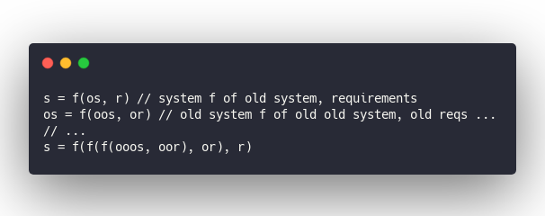

> wow this code looks like shit, we should rewrite
>
>
>
> ~ every new engineer on your team

You&#x27;re almost never going to hear an engineer say that somebody else&#x27;s code looks good. But why is code running in production always suboptimal?

Path dependence, my friend.

Complex systems aren&#x27;t a snapshot in time. They evolve. How you got here matters as much as what you were building.

🤨

Let&#x27;s say you&#x27;re The Evolution and your job is to design a mammal. One of the things mammals do is make noise.

They make noise using the larynx. An organ in their throat.

To make this larynx effective you need a high bandwidth low latency connection to the brain. The lower the latency, the faster animals can change sounds. The higher the bandwidth, the more complex their sounds can be.

Brain and throat are pretty close so you make a straight connection, right?

Makes sense to me.

And that&#x27;s not what real evolution did.

Evolution used the stupidest possible design for the [recurrent laryngeal nerve](https://en.wikipedia.org/wiki/Recurrent_laryngeal_nerve) connecting your larynx to your brain. It wraps around your heart first.

That&#x27;s right. A nerve going from your throat to your brain goes aaaalll the way down to your heart, wraps around your aorta, then piggybacks on the vagus nerve back up to your brain.

This suboptimal nerve is the only way you can move your vocal cords. In giraffes it&#x27;s so long there&#x27;s significant delay they need to compensate for.

## How path dependence works

> The extreme detour of the recurrent laryngeal nerves, about 4.6 metres (15 ft) in the case of giraffes, is cited as evidence of evolution, as opposed to Intelligent Design. The nerve&#x27;s route would have been direct in the fish-like ancestors of modern tetrapods, traveling from the brain, past the heart, to the gills (as it does in modern fish). Over the course of evolution, as the neck extended and the heart became lower in the body, the laryngeal nerve was caught on the wrong side of the heart. Natural selection gradually lengthened the nerve by tiny increments to accommodate, resulting in the circuitous route now observed.

In sauropod dinosaurs the nerve was up to 28 meters (92ft) long 😳

Quite a design flaw.

And this all stems from the fact that every complex system is a function of today&#x27;s requirements and yesterday&#x27;s design.

&amp;t=seti&amp;l=null&amp;ds=true&amp;wc=true&amp;wa=true&amp;pv=48px&amp;ph=32px&amp;ln=false&amp;code=system%20%3D%20f(old_system%2C%20requirements))

Apply that recursively ...

&amp;t=seti&amp;l=null&amp;ds=true&amp;wc=true&amp;wa=true&amp;pv=48px&amp;ph=32px&amp;ln=false&amp;code=s%20%3D%20f(os%2C%20r)%20%2F%2F%20system%20f%20of%20old%20system%2C%20requirements%0Aos%20%3D%20f(oos%2C%20or)%20%2F%2F%20old%20system%20f%20of%20old%20old%20system%2C%20old%20reqs%20...%0A%2F%2F%20...%0As%20%3D%20f(f(f(ooos%2C%20oor)%2C%20or)%2C%20r))

Keep going all the way back to the very first decision ever made on your project. That&#x27;s what you&#x27;re dealing with.

That&#x27;s why America is working on self-driving cars but not public transit. 😉

## So what can you do?

Every live system you touch shows influence of decisions made months and years ago. Often by people who don&#x27;t even work here anymore, had different constraints, and vastly different requirements.

Live systems are suboptimal. Always.

You&#x27;d do it differently today. Different technology. More experience. Different trends. Better knowledge about the problem.

But you can&#x27;t throw it out. It works. 😩

First, take a breath. Relax.

Your crappy code is solving a problem. Right now. It really is. Regardless of how bad it looks. It&#x27;s working. Without this code running in production solving real problems, you wouldn&#x27;t have a job.

Second, realize that software can change.

Unlike with mammals, you can jump in there and change anything Right now. Make it completely different. You&#x27;ve got the power!

### So here&#x27;s what you do:

1. Accept that the code works
2. Look at current requirements (warning: this often involves supporting old requirements)
3. If no code existed, how would you solve the problem?
4. How much time/resources do you have?
5. What can you do right now to get closer to 3?

The more you do 5 the more you&#x27;ll realize 3 was wrong.

So change 3 and keep going.

Do a little bit of 5 every time you touch a part of the system. As much as you can manage.

Eventually your code will look good to you and the next person to come along will say it&#x27;s crap.

Welcome to software gardening.

Cheers,  
~Swizec