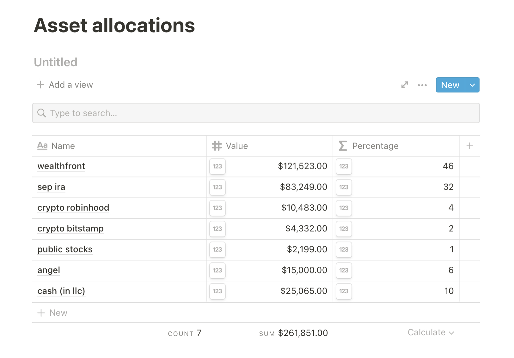
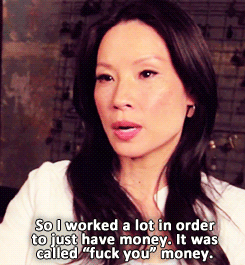

Friend, I like to share financials to encourage others. It benefits everyone when we [talk about these things](https://swizec.com/blog/why-you-should-talk-about-engineering-salaries/) at the small expense of bruising an ego or three. ✌️

Here's my asset allocation after 6 years in Silicon Valley. I came here with about $4000 to my name after a few shorter stints digital nomad style. The landing was rough – [lived on a mattress in the living room](https://swizec.com/blog/temporarily-homeless-a-story-in-one-dumb-move/) for the first two weeks.

Going from broke to not-broke happens in 2 steps:

1.  Increase your cashflow
2.  Pay yourself first

The famous [fuck you money advice from Lucy Liu](https://imgur.com/gallery/lCjlk).

## Increase your cashflow

This part is easy: You're an engineer.

Software engineers are one of the most sought-after people in the world. It's [the 2nd best job in USA](https://swizec.com/blog/software-engineering-best-job/) in terms of prospects and ease of starting.

https://www.youtube.com/watch?v=iLL2tx50rT0

There were 207,000 job openings for software engineers in December 2020. The market is hot hot hot.

Here's advice I shared on [why you aren't drowning in recruiters too](https://swizec.com/blog/why-you-arent-drowning-in-recruiters-too/) and how to approach [job hunting like an asset, not a beggar](https://swizec.com/blog/youre-not-asking-for-a-job-youre-selling-a-service/).

## Pay yourself first

Ok you've got money coming in, now what?

The traditional advice is to "save", but that sounds lame. If you skip the avocado toast you'll have $6000 in ten years.

I _enjoy_ avocado toast and $6 matcha lattes. What's the point of life, if you can't enjoy it?

You should _invest_. Turn your cashflow into wealth.

**Pay yourself first** is an idea from [The Richest Man in Babylon](https://en.wikipedia.org/wiki/The_Richest_Man_in_Babylon) and it finally clicked for me after reading [Profit First](https://swizec.com/blog/how-my-bank-account-went-from-dollar909-to-dollar50000-in-2019/#profit-first-or-how-i-actually-saved-50k-and-paid-off-debt).

> Profit is not what's left after expenses, expenses are what's left after profit.

You pay yourself first, then fit your life into what's left. 🤨

Here's how that shakes out:

My average income in 2021 has been $18,380/mo. Most of it from the dayjob. The infoproducts business, which this newsletter is part of, has turned into more of an expensive hobby lately.

Despite the $18,380 that comes in, my lifestyle fits into $5,200/mo. That covers everything I value.

$18,380/mo
\-$3,670 for taxes
\-$600 for index funds
\-$200 for cash buffer
\-$920 for profit
\-$940 for retirement

That leaves $12,000 for life and business. $5,200 goes for life in San Francisco. Rent, food, leisure, ... adds up fast not gonna lie 😅

The rest – about $6,800 – is for high risk hopefully high reward bets. A large part goes into running the infoproducts side business.

About $2,700 in monthly fixed costs right now. Making a loss and hoping for big things soon.

Like I said, it's an expensive hobby right now 😇

The other $4000-ish ebbs and flows. Sometimes I invest in myself and the business with expensive coaching, other times I dump it into RobinHood and play stocks.

One time I made an angel investment and I wanna make more. They're fun!

## The barbel strategy

The core of my approach is the barbel strategy that [Nassim Taleb](https://en.wikipedia.org/wiki/Nassim_Nicholas_Taleb) talks about in his books.

> Cap your downside, maximize your upside.

**Never invest more than you can afford to lose**. That's why I focused on stability first. Creating a safety net.

https://twitter.com/Swizec/status/1421140277096448000

As long as I invest profits, not debt, the worst that could happen is that everything blows up and I go back home to Slovenia where my savings last 5 to 6 years with no income.

Even a tech dayjob has the barbel strategy built in!

**Cushy salary caps your downside. Equity lets you partake in the upside.**

When you think about it, [engineers are paid like athletes](https://swizec.com/blog/what-if-engineers-were-paid-like-athletes/) or movie stars. You get a 4 year agreement with a company. They pay you salary (caps downside) and give you equity that vests over 4 years (large potential upside).

As a senior software engineer, my cash comp over 4 years comes out to about $700,000 right now. I'm not gonna starve.

The equity? Oh that could be anywhere between $0 and $4,000,000, but never negative. We'll see 🤷‍♂️

Yes, [working at a FAANG has higher expected return](https://swizec.com/blog/should-you-take-a-pay-cut-for-equity/). Do you want the predictability of a Toyota Corolla or the excitement of a Lamborghini?

Once you've capped your downside, go for the big swing my friend. You deserve it.

Cheers, 
~Swizec

PS: this is not financial advice and I am not a professional, do your own math before making moves
