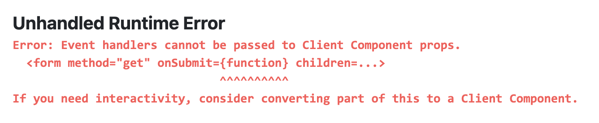
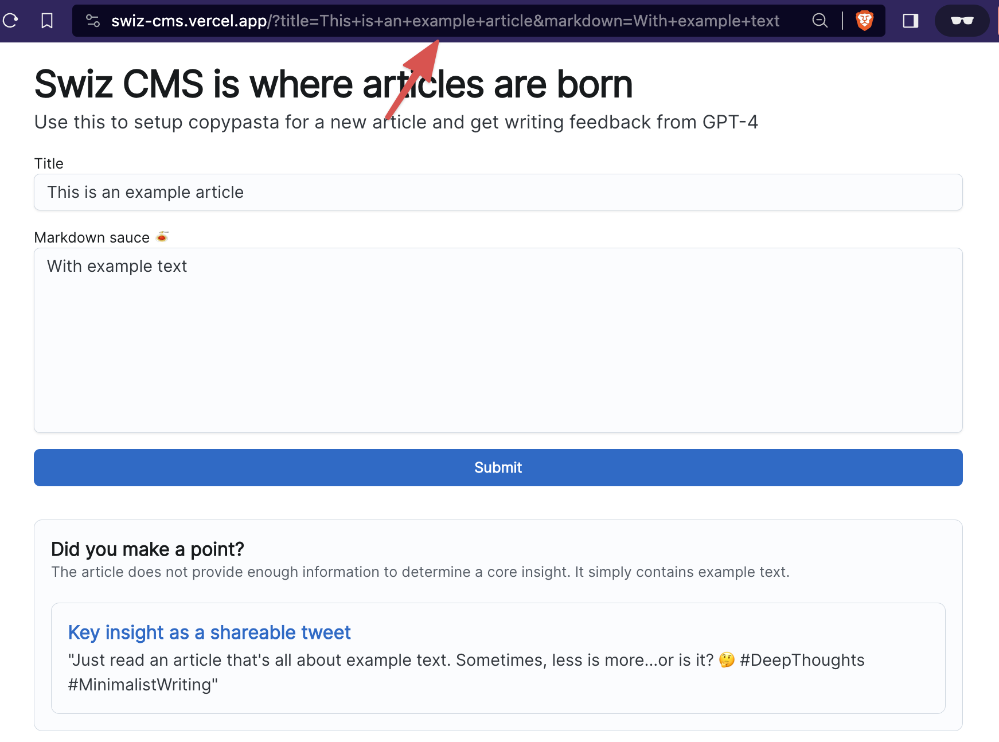
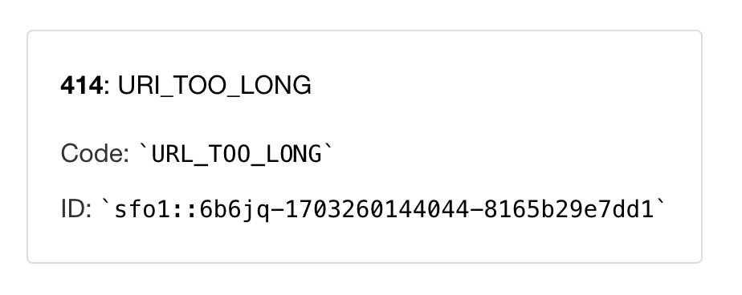
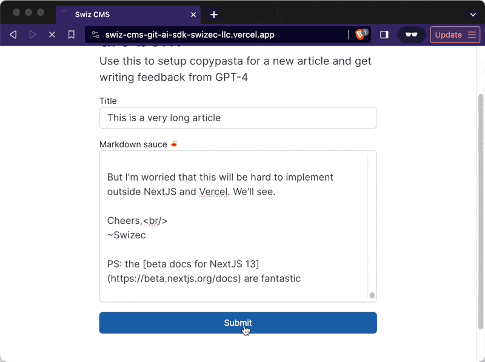

Did you know Vercel limits URLs to 14kb? I know because I'm awful 😂

For the past few weeks I've been updating my Swiz CMS as an excuse to explore NextJS 14, the app router, and React Server Components. My goal was to avoid client-side API calls.

## Implicit API calls with server components

Okay you got me, you can't _avoid_ API calls, but [the new async react tech](https://swizec.com/blog/async-react-with-nextjs-13/) lets you make them implicit and let the framework handle all details. Wrap a component in `Suspense` and it becomes an API call.

```jsx
<Suspense fallback={<Loading title="Did you make a point?" />}>
  <KeyInsight title={title} markdown={markdown} />
</Suspense>
```

That suspense boundary renders the fallback component while it waits for its children to resolve. The framework makes an API call to a serverless function that renders the `Improvements` component on the server and returns the HTML. It then injects that HTML into your page.

Improvements handles all data loading right there in component body. Makes your code pretty neat.

```jsx
const Improvements: FC<{ title: string; markdown: string }> = async ({
    title,
    markdown,
}) => {
    const feedback = await askForFeedback(title, markdown);
    const stream = OpenAIStream(feedback);

    return (
        <Card>
            <CardContent>
```

Notice the component returns a promise that resolves with JSX. That's how NextJS and React know to jump in and turn your code into implicit API calls.

## Pages are server components also

Now, your _page_, the part of an app that renders when you hit a URL, is also a server component. The client-side makes an implicit API call to a serverless function, server renders an async React component, and returns the HTML. Framework injects this into the page.

All good.

But how do you handle forms? 🤔

You can't POST to a page. Pages are GET and super cacheable. They're not supposed to handle data mutations.

And because your page is a server component, you can't make it interactive. Typical form code that you're used to will throw an error:

```jsx
<form onSubmit={doAthing}>
```



You're meant to use [React's new form actions](https://react.dev/reference/react-dom/hooks/useFormState). They let you run a function as an implicit API and do things on the server.

For that to work in Swiz CMS, I'd need a storage solution. Form action saves data, redirects to new page, page shows results.

But I don't want a storage solution. That makes the project too complicated. I fill Swiz CMS with garbage all the time, I don't want every input stored forever.

## Abusing GET params

Here's what we can do – abuse GET params 😈

Put form inputs in the URL, reload back to the same page, render additional fragments below the form. Like this:



Every fragment can use [parallel routes](https://nextjs.org/docs/app/building-your-application/routing/parallel-routes) and behave like a mini page. Make API calls on the server, process data, render JSX. Router handles implicit Suspense boundaries, server communication, and injecting the HTML into parent page.

You read the input straight from `searchParams`. No storage required.

```jsx
export default function Feedback({ searchParams }) {
    let { title, markdown } = searchParams as {
        title?: string;
        markdown?: string;
    };

    // ...

    <Suspense fallback={<Loading title="Did you make a point?" />}>
		    <KeyInsight title={title} markdown={markdown} />
		</Suspense>
```

Perfection 👌

## But there's a size limit

Back in the day a URL couldn't be longer than 4096 characters. Memory was scarce, storage for logs expensive, and you wouldn't want to overwhelm a poor underpowered router between you and the server.

Nowadays an [IKEA lamp has enough compute to run DOOM](https://www.pcmag.com/news/you-can-run-doom-on-a-chip-from-a-15-ikea-smart-lamp). Because that's cheaper than a custom on/off controller.

We can afford longer URLs and my awful code works great on localhost. On Vercel though ... it also works. Until you paste a looooong article.



This only happens when using the [edge runtime](https://vercel.com/docs/functions/edge-functions/edge-runtime). I need the edge runtime because OpenAI calls with long inputs are slow and the serverless runtime times out after 15s. There's no limit on edge. 🤷

## The solution? Compress inputs!

Here's where it gets awful. You can compress inputs before feeding them into GET params. Then decompress on the server before use.

Yes it's awful. Yes it works.



Obviously performance is slow and that's a big part of why I'm a bad person for doing this. But it works! 🥳

Thanks to [TkDodo](https://twitter.com/tkdodo) for recommending the [LZString](https://pieroxy.net/blog/pages/lz-string/guide.html) library. Gzip didn't work, but LZString has a special `compressToEncodedURIComponent` function that packs your input into a URL-compatible format.

Here's the code. I did have to make the form a client component because React's form actions freaked out trying to do this compression on the server.

```jsx
export const ArticleForm: FC<{ title?: string; markdown?: string }> = ({
    title,
    markdown,
}) => {
    function onSubmit(event) {
        event.preventDefault();

        const title = event.target.querySelector("[name=title]").value;
        const markdown = LZString.compressToEncodedURIComponent(
            event.target.querySelector("[name=markdown]").value
        );

        window.location.href = `?title=${title}&markdown=${markdown}`;
    }

    return (
        <form method="get" onSubmit={onSubmit}>
```

## Why this is awful

The URL in that final example comes out to 8408 characters. Do _you_ want to deal with that in your logs? 😂

\~Swizec
