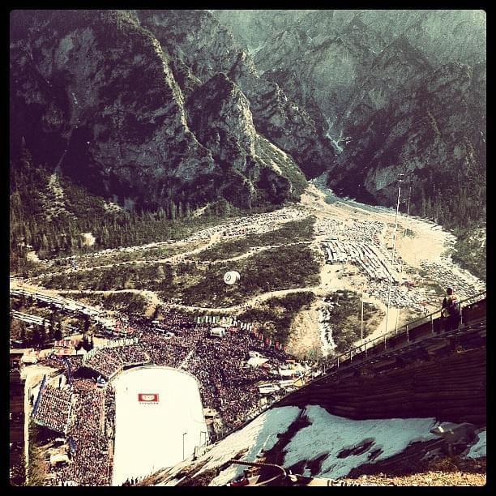
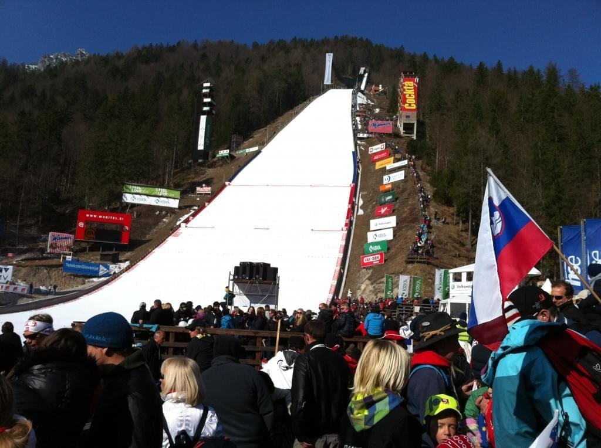
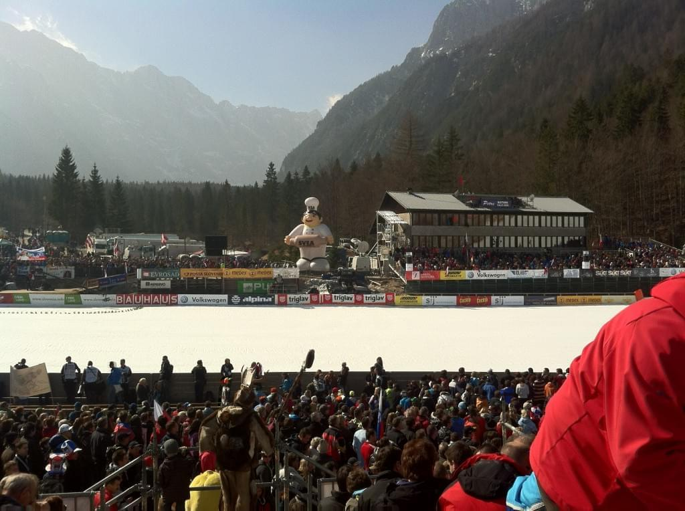
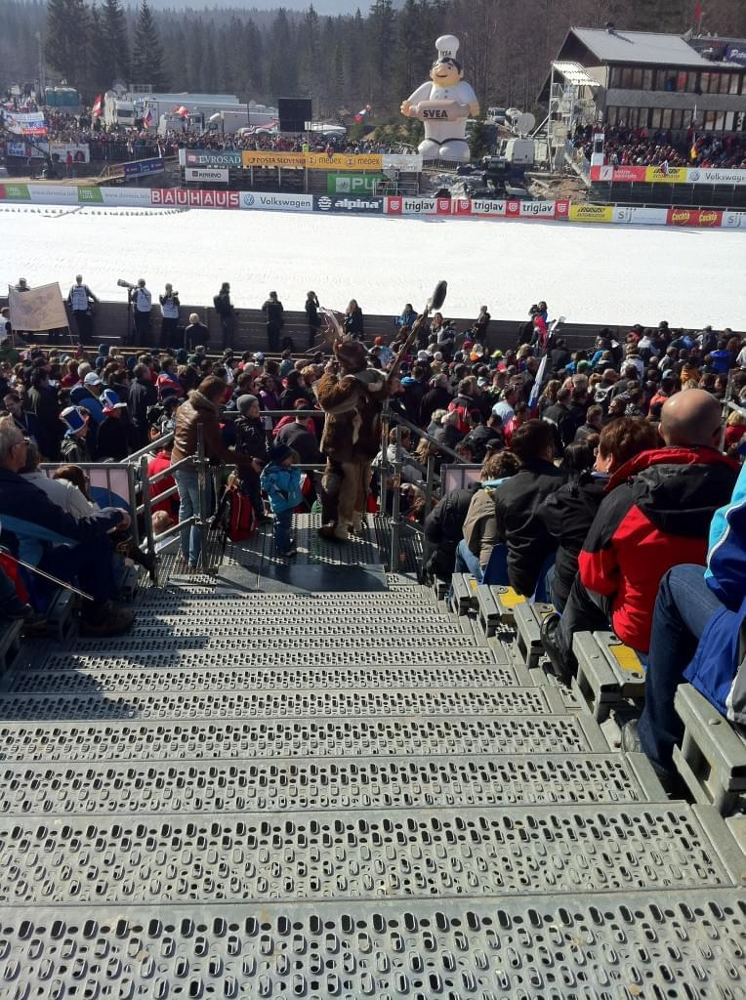
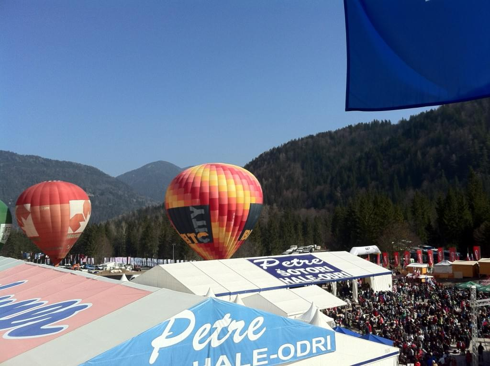
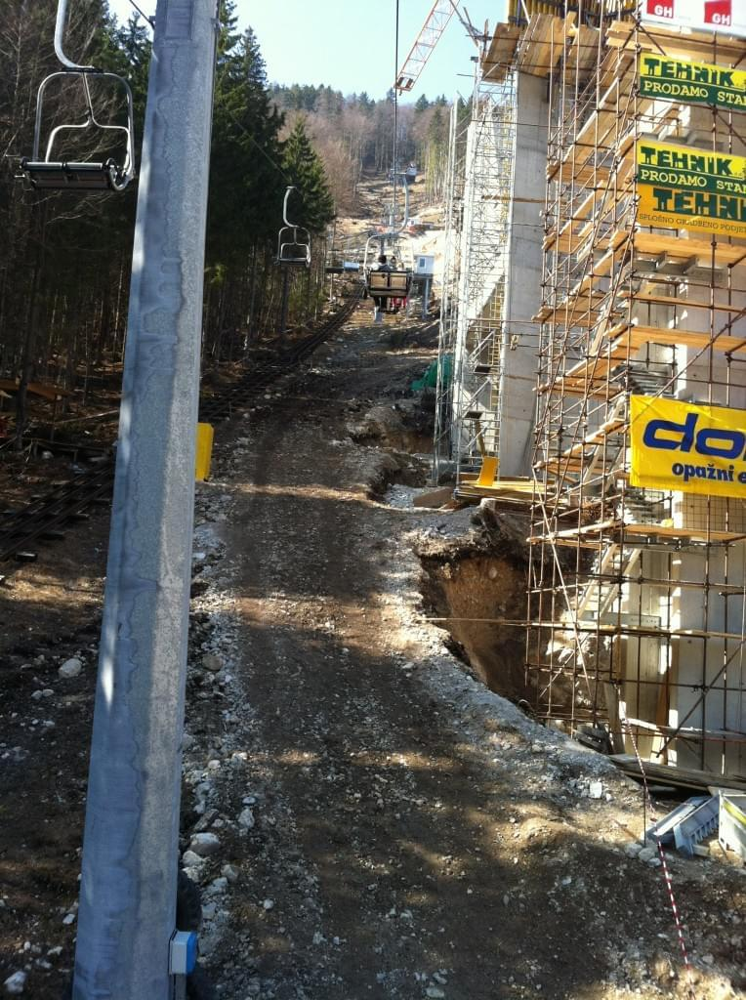
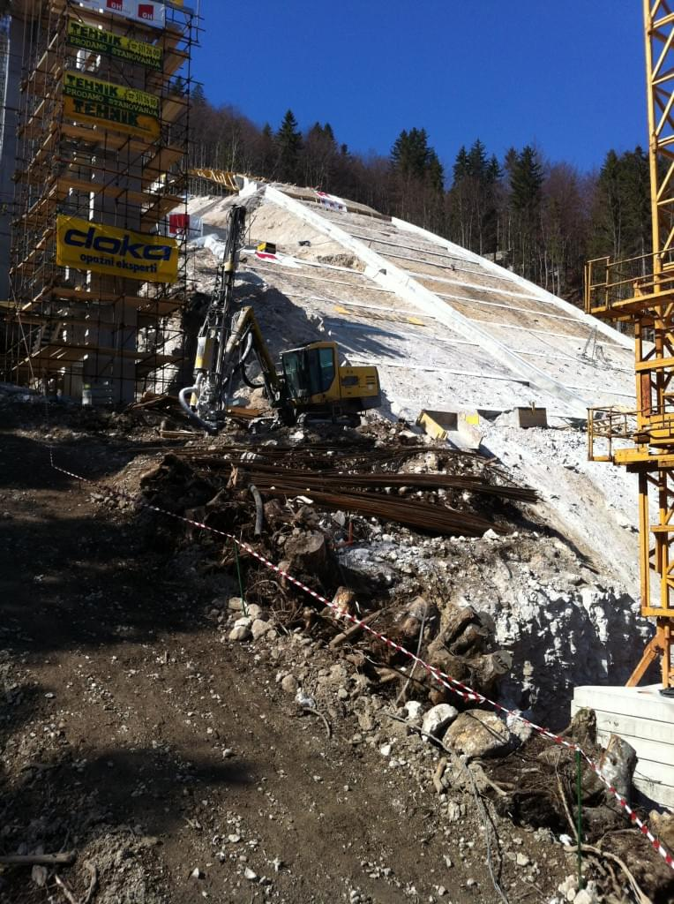
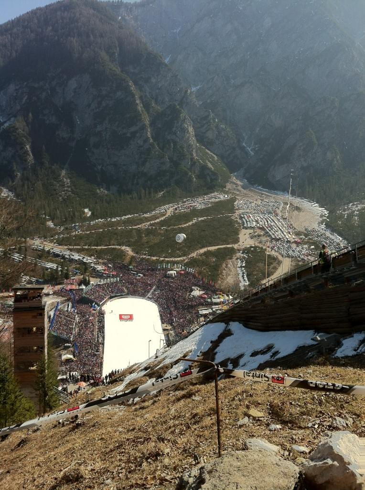
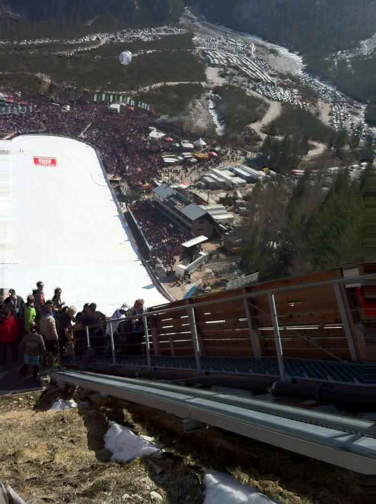
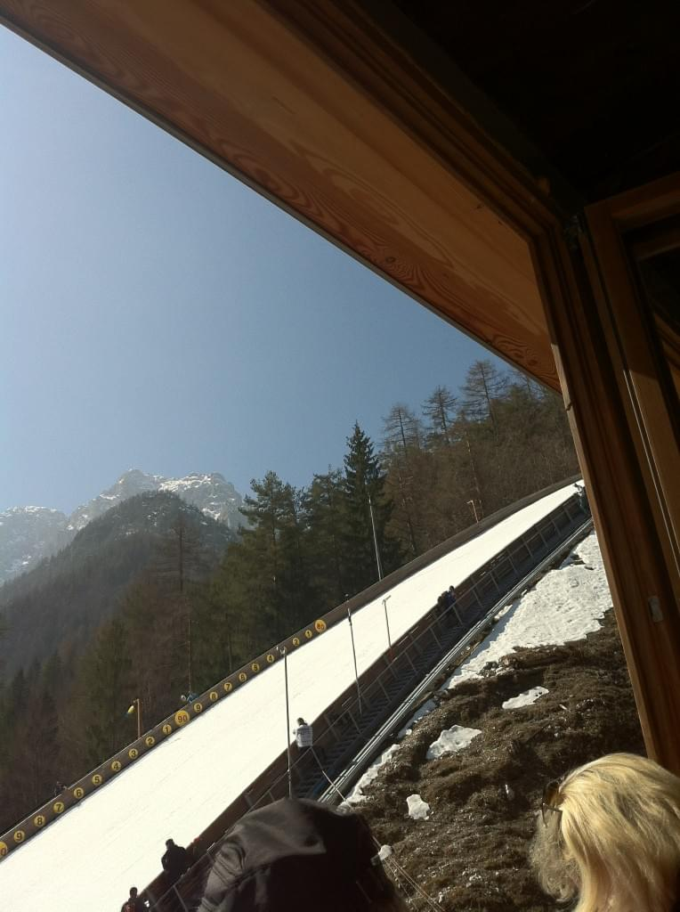

_Wake up! Wake up, we&#x27;re gonna be late!_ \[caption id=&quot;&quot; align=&quot;alignright&quot; width=&quot;342&quot; caption=&quot;Planica&quot;]\[/caption] 5am. Took my sister to [Planica](<http://maps.google.com/maps?ll=46.4983333333,13.7391666667&amp;spn=0.1,0.1&amp;q=46.4983333333,13.7391666667 (Planica)&amp;t=h> "Planica") to watch a bunch of [flying squirrel](http://en.wikipedia.org/wiki/Flying_squirrel "Flying squirrel") men throw themselves off a big hill with long sticks attached to their feet to see who can go the farthest. All the while suffering a bunch of loud drunkish people. At least that&#x27;s what I thought ... but all in all it was actually pretty damn awesome! The two free tickets didn&#x27;t just get us in the event place, after some careful maneuvering by The Ticket Guy we also got into the VIP section, right under the landing spot, with a good view of the whole flight. Then the VIP section turned into the [VIP seats](http://en.wikipedia.org/wiki/Very_Important_Person "Very Important Person"), the ones closest to all the action. Then it became a trip up the hill to see everything _very_ up close. Even the judge&#x27;s house thingy. I will never forget the eery calm of standing right next to the slope and having a guy _fall_ past you, into nothing, seemingly laying on air. Subtle whoosh sound. Amazing. And the speed on the take off ramp! Wow! TV doesn&#x27;t do it justice _at all_. Yeah, sure, he&#x27;s doing 104km/h, so what? But when you&#x27;re standing 10 meters away ... damn. Those guys are wearing underpants with a lot more room than mine have ... Seeing [Robert Kranjec](http://en.wikipedia.org/wiki/Robert_Kranjec "Robert Kranjec") jump a 231m was ... impressive. The landing looks much harder in real life than it does on the telly. Alas, the [iPhone](http://en.wikipedia.org/wiki/IPhone "IPhone") camera was too slow to catch anyone in the air. \[caption id=&quot;attachment_4000&quot; align=&quot;alignnone&quot; width=&quot;717&quot; caption=&quot;Looking up from down below&quot;]\[/caption] \[caption id=&quot;attachment_3998&quot; align=&quot;alignnone&quot; width=&quot;717&quot; caption=&quot;A bad crowd shot&quot;]\[/caption] \[caption id=&quot;attachment_3997&quot; align=&quot;alignnone&quot; width=&quot;535&quot; caption=&quot;There was a guy in a full deer suit&quot;]\[/caption] \[caption id=&quot;attachment_3999&quot; align=&quot;alignnone&quot; width=&quot;717&quot; caption=&quot;Plenty of balloons behind the VIP area&quot;]\[/caption] \[caption id=&quot;attachment_4002&quot; align=&quot;alignnone&quot; width=&quot;535&quot; caption=&quot;Ski lifts are weird without snow&quot;]\[/caption] \[caption id=&quot;attachment_4001&quot; align=&quot;alignnone&quot; width=&quot;535&quot; caption=&quot;Planica&#x27;s baby sibling&quot;]\[/caption] \[caption id=&quot;attachment_4003&quot; align=&quot;alignnone&quot; width=&quot;535&quot; caption=&quot;The crowd below&quot;]\[/caption] \[caption id=&quot;attachment_4005&quot; align=&quot;alignnone&quot; width=&quot;535&quot; caption=&quot;Whoosh, gone&quot;]\[/caption] \[caption id=&quot;attachment_4004&quot; align=&quot;alignnone&quot; width=&quot;535&quot; caption=&quot;Best seats?&quot;]\[/caption]

