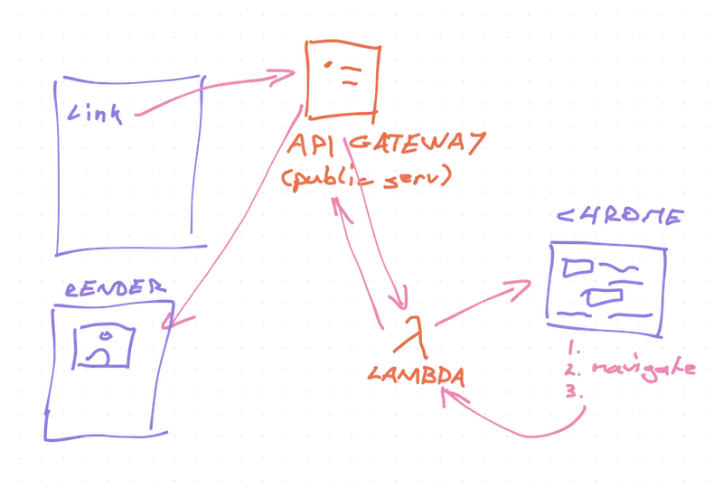
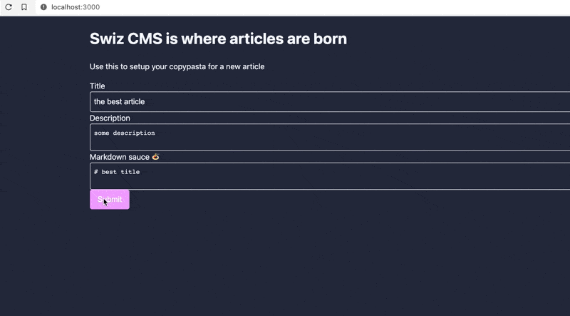

Prefetching lets you start React apps without loading spinners. Gatsby introduced this concept with `staticQuery`, react-query and NextJS make the pattern easier 😍

_CodeWithSwiz is a twice-a-week live show. Like a podcast with video and fun hacking. Focused on experiments. [Join live Wednesdays and Sundays](https://youtube.com/swizecteller)_

It took two episodes to figure this out and _verify_ it works. Here they are 👇

[https://www.youtube.com/watch?v=\_t66WKiX6Z4](https://www.youtube.com/watch?v=_t66WKiX6Z4)

[https://www.youtube.com/watch?v=20FD0Czbatw](https://www.youtube.com/watch?v=20FD0Czbatw)

We're building towards a headless CMS. The component that needs prefetching is a social card.

## Prefetchable component

```javascript
export const SocialCardImage = ({ title }) => {
  const cardQuery = useSocialCardQuery(title)

  if (cardQuery.isLoading) {
    return <Spinner />
  }

  return <Image src={cardQuery.data.url} />
}
```

The `SocialCardImage` component uses a query to create a social card for a title. When the query `isLoading`, we show a spinner, when it's done, we show the image.


We built the `useSocialQuery` custom hook [in a past CodeWithSwiz episode](https://swizec.com/blog/building-a-small-cms-with-nextjs-pt2-codewithswiz/). A thin wrapper on react-query's `useQuery` makes it more reusable.

```javascript
export function useSocialCardQuery(title) {
  return useQuery(["social-card", title], fetchSocialCard, {
    staleTime: 5000,
  })
}
```

Name the query `"social-card"`, add `title` as a parameter, use the `fetchSocialCard` data loader, and set `staleTime` to 5 seconds. Helps with query reuse and avoids refetching.

The data loader talks to my [screenshot AWS Lambda](https://swizec.com/blog/my-favorite-serverless-project/) to create social cards.

```javascript
async function fetchSocialCard(key, title) {
  if (title) {
    const res = await fetch(
      `https://pifc233qp6.execute-api.us-east-1.amazonaws.com/dev/social-card?title=${title}`
    )

    return res.json()
  } else {
    return null
  }
}
```

Basic `fetch()` request to a lambda. The lambda spins up a Chrome browser, loads a special page on my blog, renders the card, takes a screenshot, saves it to S3, returns a URL.

[](https://swizec.com/blog/my-favorite-serverless-project/)

## What is prefetching

The `SocialCardImage` component works great. Slow, but great.

Pop it on a page, add input from a form, users get a social card. Everyone expects a spinner. Can't load something before the user says what.

What if you load this as a new page?

Fill out the form, click submit, get redirected. Would you expect loading spinners like this?


Or would you think _"The site has data, why am I waiting twice?"_


Granted, it's 2020 and you wouldn't expect the site to reload after a form submit. But I wanted to figure out prefetching 😇

## Prefetching data with NextJS

[NextJS](https://nextjs.org/) offers two convenient ways to pre-define data for your page:

- `getStaticProps` for static data
- `getServerSideProps` for dynamic server data

One is meant for SSR – server side rendering – and the other for SSH – server side generation. Which is which feels unclear from the docs.

Both enable you to bake data into the initial HTML for your page. The difference is when this baking happens.

Both work the same way:

1.  NextJS starts building a page
2.  Calls your exported `getStaticProps` or `getServerSideProps` function
3.  Function does stuff
4.  Returns a `props` object
5.  NextJS renders your page with those props

### getServerSideProps with NextJS dynamic routing

To render the `SocialCardImage` with a pre-defined article title based on a URL slug, you'd write a page like this:

```javascript
// pages/[slug].js

export async function getServerSideProps(context) {
	const { slug } = context.params

	const article = magicallyReadArticle(slug)

	return {
		props: {
			article
		}
	}
}

export default ArticlePreview({ article }) {
	return <SocialCardImage title={article.title} />
}
```

Naming your file `[slug]` gives you [nextjs dynamic routing](https://nextjs.org/docs/routing/dynamic-routes) – file runs for any `/this-is-slug` URL and renders the `ArticlePreview` page component.

NextJS runs `getServerSideProps` with the routing context and you use the slug to find your article in a storage system. We used temp files but that doesn't work in production.

The function returns your `article` as a prop, it gets passed into the page component, and the user gets a preview.

And they get a spinner.


### Add React Query to the mix

You can fix the spinner by manually fetching the social card in `getServerSideProps`. And that means duplicating your logic, dealing with checking 2 data sources, etc.

You've built the query before. You've got a component that works. Why rebuild it all?? 🤨

Here's what you do instead:

1.  Wrap your app in React Query cache
2.  Prefetch query in `getServerSideProps`
3.  Dehydrate the full cache on page load
4.  Keep frontend code the same

```javascript
// pages/_app.js

const queryCache = new QueryCache()

function MyApp({ Component, pageProps }) {
  return (
    <ReactQueryCacheProvider queryCache={queryCache}>
      <Hydrate state={pageProps.dehydratedState}>
        <ThemeProvider theme={theme}>
          <Component {...pageProps} />
        </ThemeProvider>
      </Hydrate>
    </ReactQueryCacheProvider>
  )
}
```

Create a new query cache, wrap the app in `<ReactQueryCacheProvider>` and `<Hydrate>`. They're react-query's context providers for internal state sharing.

Then prefetch your queries:

```javascript
async function prefetchQueries(article) {
  const queryCache = new QueryCache()
  await queryCache.prefetchQuery(
    ["social-card", article.title],
    fetchSocialCard
  )

  return dehydrate(queryCache)
}

export async function getServerSideProps(context) {
  const { slug } = context.params

  const article = magicallyReadArticle(slug)

  return {
    props: {
      dehydratedState: await prefetchQueries(article),
      article,
    },
  }
}
```

We can't reuse `useSocialCardQuery` because we're doing something different – prefetching.

Replace `useQuery` with `queryCache.prefetchQuery` and pass that into the `dehydrate()` call from react-query. Put the full result in the `dehydratedState` prop.

The `<Hydrate>` component reads that from its props

```javascript
<Hydrate state={pageProps.dehydratedState}>
```

And you get a page load with no spinners



Okay the UX around that form submit needs work but you get the idea. No spinners! 🎉

## Why I like this

Way easier to use than Gatsby's `useStaticQuery`. Same code works with both static data _and_ dynamic updates later.

Data baking in Gatsby is more suited to pages that don't turn into single-page-apps. This works for both 😍

Cheers,<br/>
~Swizec
