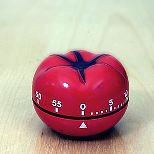

I am a procrastinator.

Everybody who's ever agreed to meet with me can confirm that I am always 5 minutes late. It's not because I'm mean or don't respect people's time, it's because I leave it to the last minute to pry myself away from work and start getting ready.

The point is, I procrastinate _everything_. I'd start procrastinating five minutes later if I could.

It's very bad.

## Cure, step 1 - pomodoro

About a year ago [I started using the Pomodoro technique](https://swizec.com/blog/living-life-in-25min-increments/)to ward off procrastinating while I work. You know, the whole, finish ten lines of code, go online for two minutes, write a bit of code ...

You might call it stupidity and bad work habits, but I was procrastinating The Next Step (tm).

Pomodoro's 25 minutes of work, 5 minutes of internet right-to-the-vein worked great. For a while at least, I've started slipping up a bit so sometimes it's 27 minutes of work or 7 minutes of internet. But that's okay, it keeps me generally inline.

I noticed something far more interesting than a general improvement in work habits.

For a while now I can no longer get any work done without a ticking pomodoro timer. The connection between that annoying tik-tak is so strong it's become impossible to focus on a single task when the noise isn't there.

Sometimes work would be better without forced breaks - when writing for instance - but I just can't do it. Unless something is ticking I can't keep my grubby little paws off the twitter and facebook and hackernews and so on.

With ticking, effortless. It seems whenever the ticking starts I feel an irresistible urge towork. To drop whatever internet buffoonery I'm up to, fire up a code editor and get cracking. As irresistible as hunger.

As a result, I've started turning the timer on before I actually start working. Otherwise I would just procrastinate starting until the day was over, but the ticking gets me to stop within a minute or two.

Brilliant.

## Cure, step 2 - project soundtracks

About two months ago I decided to take the concept of training myself in a mad Pavlovian experiment even further.

What if I could program myself not only to feel an irresistible urge to work, but an irresistible urge to work on a specific project?

The idea of project soundtracks was born.

I have four or five work playlists in Spotify. 8-bit music mixes has proven the best for coding, while _The Electro Swing Revolution_ seems best for writing. Blogging happens without a soundtrack to a well tuned radio station.

Amazing results! Seriously.

The biggest benefit is that context switching between projects is now almost effortless. As soon as a certain playlist starts my mind immediately jumps to its project - ideas star popping up, context is becoming clear and I can remember specific details I've worked on days ago.

More importantly, other projects and concerns fade into the background instead of jumping all over each other, begging for my attention.

Has any one else tried this before, or noticed similar effects?

EDIT: some playlists:

- [Super Mario](http://open.spotify.com/user/swizec/playlist/2k9u77IDuNxqIDghbpfOMP)
- [8bit](http://open.spotify.com/user/swizec/playlist/1qOmvq5TnFeeBR5MPEgQPX)
- [Tetris](http://open.spotify.com/user/swizec/playlist/3nih9fqf5MzWNlQrwLSzyP)
- [Lyre Le Temps](http://open.spotify.com/user/swizec/playlist/6orkbDvW7gmPBJLxpeX8Uw)
- [London Phillharmonic Orchestra - Greatest Video Game Music](http://open.spotify.com/user/crbwi/playlist/3ynTPnCy3kP1WhNuticSOK)

###### Related articles

- [Procrastination - aaarrggh!](http://suerowan.wordpress.com/2013/01/07/procrastination-aaarrggh/)
- [Spinning songs and sharing music, digitally with Spotify](http://www.collegemediainnovation.org/blog/2012/12/spinning-songs-and-sharing-music-digitally/)
- [Is improving your mood the best way to be more productive?](http://www.bakadesuyo.com/2013/01/improving-mood-productive/)
- [Get more done: A guide to beating procrastination](http://www.flyerzone.co.uk/blog/get-more-done-a-guide-to-beating-procrastination/)
- [The Pomodoro Technique](http://teenmakerramblings.wordpress.com/2013/01/02/the-pomodoro-technique/)

