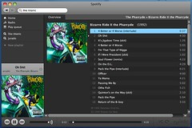

 I am a procrastinator. Everybody who's ever agreed to meet with me can confirm that I am always 5 minutes late. It's not because I'm mean or don't respect people's time, it's because I leave it to the last minute to pry myself away from work and start getting ready. The point is, I procrastinate _everything_. I'd start procrastinating five minutes later if I could. It's very bad.

## Cure, step 1 - pomodoro

## Cure, step 2 - project soundtracks

\_\_

- [Super Mario](http://open.spotify.com/user/swizec/playlist/2k9u77IDuNxqIDghbpfOMP)
- [8bit](http://open.spotify.com/user/swizec/playlist/1qOmvq5TnFeeBR5MPEgQPX)
- [Tetris](http://open.spotify.com/user/swizec/playlist/3nih9fqf5MzWNlQrwLSzyP)
- [Lyre Le Temps](http://open.spotify.com/user/swizec/playlist/6orkbDvW7gmPBJLxpeX8Uw)
- [London Phillharmonic Orchestra - Greatest Video Game Music](http://open.spotify.com/user/crbwi/playlist/3ynTPnCy3kP1WhNuticSOK)

###### Related articles

- [Procrastination - aaarrggh!](http://suerowan.wordpress.com/2013/01/07/procrastination-aaarrggh/)
- [Spinning songs and sharing music, digitally with Spotify](http://www.collegemediainnovation.org/blog/2012/12/spinning-songs-and-sharing-music-digitally/)
- [Is improving your mood the best way to be more productive?](http://www.bakadesuyo.com/2013/01/improving-mood-productive/)
- [Get more done: A guide to beating procrastination](http://www.flyerzone.co.uk/blog/get-more-done-a-guide-to-beating-procrastination/)
- [The Pomodoro Technique](http://teenmakerramblings.wordpress.com/2013/01/02/the-pomodoro-technique/)

