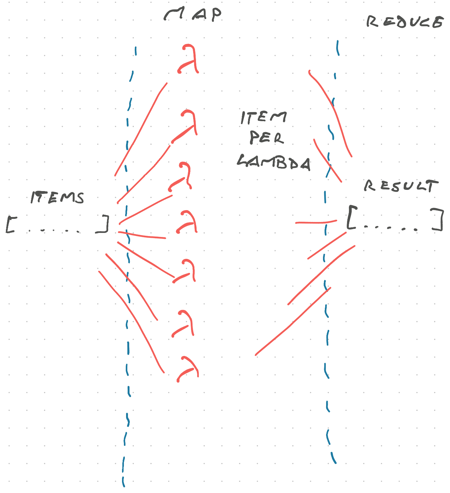

A while back you got [A Quick Lesson in Writing Resilient Code](https://swizec.com/blog/a-quick-lesson-in-writing-resilient-code/) and Dominic, a reader, asked _"Why not use Promise.allSettled?"_

The goal of that lesson was to show how you might consider writing code when [anything can and will fail](https://serverlesshandbook.dev/robust-backend-design). Unless you're doing an atomic operation, you have to let things fail separately.

For example: When processing payments and User A's credit card gets rejected, you still have to charge and renew User B's account.

## Failing separately, approach 1

The easiest approach to isolating failures is when you're using a cron job that executes on a schedule. Fetch items to process, iterate, catch and handle errors.

```javascript
// consider this pseudocode

async function runsEveryHour() {
  const items = await db.fetchUnprocessedItems();
  let successCount = 0;
  let errorCount = 0;

  for (let item of items) {
    try {
      await db.transaction(async (trx) => {
        const result = await doSomethingFancy(item, trx);
        if (result) {
          successCount += 1;
        }
      });
    } catch (err) {
      console.error("Error processing item", item, err);
      errorCount += 1;
    }
  }

  console.log(`Processed ${successCount} items; got ${errorCount} errors`);
}
```

This approach is easy to read and quick to understand.

Fantastic for cron jobs and manual scripts because items are processed one by one. Any errors and debugging logs come out in sequence, which makes this approach easier to debug.

## Failing separately, approach 2

Another way to write the above code is using [Promise.allSettled](https://developer.mozilla.org/en-US/docs/Web/JavaScript/Reference/Global_Objects/Promise/allSettled), which waits until an array of promises succeeds or fails. It returns the result of each promise.

```javascript
// consider this pseudocode

async function runsEveryHour() {
  const items = await db.fetchUnprocessedItems();

  const result = await Promise.allSettled(
    items.map(async (item) =>
      db.transaction(async (trx) => {
        const result = await doSomethingFancy(item, trx);
        if (result) {
          successCount += 1;
        }
      })
    )
  );

  const errors = result.filter((r) => r.status === "rejected");
  const successes = result.filter((r) => r.status === "fulfilled");

  console.log(
    `Processed ${items.length} items with ${successes.length} success and ${
      errors.length
    } errors. The errors are ${JSON.stringify(errors)}`
  );
}
```

We changed the loop to a map that creates an array of promises, fed that into `Promise.allSettled`, and filtered the result to find errors and successes.

Our processing now runs in parallel, which improves performance, but we lost the ease of debugging. Logs get mixed up between function calls and even though errors contain the Error object, is that enough to know exactly which item failed? Maybe 🤷‍♀️

## Failing separately, approach 3

The ultimate approach, when you have lots of data, is distributed map-reduce processing. I talk about this in the [Lambda Pipelines](https://serverlesshandbook.dev/lambda-pipelines) chapter of Serverless Handbook.



This is the same as above – map over an array of items, fan them out to individual processors (like an AWS Lambda), then recombine the result for a final tally.

You'd use this approach when you have massive amounts of data or each individual item takes a long time to process. If you add some queues with built-in retry mechanisms you get a superbly resilient architecture.

But it's a beast to debug end-to-end and overkill for most cases. You do get the benefit of _"Item 5 failed, retry?"_ however so that's nice.

I'd start with the first approach and beef up the machine running my background tasks ✌️

Cheers,<br/>
~Swizec
