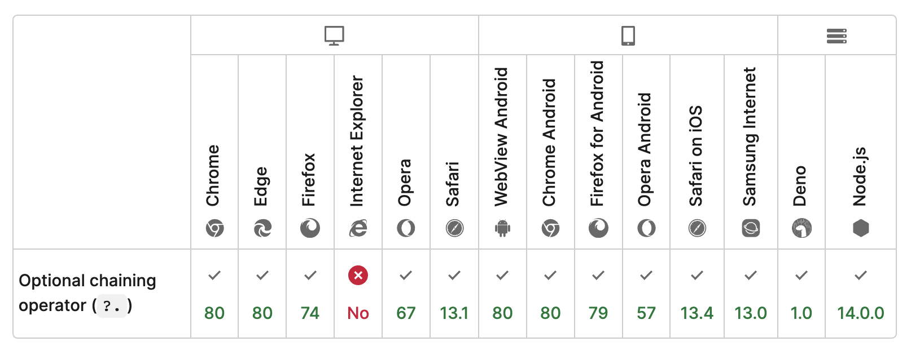

People on twitter loved this trick I learned from a coworker's pull request the other day. You might like it too.

https://twitter.com/Swizec/status/1516866901460221952

You can use `?.()` to call a potentially undefined function 🤯 Works for array access too. `?.[]`

The common use case for optional chaining is object access. If you're like me, that gave you the wrong mental model of the operator.

```javascript
const bird = {
  name: "Kiwi",
  species: ["Parrot"],
}

// prints undefined
console.log(user.address?.street)
```

If `.` is chaining, then `?` is the optional part. Obvious.

And wrong. `?.` is the [optional chaining operator for JavaScript](https://developer.mozilla.org/en-US/docs/Web/JavaScript/Reference/Operators/Optional_chaining).

That gives you the flexibility to use it _anywhere_. Function calls, array access, ... I can't think of others.

Optional chaining doesn't guarantee that what you're using supports the way you're holding it. Optional chaining is not a type check, it's an ergonomic way to hold `null` and `undefined` values.

Best used in combination with TypeScript, which guarantees (ish) the correct type of underlying value. Like this:

```typescript
type Bird = {
  name: string
  species?: string[]
  address?: {
    continent: string
    environment: string
  }
}

const BirdButton = (props: { bird: Bird; onClick?: Function }) => {
  const { bird, onClick } = props

  return (
    <button onClick={() => onClick?.()}>
      {bird.name} is a {bird.species?.[0]} from the {bird.address?.environment}{" "}
      of {bird.address?.continent}
    </button>
  )
}
```

The `?` in TypeScript types means "possibly undefined". The `?.` in JavaScript lets you use that ergonomically. No more `onClick && onClick()` 😍

You can use `<BirdButton>` all these ways:

```javascript
<BirdButton bird={{ name: "Kiwi" }} />

<BirdButton bird={{ name: "Kiwi" }} onClick={() => alert("hai")} />

<BirdButton bird={{ name: "Kiwi", species: ["Parrot", "Conure"] }} />

<BirdButton
    bird={{
        name: "Kiwi",
        species: ["Parrot", "Conure"],
        address: { continent: "Brazil", environment: "Jungle" },
    }}
/>
```

Browser and server environment support is good except you need the latest Safari and recent NodeJS.



Not a concern, if you're using a build step in your code like Babel or TSC. Make sure you regularly update your `browserlist` because I hear Babel turns `?.` into lots of code.

Cheers,<br/>
~Swizec

PS: yes my example doesn't do well with partial bird info. It prints `Kiwi is a from the of`. But that's not the point of this email 😅
