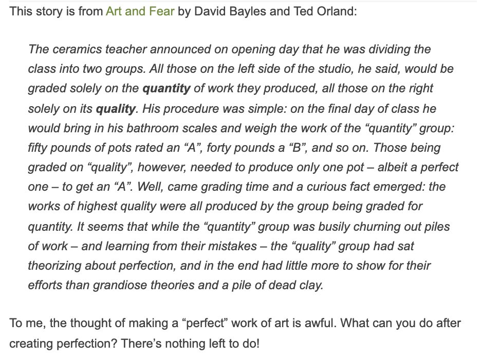

Hey,

The other day Kyle complained about system design interviews on twitter and I shared a few words of advice. You might like them too :)

https://twitter.com/kyleshevlin/status/1486045038928752641

This is the point of system design interviews. To find where your strengths are and aren't. (important for team building)

Ideally you have a rough high level sketchy understanding of all the pieces and enough humility to say "I don't know"

I've done several dozen of these interviews over the past ~year and the [easiest way to fail](https://swizec.com/blog/the-quickest-way-to-fail-a-tech-interview/) were people who pretended to know about something they didn't.

Anyone who said _"I've never done this but here's what I'd look into"_ got a 👍

Details depend on position.

I'd expect a fullstack engineer to know SQL and be able to explain what a CDN is for. But for a pure frontend, I'd dig more into domain modeling and state management.

As for how to get better ... I think this is one of those things that work like the pottery class metaphor.

You have to design a bunch of systems and get feedback.

The best feedback comes from production.

Cheers, 
~Swizec
