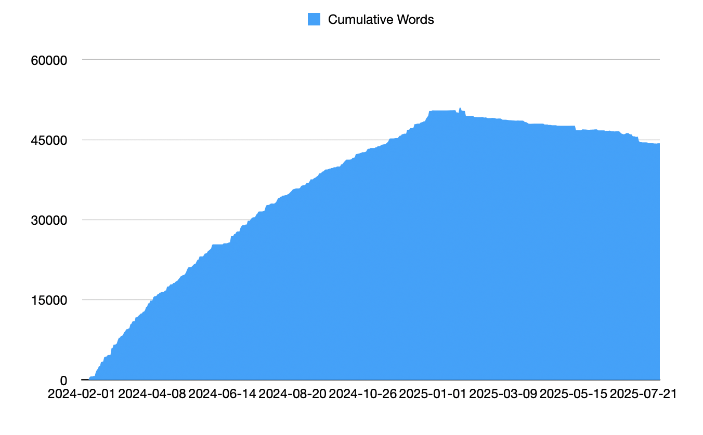

How are you? What are you working on? I mean it, hit reply :)

Here's a quick update from me:

Work has been pretty crazy. The [company I joined last year](https://swizec.com/blog/some-personal-news/) is going 🚀 and my brain feels full. More on that when I hit the 1 year mark on Aug 12. Also in my [September keynote at TechLeadConf](https://techleadconf.com).

The book [I started writing](https://swizec.com/blog/ask-me-a-question/) in January 2024 is ... done 🤨 With one big push this Sunday I finished my last editing pass. It almost feels weird \[name|]. Check this out

## The process of writing a book

The weird thing about books is that they have 3, maybe 4, done dates. First you finish the manuscript. This is a big achievement, you put all your thoughts down on paper. Then the hard work begins.

Your next done date is when you finish developmental edits. You kill all the fluff, delete anything extra, rearrange chapters, find the right graphics, add research to support your points, and change your anecdotes to make them land. Finding the right way to say your words is important.

**Your goal is not to write a book, it's to change how your reader thinks**.

If you get this right, every chapter feels like _"Yeah that's obvious, was it even worth writing?"_. Readers might feel like your book was pointless and with some luck it's gonna keep coming back in their mind. That means you explained the concept and made your ideas stick.

Then comes another fun part – you read the whole book out loud and make the words sing. Add color, remove noise, make it flow. Success means you can read super fast without twisting your tongue or getting lost.

https://twitter.com/Swizec/status/1952182174486237522

After that comes the slow part: The publishing process.

Scaling Fast is going off to get layouted, I'll send out advance reader copies to build some buzz, make a landing page, get in retail outlets, write a launch sequence, the works.

And I need to choose between these two covers.

Out in September 🤞

What are you up to \[name|]? Hit reply

Cheers, 
\~Swizec
