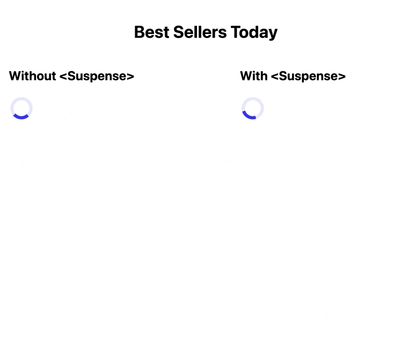

Friend, I have glimpsed the future and it is amazing.

https://twitter.com/Swizec/status/1418211981958463488

[React 18 is shipping with `<Suspense>`](https://swizec.com/blog/trying-out-react-18-alpha/) and [startTransition](https://swizec.com/blog/a-better-react-18-starttransition-demo/) for deferred component rendering, but not data loading. That's coming in a future 18.x version.

To explore that future, I built a side-by-side comparison of current best practice – [React Query](https://swizec.com/blog/how-react-query-gives-you-almost-everything-you-thought-you-needed-graphql-for/) – and future `<Suspense>` for data fetching. Using the latest experimental version of React.

https://codesandbox.io/s/react-suspense-vs-no-suspense-8mssr?file=/src/WithSuspense.js

_PS: I'll be talking about this stuff at [React Dinner, an in-person event](https://ti.to/real-world-react/technical-dinners-july-2021), next week._

## What you see in this demo

[The demo](https://codesandbox.io/s/react-suspense-vs-no-suspense-8mssr) shows a New York Times best seller list.

Its name and publication date come from an API call. The list of books comes from another API call. You get a cascading spinner effect. Need data from the first call to make the second.



Suspense coordinates those loading states for you and shows 1 spinner. Nothing renders until everything's ready. 😍

But the true benefit is how Suspense simplifies your code.

## You're doing extra work right now

Look at the [WithoutSuspense branch of my demo](https://codesandbox.io/s/react-suspense-vs-no-suspense-8mssr?file=/src/WithoutSuspense.js). There's a lot of unnecessary fluff in there.

https://codesandbox.io/s/react-suspense-vs-no-suspense-8mssr?file=/src/WithoutSuspense.js

### Low-level fetching

**First** you have the low-level data loading. An `async` helper that calls the `fetch()` method to load data from an API.

```javascript
export async function fetchBookLists() {
  const res = await fetch(`
  https://api.nytimes.com/svc/books/v3/lists/names.json?api-key=${API_KEY}`)

  const json = await res.json()

  if (json.status === "OK") {
    return json.results
  } else {
    console.log(json)
    throw new Error("Loading failed, likely rate limit")
  }
}
```

Async function, a bunch of awaits. You await the `fetch()`, then you await the `json()` parsing, then you return the result or throw an error.

Libraries like Axios make this part easier, but not much. I never found them worth the extra JavaScript. 🤷‍♂️

### Hooks for data loading

**Second** you have a helper hook that loads your data. You should use [React Query](https://react-query.tanstack.com/) or similar for this part.

A basic implementation looks like this:

```javascript
// fetches NYT best seller lists
function useNYTBestSellerLists() {
  // poor man's useQuery implementation
  const [isLoading, setIsLoading] = useState(false)
  const [lists, setLists] = useState(null)

  useEffect(() => {
    setIsLoading(true)

    fetchBookLists()
      .then((lists) => {
        setLists(lists)
        setIsLoading(false)
      })
      .catch(() => setIsLoading(false))
  }, [])

  return { isLoading, lists }
}
```

State for `isLoading` and `lists` (data). An effect runs on component mount, sets `isLoading` to true, asynchronously loads your data, then updates state.

You can use this query for any component that needs a list of best sellers lists.

To avoid re-fetching the same data for every component, libraries like React Query and ApolloGraphQL use an internal global cache. The shared cache leads to ridiculously snappy UI.

Feels like your app's broken sometimes because it's so fast 😁

### Dealing with async data in components

**Third** you have to handle loading states _everywhere_.

```javascript
export const BestSellers = () => {
  const { isLoading, lists } = useNYTBestSellerLists();

  if (isLoading) {
    return <Spinner />;
  }

  if (!lists) {
    return "not loading or error";
  }

  const list = lists[0];

  return (
    <>
      <h4>From {list.display_name}</h4>
      <Paragraph sx={{ mt: -3 }}>
        Published on {list.newest_published_date}
      </Paragraph>
      <BookList list={list} />
    </>
  );
```

Run the query, show `<Spinner>` while loading, render your component when data becomes available.

Every component that depends on a data query grows this fuzzy little workaround. You never know when a cache might expire.

You can shove all your data loading into parent components and keep renders pure, but that leads to even fuzzier code in practice.

Load data where you use it. Let React Query coordinate.

## The future with `<Suspense>`

`<Suspense>` turns async states into first-class citizens of React. You don't have to think about it. At all 🤯

Took me a while to grok this.

You'll need React 18.x and a suspense-enabled library like react-fetch. The library would rely on [suspense `<Cache>`](https://github.com/reactwg/react-18/discussions/25) internally. All of this is experimental, not even alpha.

Here's what the future looks like:

https://codesandbox.io/s/react-suspense-vs-no-suspense-8mssr?file=/src/WithSuspense.js

All the fiddly stuff from before melts away.

### Low-level fetching

No more async in your low-level fetches.

```javascript
import { fetch } from "react-fetch"

export function fetchBookLists() {
  const res = fetch(`
  https://api.nytimes.com/svc/books/v3/lists/names.json?api-key=${API_KEY}`)

  const json = res.json()

  if (json.status === "OK") {
    return json.results
  } else {
    console.log(json)
    throw new Error("Loading failed, likely rate limit")
  }
}
```

Fetch data from an API, parse the json, return the result or throw an error. No async or await in sight.

### Show loading states

You use a `<Suspense>` component to show loading states.

```javascript
export const BestSellers = () => {
  return (
    <Suspense fallback={<Spinner />}>
      {/* loading must happen inside a <Suspense> */}
      <Content />
    </Suspense>
  )
}
```

Any component inside `<Suspense>` can say _"Halt! Don't render me yet"_. React waits until every "halt" is resolved to render the children.

That's true for sibling components as well!

```javascript
<Suspense fallback={...}>
  <ComponentThatLoadsData />
  <PlainSibling />
</Suspense>
```

`<PlainSibling>` won't render until `<ComponentThatLoadsData>` is ready. Its effects won't run either. ✌️

While components resolve, React shows the `fallback`.

### No async state in components

And here's the best part – _no more async state_ 🤯

```javascript
// We never have to notice data loading is async
const Content = () => {
  const list = fetchBookLists()[0]

  return (
    <>
      <h4>From {list.display_name}</h4>
      <Paragraph sx={{ mt: -3 }}>
        Published on {list.newest_published_date}
      </Paragraph>
      <BookList list={list} />
    </>
  )
}
```

The component fetches best seller lists from an API. Zero consideration for async loading.

No spinner states, no "list may be undefined", nothing. Just plain ol' JavaScript.


It honestly looks like magic. I'm almost afraid to dig into how the heck they achieved this.

What do you think? I for one can't wait to start deleting half my code 😇

Cheers,<br/>
~Swizec

PS: if you're in town, next week's [React Dinner about React 18](https://ti.to/real-world-react/technical-dinners-july-2021) is almost sold out
