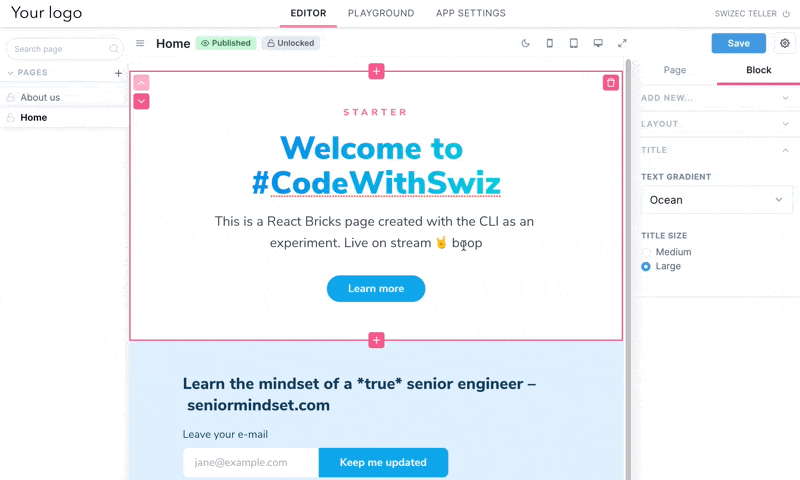

Tried a new visual editor for NextJS and CreateReactApp. Got a site up in 20min 🤘

_CodeWithSwiz is a weekly live show. Like a podcast with video and fun hacking. Focused on experiments and open source. [Join live Mondays](https://youtube.com/swizecteller)_

[https://www.youtube.com/watch?v=AA7kzViQwWY](https://www.youtube.com/watch?v=AA7kzViQwWY)

A friend asked me to try [React Bricks](https://reactbricks.com/) and honestly I was skeptical. Visual website builders. Pfft. What self-respecting web developer uses a WYSIWYG?

Give me markdown or give me death.

And then we got this page up in 20 minutes. It's pretty, easy to edit, and anyone can use it to run experiments. No custom code.

[](https://cms-experiment.vercel.app/)

We even got the founder to leave a totally real review.


## How it works

[React Bricks](https://reactbricks.com/) is currently in beta and worth a try. Going to be a paid tool when it's ready.

Start with a CLI command to create a new site and follow the prompts:

```
$ npx create-reactbricks-app
```

You get a NextJS project (or CRA) configured to use with React Bricks. Beautiful default setup using Tailwind and a couple bricks to show what's possible.

There's the usual suspects like hero headers, testimonials, email signup, image with left-text, FAQ, etc. Everything you need for a generic yet decent landing page.

Copy is what matters 😉

Click the edit button, login with your React Bricks account, and you get a visual editor.



Typical visual editors suck. They're fiddly. Click the wrong thing and lose all your work kind of fiddly.

But this one was nice. Felt stable. I couldn't get it to lose my work.

Except that one time I didn't notice a required field and couldn't save and refreshed the page. But that's on me.


### Deploy

When you're happy with the page, Vercel is your friend.

```
$ vercel
```

Page goes live and becomes a typical NextJS site. Render-on-demand, cached for speed, HTML has all the content.

Editor works on your live page. No need for local dev environments 🤘

You have to re-deploy for changes to go live.

### Go live button

A deploy webhook gives you the Go Live button. Anyone can press this without engineering skills and that's love.


We set [this up on stream](https://www.youtube.com/watch?v=AA7kzViQwWY&t=1820s).

Go into Vercel dashboard, integrate with Git. You don't have git-based version control because of the visual editor, but okay Vercel likes it that way.

Then you create a hook and paste it in React Bricks settings.


You'll need to set up your API key as a secret on Vercel. Automated deploys get an error otherwise, but not when you deploy manually. Not sure how that works 🤔


Anyone with edit access to your site can deploy changes. No dev environment required. Great when you're traveling and find a typo.

### The mechanics, probably

React Bricks is closed source so this is a guess. I'll ask Matteo if I'm close :)

The visual editor itself is made of unicorns and magic.

Controls on the right are component props. Every change triggers a re-render because React.

When you hit `Save`, a JSON representation of each component's props and children saves to a database. A JSON for page structure describes the bricks order.

Something like this:

```json
{
	type: "page",
	name: "Home",
	bricks: [
		{
			type: "hero",
			props: [
				layout: "white",
				borderTop: "none",
				...
			],
			children: [
				...
			]
		}
	]
}
```

Then there's the `[slug].tsx` component that represents each page. You can [see it here](https://github.com/Swizec/cms_experiment/blob/master/pages/%5Bslug%5D.tsx).

There's a `getStaticProps` that phones home and fetches this JSON. The page then uses a `<PageViewer>` component to render.

```typescript
export const getStaticProps: GetStaticProps = async (context) => {
  const { slug } = context.params
  const page = await fetchPage(slug.toString(), config.apiKey)
  return { props: { page } }
}

const Page: React.FC<PageProps> = ({ page }) => {
  // ..

  return (
    <Layout>
      // ...
      <PageViewer page={pageOk} />
    </Layout>
  )
}
```

Neat trick.

Works great because NextJS is smart enough to call this once. First visitor gets a slow page, everyone else gets blazing speed.

## But Why?


Adrian said it best on stream:

> I got tired of building 100 wordpress pages every year and hired a bunch of people. Became an agency and now I can focus on my unique value props.
> This would make everything easier.

He's right. Landing pages are the lettuce of webdev. Don't craft that shit by hand. You've got interesting things to do.

Like creating custom bricks 😍

[https://twitter.com/matfrana/status/1359068598229225473](https://twitter.com/matfrana/status/1359068598229225473)

Cheers,<br/>
~Swizec

PS: this is not an ad but the founders did ask me to check it out through a friend
