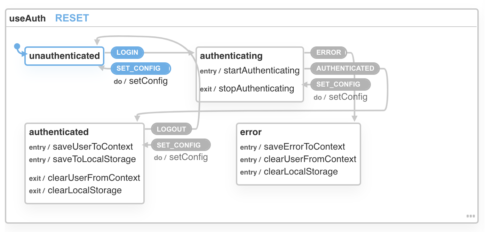

[useAuth](https://github.com/Swizec/useAuth) works without React Context! 🎉

_CodeWithSwiz is a twice-a-week live show. Like a podcast with video and fun hacking. Focused on experiments. [Join live Wednesdays and Sundays](https://youtube.com/swizecteller)_

This was quite the saga my friend. Started on October 8th, thought, _"Pfft, how hard can it be"_, and here we are a month later. 😅

I made a [pull request with the full diff](https://github.com/Swizec/useAuth/pull/107), if you're curious. Read about steps 1 through 3 👉 [Refactoring a useReducer to XState](https://swizec.com/blog/refactoring-a-usereducer-to-xstate-pt1-codewithswiz-11), [Writing tests for XState](https://swizec.com/blog/how-to-write-tests-for-xstate-codewithswiz-12), [Swap useReducer with XState](https://swizec.com/blog/swap-usereducer-with-xstate-codewithswiz-13).

Today's post is about the last part: Tossing react context.

[https://www.youtube.com/watch?v=IXhJK8FjALg](https://www.youtube.com/watch?v=IXhJK8FjALg)

[https://www.youtube.com/watch?v=XzE32ZAW87I](https://www.youtube.com/watch?v=XzE32ZAW87I)

## Why React Context

React Context is the workhorse behind [wormhole state management](https://swizec.com/blog/wormhole-state-management) – the idea that hooks should feel like magic. Call `useAuth` anywhere in any component and it knows everything about the user.

```javascript
function RandomComponent() {
  const { user } = useAuth()

  return <h2>Hello {user.username}</h2>
}
```

That's what an API in modern React should look like. No prop drilling, no fumbling with global state, no worries about performance. Call the hook, get the info.

`useAuth` achieves that with context.

A global provider wraps your React tree. It holds a piece of global state and shares it with everyone via context. `useAuth` hooks into this state with a `useContext` call.

Like this example from the [Wormhole state management](https://swizec.com/blog/wormhole-state-management) article:

[https://codesandbox.io/s/wormhole-state-pattern-5-j4w5e](https://codesandbox.io/s/wormhole-state-pattern-5-j4w5e)

A couple counters sharing state via context. You get a neat API.

```javascript
const { count, incB } = useSharedCount()
```

But the machinery to make this work is gnarly.

Avoiding unnecessary re-renders involves 2 sets of state. One for context, one for machinery around context. You have to be careful how context updates.

For `useAuth`, it looked like this:

```typescript
export const AuthProvider: AuthProviderInterface = ({ ... }) => {
    // omitted config code

    // Holds authentication state
    const [state, dispatch] = useReducer<React.Reducer<AuthState, AuthAction>>(
        authReducer,
        getDefaultState()
    );

    const [contextValue, setContextValue] = useState<AuthContextState>({
        state,
        dispatch,
        auth0,
        callback_domain: callbackDomain,
        customPropertyNamespace,
        navigate
    });

    // Update context value and trigger re-render
    // This patterns avoids unnecessary deep renders
    // https://reactjs.org/docs/context.html#caveats
    useEffect(() => {
        setContextValue((contextValue: AuthContextState) => ({
            ...contextValue,
            state
        }));
    }, [state]);

    // omitted auth check code

    return (
        <AuthContext.Provider value={contextValue}>
            {children}
        </AuthContext.Provider>
    );
};
```

Not intimidating at all 😅

Functions inside `useAuth` change state via methods they grab out of context, effect in provider sees the change, updates context, triggers re-renders.

Works great and means users have to wrap their code in `<AuthProvider>`.

You know what would make useAuth feel more magical? No global provider 😍

## Using XState over Context

XState introduces the concept of [actors](https://en.wikipedia.org/wiki/Actor_model) – independent objects that hold their own state and respond to events.

Every _interpreted_ XState state machine is an actor. The state machine defines how the actor responds to events, the object is the actor.

```typescript
import { interpret } from "xstate"

export const authService = interpret(authMachine)
authService.start()
```

Because you export an _instance_ of an object, you can access that instance anywhere. Your bundler ensures it's the same instance everywhere.

`import { authService } from 'authService.ts'` doesn't call `interpret(authMachine)`. It returns the memoized result. How that works depends on the bundler you're using.

What that means for you is that you now have global shared state without a context provider.


Thanks to [XState's React integration](https://xstate.js.org/docs/packages/xstate-react/), you can safely access this shared state.

```typescript
export const useAuth: useAuthInterface = () => {
  const [state, eventSend] = useService(authService)

  // ...
}
```

`state` is the state machine state – `unauthenticated`, `authenticating`, `authenticated`, `error`. The application state lives in `state.context`. You can read more about that in [Refactoring a useReducer to XState](https://swizec.com/blog/refactoring-a-usereducer-to-xstate-pt1-codewithswiz-11).

`eventSend` lets you dispatch events to transition between states. `LOGIN` to start authenticating, `LOGOUT` to logout, etc. Available transitions depend on the current state of the state machine.



When state updates, entry and exit actions update `state.context`. When your components depend on those values, they re-render.


## What about configuration?

A common pattern is to use the global context provider as an API for configuration. I used the same approach in `useAuth`.

```javascript
export const wrapRootElement = ({ element }) => (
  <AuthProvider
    navigate={navigate}
    auth0_domain="useauth.auth0.com"
    auth0_client_id="GjWNFNOHq1ino7lQNJBwEywa1aYtbIzh"
  >
    {element}
  </AuthProvider>
)
```

Without a provider, how do users configure your library?

With a new event!

I kept the `<AuthProvider>` as a convenience. Accepts configuration params and passes them into the XState machinery. You can do it without the provider.

```typescript
export const AuthProvider: AuthProviderInterface = ({ ... }) => {
    // omitted config munching

    const { dispatch } = useAuth();

    useEffect(() => {
        const auth0 = new Auth0.WebAuth({ ...params, ...auth0_params });
        dispatch("SET_CONFIG", {
            authProvider: auth0,
            navigate,
            customPropertyNamespace,
            callbackDomain
        });
    }, [navigate, customPropertyNamespace, callbackDomain]);

    return <React.Fragment>{children}</React.Fragment>;
};
```

Notice the provider is using the hook. Like any other component would. 🤯

The `SET_CONFIG` event configures `useAuth`. And in a move towards supporting many auth providers, the library now accepts a configured auth provider object.

🤘

Cheers,<br/>
~Swizec

PS: the React.Fragment bit is interesting, components can't return `children` without wrapping in a React element. Who knew
