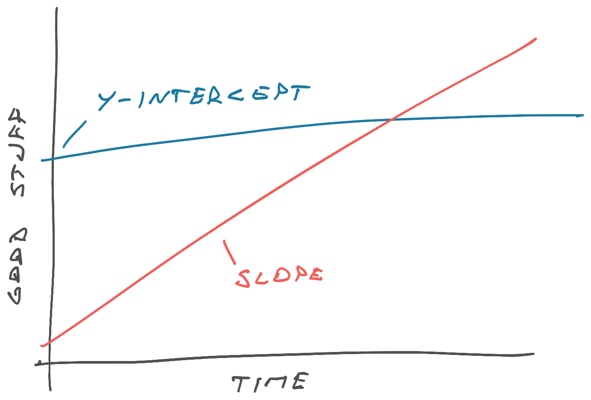

Fellow reader Ryan writes in with an age-old question that's hard to google and difficult to discuss in places where engineers hang out: What's next?

> 10 years in wide range of experience, consultancy product dev, leading teams, I'm not sure what that next step is, I still want to be hands on, any thoughts? Thanks mate, you're smashing it! ~ Ryan

First: Congratulations Ryan! 10 years of experience puts you in the top 25% of engineers by tenure 👏 The field [about doubles every ~5 years](https://swizec.com/blog/25-lessons-from-25-years-of-coding/#14-the-ecosystem-changes-every-5-years).

Second: Great work keeping it varied. You don't want to have 1 year of experience 10 times.

Ryan is in a great position here. We can guess technical skills won't be a problem by virtue of having made it 10 years. The variety means he can not only be a good fit in many companies, he can _show_ he's done that in the past. Hiring managers love it when they're not your first.

## Do you _have to_ grow?

No. [Senior engineer is a terminal title](https://swizec.com/blog/can-you-stay-a-senior-engineer-forever/). You can stay there forever.

Enjoy your career as a source of funding for your other hobbies. I have lots of friends who do that and between you and me, they seem the happiest.

But be careful not to stagnate. A little bit of slope makes up for a lot of Y-intercept.

## What if you _want to_ grow?

I've written about this before from my own experience 👉 [How to grow as a senior engineer or why I got a new job](https://swizec.com/blog/how-to-grow-as-a-senior-engineer-or-why-i-got-a-new-job/)

As someone who gets bored, I need increasingly harder challenges to stay engaged. Without that engagement my work becomes worse.

Two years ago I boiled it down to 4 options:

1.  Go into management
2.  Become an entrepreneur
3.  Find a company with bigger better challenges
4.  Become junior at new thing

For someone like Ryan who wants to stay hands-on, I would recommend finding bigger better challenges to solve. Leverages your experience, looks great on a resume, maybe forces you to learn a new approach.

## Solving bigger better challenges

Bigger better challenges come in many shapes.

You can find your way into a FAANG-size company and work on systems so massive every detail matters. I have a friend who removed NULL columns from a database and saved gigabytes of disk space. That's hard to do.

You can join a fast-paced startup [early in their S-curve](https://swizec.com/blog/when-to-join-and-leave-a-company-project-or-trend/) and experience the attitude of _"Anything but slowing growth with technology problems"_. That can be fun.

You can find a hard problem with high stakes. Like the system we're currently rewriting at work with a multi million dollar contract on the line. The code will be easy, basic CRUD, but we've been domain and team modeling for a month. Fun!

**Bigger** means the stakes are higher. And that's exciting.

**Better** means the problems are new. At least to you, if not the world. My favorite indication of a better problem is when Google stops being useful.

https://twitter.com/Swizec/status/1613958506604023808

Cheers, 
~Swizec
