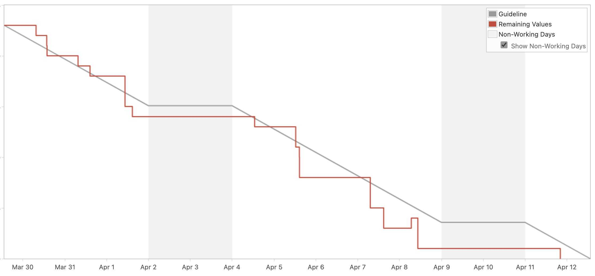
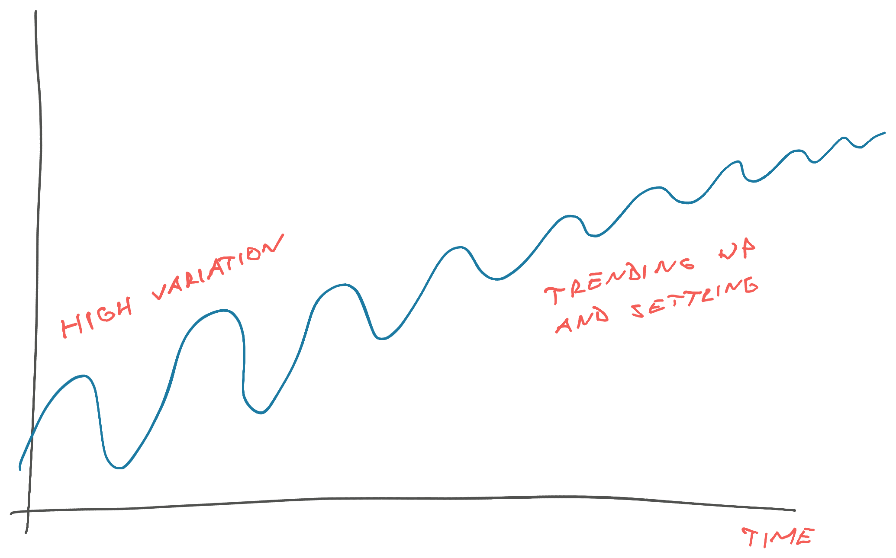

A fellow reader wrote in with this question:

> This feels very simplified. If the 6 steps were all that's necessary, why aren't more teams doing this. Additionally, 18 months can be an eternity in software. Any ideas why it took that amount of time and if can be shortened?

It was a comment on [How we made the best burndown chart you've ever seen](https://swizec.com/blog/how-we-made-the-best-burndown-chart-youve-ever-seen/) and unfortunately they didn't leave an email. Might never see this answer.

But it could help you, so here we go.

This is the best burndown chart I've seen. It shows our team getting stories done exactly on time and finishing all work a day early.

I use it as an example in [Senior Mindset](https://swizec.com/senior-mindset/) workshops to talk about theory of constraints, bias to action, and The Mythical Man-Month lesson everyone forgets 👉 Delays happen one sneeze at a time.

## The 6 steps

In [How we made the best burndown chart you've ever seen](https://swizec.com/blog/how-we-made-the-best-burndown-chart-youve-ever-seen/), I outlined 6 factors that made this happen:

1.  A real deadline
2.  Small stories
3.  Work in sequence
4.  Bias to action
5.  Don't be a blocker
6.  Break the process

I stand by these. You need a deadline otherwise [work expands to fill the time available](https://en.wikipedia.org/wiki/Parkinson's_law). Fake deadlines don't work.

Small stories are easier to track and help you build momentum, working on every story as a team [keeps work in progress low](https://swizec.com/blog/workinprogress-kills-your-progress/) and makes them go faster.

The rest is cleaning up those little time sucks that sneak into all our days. The 5min break that oopsies into 15min between one task and another. The 3 hour back-and-forth on a pull request that could be a 5min _"Ah let me just do it for you"_ commit.

## Why aren't all teams doing this

Because it's culturally hard. Even weird.

Every time we hire a new engineer they say 2 things:

1.  Wow I've never seen a team move this fast
2.  I don't like this

When we first started working as a team instead of a group of soloists, every story felt like a million gerbils running through my brain. You had a thought, an idea, an approach you wanted to take and immediately the gerbils would trample all over. Move things around, change the code, grab a piece of your brain and connect it to a new piece that felt wrong.

It was jarring, confusing, distinctly uncomfortable, and way better.

We moved faster. We got more done. We kept everyone in the loop. Shared more ideas. Found more edge cases. Created fewer bugs. And heard more opinions.

Think of the stereotypical engineer on the internet. The reply guy. The well-achually dude. The brilliant nerd sitting in their ivory tower of perfection that nobody else can touch.

This is _my_ code. You, peasant, touch your own code.

They don't last long in a team like ours. Hell, they wouldn't even make it through the interviews.

## Why it took 18 months to learn this

Changing a culture takes time.

Humans are messy. You can't say _"Okay we'll do things this new way"_ and suddenly it's all better.

Progress looks like this:

Your progress oscillates around the ideal. High variation at first, then closer and closer until one day, you get it right almost every time.

This is known as [regression to the mean](https://en.wikipedia.org/wiki/Regression_toward_the_mean).

Exceptionally good performance? Your next try is likely to be worse.

Exceptionally bad performance? Your next try is likely to be better.

Independent of external feedback! The effect is so powerful it [fools expert coaches and managers](https://faculty.mccombs.utexas.edu/carlos.carvalho/teaching/regression_to_the_mean.pdf).

> In the late 60s, Kahneman was a consultant for the Israeli Air Force. He lectured instructor pilots on the latest research that showed that reward was far more effective than punishment at improving performance. Instructor pilots were not buying any of it.
>
> They told Kahneman, when student pilots have a bad flight we yell and scream at them, and the next day they tend to do better. But when they have a good flight we'll praise them like you suggest, and they tend to do worse.
>
> It was then that Kahneman realized how natural variation in performance, and its natural regression to the mean, were fooling the flight instructors into believing it was their yelling and screaming that improved the student pilots' performance.

You have to focus on your average performance my friend. The easiest way is to consistently do more of what's working.

And that takes time.

Cheers, 
~Swizec

PS: yes our very next sprint was worse. We got cocky and took on too much
