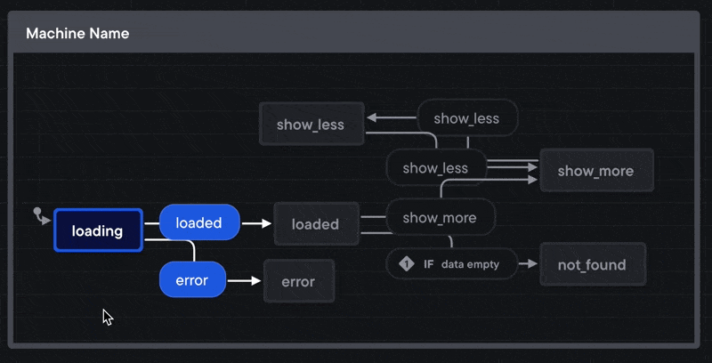

Following up from [When your brain is breaking, try Stately.ai](https://swizec.com/blog/when-your-brain-is-breaking-try-stately-ai/), fellow reader S. asked if `useReducer` could ever be relevant when using state machines in React code.

Yes!

You can use `useReducer` to implement a state machine and clean up your ternary soup. It won't have the safety guarantees of [XState](https://xstate.js.org) or the built-in support for side effects (called actions in xstate), but it's going to be a state machine.

State machines are a way of thinking about your code. They don't care about implementation details. As I wrote in February – [you're building state machines even if you don't know it](https://swizec.com/blog/a-new-vscode-extension-makes-state-machines-shine-on-a-team/#youre-already-building-implicit-state-machines).

When [Moore invented state machines in 1956](https://en.wikipedia.org/wiki/Moore_machine) programming was done with pen and paper first. You didn't have time for trial and error. When a computer ran your code, it better be right. Hell, FORTRAN (first compiled language) didn't even come out until 1957.

## useReducer state machine example

Using [the same example as before](https://swizec.com/blog/a-new-vscode-extension-makes-state-machines-shine-on-a-team/), you start with a render like this:

```javascript
return (
  <div>
    {isLoading && <Spinner />}
    {!isLoading && !data && <NotFound />}
    {!isLoading && isError && <Ooopsies />}
    {!isLoading && data && (
      <>
        <List data={data} count={10} />
        {!showMore && <Button onClick={onShowMore} />}
      </>
    )}
    {!isLoading && data && showMore && (
      <>
        <List data={data} count={data.length} />
        <Button onClick={onHideMore} />
      </>
    )}
  </div>
);
```

and would prefer to have code like this:

```javascript
switch (state) {
  case "loading":
    return <Spinner />;
  case "not_found":
    return <NotFound />;
  case "error":
    return <Ooopsies />;
  case "show_less":
    return (
      <>
        <List data={data} count={10} />
        <Button onClick={showMore} />
      </>
    );
  case "show_more":
    return (
      <>
        <List data={data} count={data.length} />
        <Button onClick={showLess} />
      </>
    );
  default:
    return <Spinner />;
}
```

I think that's easier to work with. You may disagree, lots of people do 😅 Personally I like code that _doesn't_ make me feel smart.

To support that with a `useReducer`, you'd write a state machine like this:

```javascript
function reducer(state, action) {
  if (state === "loading") {
    switch (action.type) {
      case "loaded":
        if (action.data.length === 0) {
          return "not_found";
        } else {
          return "loaded";
        }
      case "error":
        return "error";
    }
  }

  if (state === "loaded") {
    switch (action.type) {
      case "show_more":
        return "show_more";
    }
  }

  if (state === "show_more" && action.type === "show_less") {
    return "show_less";
  }

  if (state === "show_less" && action.type === "show_more") {
    return "show_more";
  }
}
```

If you look carefully, draw a picture of possible transitions, and I didn't make mistakes, you'll get the same animation as last time:

[](https://swizec.com/blog/when-your-brain-is-breaking-try-stately-ai/)

The `useReducer` hook lets you use this in a React component:

```javascript
// init with the "loading" state
const [state, dispatch] = useReducer(reducer, "loading");
```

All that remains is to call `dispatch` with the right actions at the right moments. Either by integrating deeply with your data loading or relying on `useEffect` when values change.

As implemented, the `reducer()` expects calls like `dispatch({type: 'error'})`.

Cheers,
~Swizec

PS: a few readers complained the Stately article was an ad. It wasn't. I just liked it and thought you might too

PPS: here's a series of articles and videos on [refactoring a useReducer to XState](https://swizec.com/blog/swap-usereducer-with-xstate-codewithswiz-13/)
