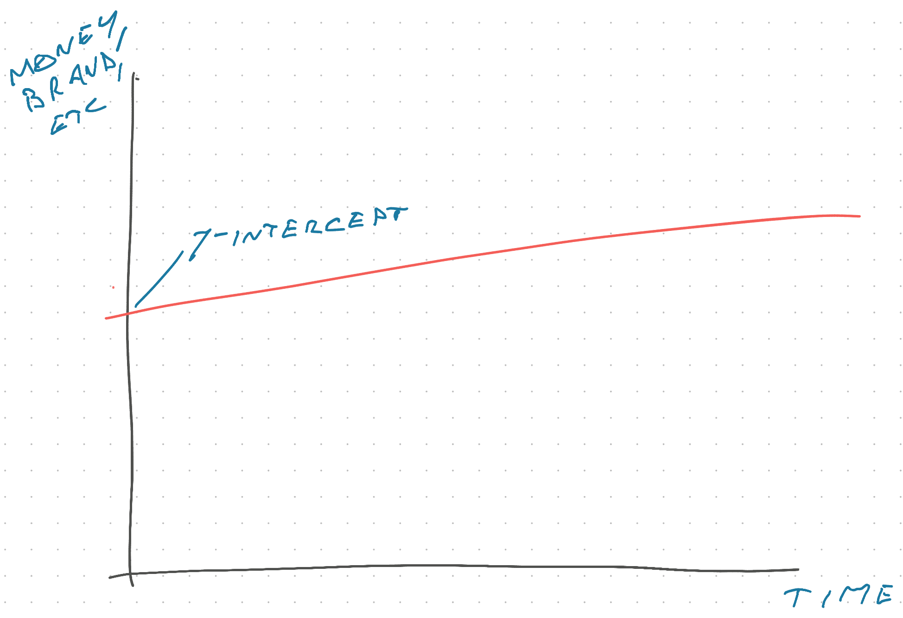
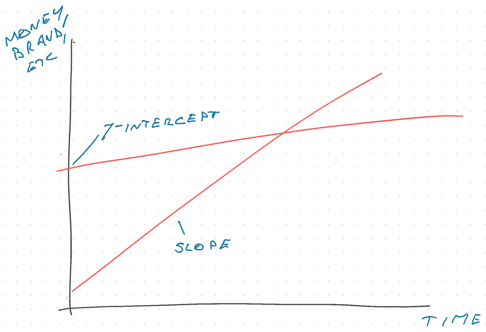

Fellow reader Frank writes in with a question about career moves and I thought my answer could help you too.

He's got two offers and a choice:

> 1.  Senior dev on biggest salary I've ever had at a big name financial company, old tech, not exciting work.
> 2.  Medium dev (tech interview scored me as such) on half the salary as 1 and even much reduced salary from my last one, local smaller company, varying project work, environment full of enthusiastic to learn devs and chill managers.

In the rest of his email Frank describes the first option as soulless and the second as exciting. I think he made his choice before writing :)

And that's an important lesson from Daniel Kahneman's, father of behavioral economics, [Thinking, Fast and Slow](https://en.wikipedia.org/wiki/Thinking,_Fast_and_Slow) – *we* aren't in the driver's seat. Our emotional subconscious is driving while the analytical conscious mind desperately invents justifications and explanations for our actions to feel in control.

**Big decisions come from the gut**. If you're finding reasons to say No, the answer has always been no. If you're looking for reasons to say Yes, it's always been yes.

## Evaluating options

Frank is facing a choice between fast growth and piles of money. You _can_ have both but that's hard to find.

The soulless big company offers lots of money and looks good on a resume. But you "pay" for that money with a slower pace of learning, cookie cutter work in a large machine, and probably learning fewer transferable skills.

Looking at your career from now onward, this gives you a high y-intercept – lots of money, sounds good on resume – but not lots of growth.

The exciting small company offers less money and looks anonymous on your resume. But it offers something a big company can't – wealth of experience. Small companies naturally lead to trying lots of different technologies, touching all parts of the stack, and working closely with stakeholders. There's nobody else to do it!

This leads to fast growth and quick learning – slope.

You can then leverage that faster growth to get bigger opportunities, more interesting problems to solve, and be in a better position for future jobs. Pure career capital.

That triangle between y-intercept and slope, that's your opportunity cost. Will the faster growth catch up to a higher starting point quickly enough to work out long term? [That's the bet](https://swizec.com/blog/a-mental-framework-that-helps-you-code-faster/).

An economist can turn this into a precise formula. I cannot.

## An important caveat

Another important consideration is the impact of your environment. **You become the average of the people you surround yourself with**.

https://youtu.be/nJ_htuCMCqM

Go into an enthusiastic environment full of bright people doing their best, pushing tech, and having fun 👉 you'll have fun, push tech, and enjoy yourself.

Go into an environment full of people cashing in their paychecks, resting and vesting, and not caring much about their jobs 👉 you'll become a corporate drone.

But not all large companies are like that. And certainly not all teams. If you land on a good team that pushes you and gives space for learning, a big environment can create opportunities that a small environment doesn't even have available.

Similarly a small company can turn into a trap, if you grow faster than the environment and there's nowhere left to go but out.

And it's normal for your priorities to change. Careers are long. You have time to try everything.

https://twitter.com/Swizec/status/1582796420314062860

Cheers, 
~Swizec
