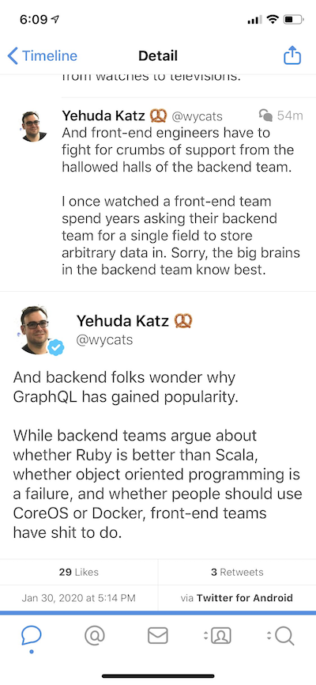

Still dreaming about that big idea? Thinking about launching an app that makes $1,000/month and not sure how to get started? Or just frustrated with the tyranny of Real Engineering™ at work?

Wouldn't it be great if you could own entire features start to finish? Build ideas from scratch to launch? **Create whatever your heart desires?**

That's what we became engineers for, damn it. To build things. To create. To make our ideas reality.

Not this 👇

😡

That's why I created [ServerlessReact.Dev](https://serverlessreact.dev). To give **YOU** the power to create anything you want.

The tech is there. The fullstack frontend engineer is back. **You can build everything** back to front.

But you gotta decide you want to. _You_ have to make that first step.

Your app won't build itself. Your boss won't wake up one morning and think _"Maybe I should give you a project you're completely unqualified for 🤔"_.

Stop dreaming. It's time to act.

People always ask me: _"Should I do the thing or play it safe?"_

And I tell them what I always tell my sister

> You are the youngest you’ll ever be. Go do the thing.

**NOW** is the best time to take that risk. To leap that leap. To work your butt off and leapfrog your peers.

You can always play it safe later. Your ducks will never be all in a row.

Hell, you don't even have to join [ServerlessReact.Dev](https://serverlessreact.dev) if you don't think it's a fit, just please don't live a life of whatifs.

But if you want support on your journey. A helping hand. A guideline on how to set yourself up for long-term success ...

then ServerlessReact.Dev is here for you

With this course you'll learn everything you need to build successful modern webapps.

And [the \\\\\\$100 launch discount](https://serverlessreact.dev) ends tonight at 11:59pm Pacific. This is the cheapest it's ever going to be.

So if you're ready to stop dreaming and start building 👉 [join now](https://serverlessreact.dev)

Cheers, ~Swizec

PS: I'm creating an exciting challenge for everyone who joins the course
