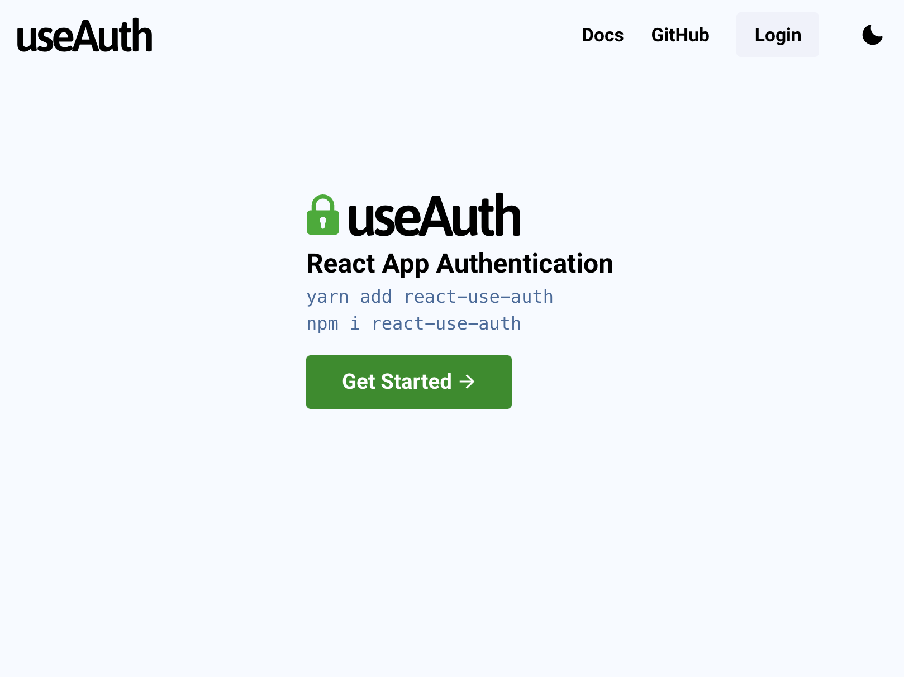
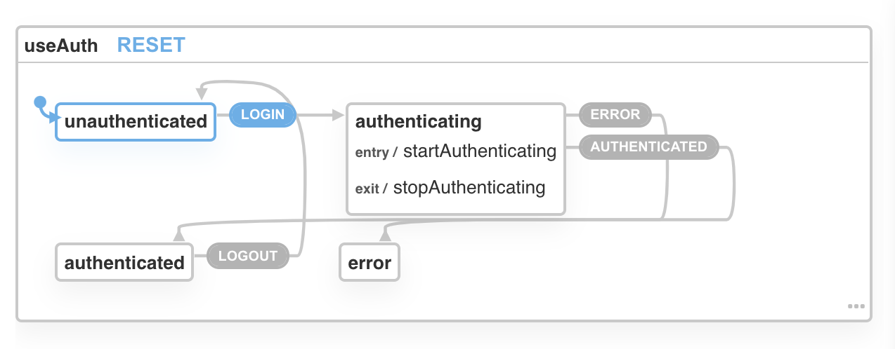

XState promises to be like useReducer+Context combined and the simplest way to handle complex state in React apps. But can it deliver? On this episode of #CodeWithSwiz, we gave it a shot.

_CodeWithSwiz is a twice-a-week live show. Like a podcast with video and fun hacking. Focused on experiments. [Join live Wednesdays and Sundays](https://youtube.com/swizecteller)_

https://www.youtube.com/watch?v=ftbH90Sd7aU

[useAuth](https://github.com/Swizec/useAuth) was always meant to become _the_ best way to add authentication to your React and JAMStack apps. Regardless of auth provider.

But as time passed, contributors grew (up to 19), pull requests mounted (70 closed or merged 🤘), and bugs got fixed, the codebase became a mess. Hard to reason about, difficult to understand, bleh to work with.

https://twitter.com/Swizec/status/1159865098556432384

It was time to refactor. And [When your brain is breaking, try XState](https://swizec.com/blog/when-your-brain-is-breaking-try-xstate/)

## 1: Housework

We started in ep10 with housework.

Merge existing PRs, verify tests work, fix lingering bugs. Anything that could lead to merge conflicts after a large change to the codebase.

You don't want to leave your contributors hanging.

https://www.youtube.com/watch?v=VQruDDBxyi8

Among the neglected pull requests we found a fantastic candidate for a useAuth docs page! Thanks Eric Hodges, you're amazing 😍

[](https://chakra-ui-test-delta.now.sh/)

You can try it on his demo deploy 👆

## 2: Identify possible states



Refactoring a `useReducer` to [XState](https://xstate.js.org/) starts by identifying your states. Each `case` corresponds to a transition between states.

```typescript
export const authReducer = (
  state: AuthState,
  action: AuthAction
): AuthState => {
  switch (action.type) {
    case "login":
    // ...
    case "logout":
    // ...
    case "stopAuthenticating":
    // ...
    case "startAuthenticating":
    // ...
    case "error":
    // ...
    default:
      return state
  }
}
```

Your XState state machine will have N-1 states.

```typescript
const authMachine = Machine<AuthState>(
  {
    id: "useAuth",
    initial: "unauthenticated",
    // ...
    states: {
      unauthenticated: {},
      authenticating: {},
      authenticated: {},
      error: {},
    },
  }
  // ...
)
```

A user can be either `unauthenticated`, `authenticating`, `authenticated`, or there's an `error`. No other state exists.

## 3: Define transitions between states

You can read transitions from the reducer. Each `case` becomes an XState transition.

Harder is identifying what they transition from and to. Reducers hide that info in the gaggle of returned state. _You_ have to read the code and understand its intent.

```typescript
states: {
    unauthenticated: {
        on: {
            LOGIN: "authenticating"
        }
    },
    authenticating: {
        on: {
            ERROR: "error",
            AUTHENTICATED: "authenticated"
        },
    },
    authenticated: {
        on: {
            LOGOUT: "unauthenticated"
        }
    },
    error: {}
}
```

If you're `unauthenticated` and trigger `LOGIN`, you get to `authenticating`. From there you can either get `AUTHENTICATED` or an `ERROR`. To get out of the `authenticated` state, you have to `LOGOUT`.

Isn't that more readable?

[XState's visualizer](https://xstate.js.org/viz/) even draws helpful diagrams.


## 4: Move your state into context

Final step is moving what you used to think of as "state" into the state machine `context`.

You can think of context as the meta state. The application state that your state machine states correspond to.

Best copied from your TypeScript definition of the reducer's state ✌️

```typescript
const authMachine = Machine<AuthState>(
    {
        // ...
				context: {
				    user: {},
				    expiresAt: null,
				    authResult: null,
				    isAuthenticating: false,
				    error: undefined,
				    errorType: undefined
				},
```

XState docs call this the infinite state next to the finite state of a state machine. I like "application state".

This is where you store the values that _you_ care about.

On stream we got as far as manipulating the `isAuthenticating` flag as a side-effect of the `authenticating` state. Might be unnecessary now that's an explicit state, but made for a good playground.

```typescript
const authMachine = Machine<AuthState>(
  {
    // ...
    states: {
      // ...
      authenticating: {
        on: {
          ERROR: "error",
          AUTHENTICATED: "authenticated",
        },
        entry: ["startAuthenticating"],
        exit: ["stopAuthenticating"],
      },
      // ...
    },
  },
  {
    actions: {
      startAuthenticating: assign((context) => {
        return {
          isAuthenticating: true,
        }
      }),
      stopAuthenticating: assign((context) => {
        return {
          isAuthenticating: false,
        }
      }),
    },
  }
)
```

Adding `entry` and `exit` effects to the `AUTHENTICATING` action tells XState to call the `startAuthenticating` and `stopAuthenticating` actions.

They're set up with the `assign()` action creator from XState. I figured out this exact incantation off stream. Docs were confusing as heck on stream and making it play with TypeScript was hell.

## 5: Accessing XState context to read application state

You can't access context directly.

https://twitter.com/DavidKPiano/status/1314201314193076226

That means you'll have to either `.subscribe` to changes or use a dirty side effect in an `.onTransition` call.

Here's a test that works to verify the authenticating entry side-effect.

```typescript
it("changes isAuthenticating to true", () => {
  let context = { isAuthenticating: false }

  authMachine
    .onTransition((state) => {
      context = state.context
    })
    .send("LOGIN")

  expect(context.isAuthenticating).toBe(true)
})
```

Notice how I'm storing a value in a variable when `onTransition` runs. That can get messy and I'm not sure yet how we'll use it to make the `authMachine` a drop-in replacement for `authReducer`.

Want to make this refactor invisible to users of [useAuth](https://github.com/Swizec/useAuth) 😊

## Fin

In conclusion, XState is like an inverted useReducer. Cases become transitions, the space between cases becomes state machine states, reducer state becomes context.

<!--  -->

Cheers,<br/>
~Swizec

PS: continue reading with part 2 👉 [How to write tests for XState](https://swizec.com/blog/how-to-write-tests-for-xstate-codewithswiz-12/)
