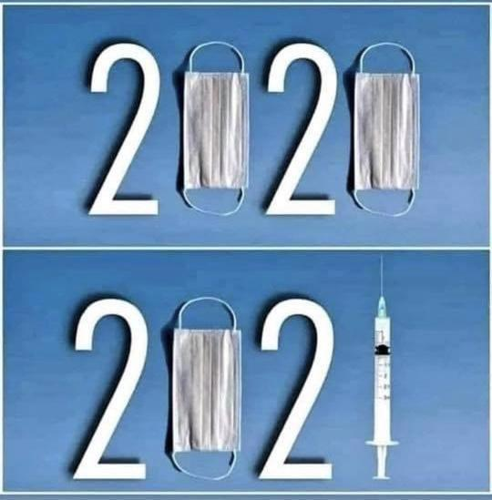
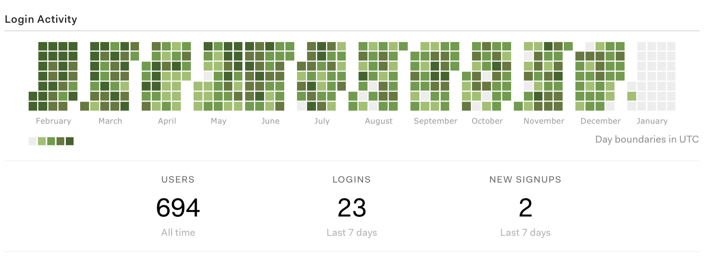
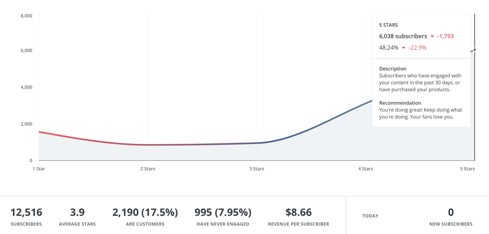
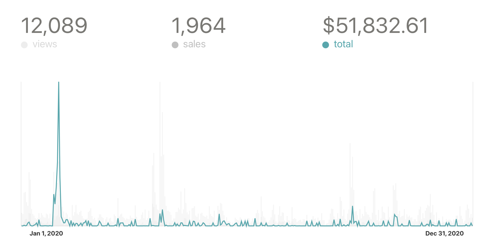

2020 feels like a decade of history packed into a couple short months.

Yet nothing happened. We waited. Lived in starts and sputters as restrictions came and went.

So much Netflix 🤮

https://twitter.com/Swizec/status/1345027516184973312

## The days are long but the weeks are short

> Most people overestimate what they can do in one year and underestimate what they can do in ten years.
> ~ Bill Gates

Since 2020 felt like the longest decade, we got a decade of work done ... right?

Not quite my friend.

For me, the year felt like a war of attrition. Little by little, hour by hour, time slipped through my fingers.

Each day felt endless. Dragging. Like you couldn't find enough to do to fill such a long stretch of time.

And then it's next week. 😳

The year that felt like a drag and ended in the blink of an eye.

Think of noteworthy events in your life since March. _Your_ life. Not politics, not news, not pandemics. What did _you_ do?

## What did Swiz do

I wish I could share a [heroic story like last year](https://swizec.com/blog/how-my-bank-account-went-from-dollar909-to-dollar50000-in-2019). A story of bucking trends, beating odds, winning life.

Instead it's a story of grey. Habits, systems, brick stacking. Smol success.

A story of days that felt meh. Without a goal, little direction, hanging on by a thread. Habits kept me going.

### New habits

I started a plague diary. Every morning I write 3 pages by hand. Clear the cobwebs. Write what comes to mind.

https://twitter.com/Swizec/status/1304792843223851009

It's been wonderful. Better than the [750words.com](https://750words.com) digital version.

Writing by hand feels nice. Slow. Gets you off the computer. 😌

And I've been getting up early!

The guy who wrote [Why Programmers Work at Night](https://swizec.com/blog/why-programmers-work-at-night-2) now gets up at 6am. Sometimes earlier.

It's better that way. Lets you think your own thoughts before your brain is full of other people's crap.

As long as you avoid the internet. I'm working on that part 😅

### Trends that continued

2020 was the year of keeping on.

Worked on my business in the mornings before the day job. That flow worked wonders.

Translated to [1319 dones](https://wip.co/@swizec/year-in-review-2020), [94 new posts on swizec.com](https://swizec.com/blog), a few emails just for the newsletter. Not sure how many videos I uploaded to YouTube.

But 234 video lessons on Vimeo 🤘 for folks who buy a course. The embedded player looks nicer.

694 users of my new course platform. Coming back and logging in, not just buy and forget ❤️

And it looks like folks continue to enjoy my emails. Engagement fell because I didn't write in December, but looking good.

### \\$\\$\\$

https://twitter.com/ZanKeglic/status/1344418996989399041

[Following the Profit First method](https://swizec.com/blog/how-my-bank-account-went-from-dollar909-to-dollar50000-in-2019#profit-first-or-how-i-actually-saved-50k-and-paid-off-debt) has done wonders. The year felt stable with little stress.

It helps that [in June I changed jobs](https://swizec.com/blog/how-to-grow-as-a-senior-engineer-or-why-i-got-a-new-job). Now there's exciting new challenges and way more salary.

Was going to make a product around job searching and interviewing, but the process took a week. There was nothing to say.

It surprised me how easy the path to ridiculous money is in San Francisco. As long as you're okay working for someone else. 2 days of effort turned into a $40k raise 😅

That shook me. Rocked my worldview.

https://twitter.com/Swizec/status/1339734033081671683

Yes those are my numbers.

Going into 2021, the LLC has a 6 month runway for my salary (dayjob pays through LLC for reasons), prepaid all taxes, got 100k in my index funds, and 50k in the retirement fund.

https://twitter.com/Swizec/status/1331284284154335232

The pressure is off and that's weird.

For the last 32 years of my life, money has been _the_ source of stress, worry, concern, and drive. Now I'm fast approaching the _"Eh it's just money"_ mentality.

And I look at my bank account every day. _"Is it still there? Was I dreaming? Am I safe? What did I forget to pay, this can't be real"_

People who experienced broke-ness get it.

### Bricks that got stacked

2020 saw a lot of brick stacking. Work that takes time and effort today and brings results tomorrow.

Or next year 🤞

A big one was [migrating swizec.com from Wordpress to Gatsby](https://swizec.com/blog/lessons-from-migrating-a-14-year-old-blog-with-1500-posts-to-gatsby). Huge improvement in readability, authoring, and reader experience.

Needs more but it's a great start.

And there's a course platform now! [ReactForDataviz.com](https://reactfordataviz.com), [ServerlessReact.dev](https://serverlessreact.dev), and [ServerlessHandbook.dev](https://serverlesshandbook.dev) run off the same Gatsby codebase packaged as an NPM install. 🤘

Super exciting. I think there's big potential here.

Best part is that I can create different newsletter signup flows for different topics. That's going to be a fun playground in 2021.

Another great bit of brick stacking were the workshops and research I did in Q4 – September to December. Building a huge revamp of ServerlessReact to launch soon.

And we can't forget [useAuth.dev](https://useauth.dev). Not sure yet if that's a brick or a distraction, but it's helping people with an annoying task.

Fingers crossed the hard work improves this graph.

### Building a team

Oh, I've been building a team. Outsource aspects of business that others can do.

https://twitter.com/Swizec/status/1253796006698737664

Harder than I thought. Mad respect to everyone who gets it right fast.

We're making good progress. Coming together, building systems, figuring out how to do it right. I fear I jumped too early and there isn't enough demand and revenue.

But without this I'll die. Can't do everything yourself. Such is the bootstrapping paradox.

There's entire blogs I could write about this. Lemme know if you're interested.

## What Swiz failed to do

Highlights are nothing without the lowlights.

Here's everything that failed:

- did not make $130k in product sales (the main goal)
- didn't finish [ServerlessHandbook.dev](https://serverlesshandbook.dev) (1.5 chapters left)
- disappointed folks with editing delays on ServerlessReact.dev
- failed to make SRD as good as I wanted (fixing)
- didn't start a daily short video thing
- couldn't grow sales for RDV (still at $1k/month average)
- didn't crack newsletter growth (churn and growth are balanced)
- didn't build markdownemail.com
- failed to fix UX of SparkJoy widgets at bottom of emails
- didn't build a SaaS
- failed to build a marketing flywheel
- failed to outsource parts of creation process
- did not take a break after every quarter
- haven't productized the course platform
- can't run 26km under 2 hours

😅

## A year of lasts

Towards December 2020 a thing became clear: I need to kill my darlings.

Too many projects that are in progress. Too many good habits. Too much everything.

https://twitter.com/Swizec/status/1334201415078612993

This year I want to go deep. Fewer projects. More shipping, more value, bigger. Focus on long-term games and building assets.

Don't know what's getting killed yet. I love my darlings. ❤️

What's your plan for 2021? How can I help?

Happy new year, 
~Swizec

PS: can you answer [a couple questions about these emails](https://swizecteller.typeform.com/to/Sko9g6tM) to help me improve?
