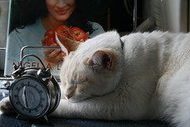

")

- moving to not-[wordpress](http://wordpress.org "WordPress") is a problem because I'd have to migrate plugins, the layout, and so on
- on using _static page generator_ ... my wordpress is configured to do just that, all you see are static pages
- my hosting is free, I like [free stuff](http://FreeStuff4Free.com "Free Stuff")
- this host has withstood traffic of _500 **visitors**_ a second (each visitor translates into 10+ requests)
- I don't like doing sysadmining

## The Story of Being a Free User and Not Buying Enough [Cakes](http://en.wikipedia.org/wiki/Cake "Cake")

__**\_\_**\_**\_\_\_**

###### Related articles

- [Archie the cake eating dog.](http://mertonmick.wordpress.com/2012/05/10/archie-the-cake-eating-dog/) (mertonmick.wordpress.com)
- [Sysadmin Sunday 78](http://blog.serverdensity.com/2012/05/06/sysadmin-sunday-78/) (serverdensity.com)
- [The Most Important things for running a Reliable Internet Service](http://etbe.coker.com.au/2012/04/17/reliable-internet-service/) (etbe.coker.com.au)
- [The Best-Laid Plans of SysAdmins, or Trading Off Capital Vs. Labor](http://smallshoptechheavy.wordpress.com/2012/04/16/the-best-laid-plans-of-sysadmins-or-trading-off-capital-vs-labor/) (smallshoptechheavy.wordpress.com)
- [Fighting boredom at a sysadmin job by writing a binary grabber](http://rachelbythebay.com/w/2012/03/07/nb/) (rachelbythebay.com)

