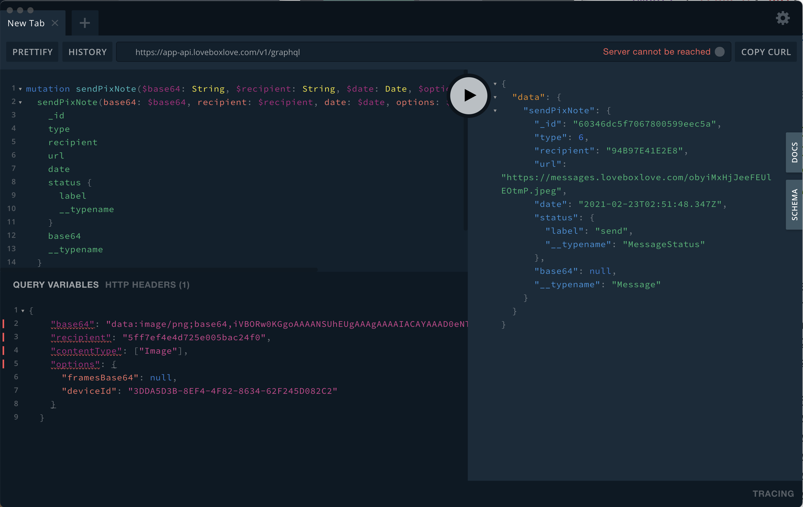

Epic stream Friend! We used a man-in-the-middle attack to snoop an app's API traffic, replayed it in a GraphQL client, and successfully put it inside an AWS Lambda 🤘

_CodeWithSwiz is a weekly live show. Like a podcast with video and fun hacking. Focused on experiments and open source. [Join live most Mondays](https://youtube.com/swizecteller)_

For Valentine's day The Girl got a [Lovebox](https://en.lovebox.love/) – an IoT device that accepts love notes, spins a 3D printed heart, and shows your note on a color screen. She loved it. 😍

And you know how this goes, right?

Day 1: Send 20 notes

Day 2: Send 2 notes

Day 3:

Day 4:

...

But if you could automate it to send cute notes and pictures from your relationship at random intervals 🤔

[https://twitter.com/Swizec/status/1361141468803461121](https://twitter.com/Swizec/status/1361141468803461121)

## The plan

Lovebox's marketing team says _"Send notes to your Lovebox from an app, it's cute and awesome and shows Your Person you thought of them!"_

As a nerd that reads: _"We have an API."_

How else would it work? There must be a server. Apps send API requests to the server, server reads a lookup table, sends message to the box – a tiny computer – through another API.

1.  Read API traffic from app to server
2.  Find request that sends a message
3.  Replay request
4.  Create AWS Lambda that runs on schedule
5.  Send random notes

## Step 0: Fail to hack the API

[https://www.youtube.com/watch?v=ndLGFx7U--w](https://www.youtube.com/watch?v=ndLGFx7U--w)

Lovebox has a webapp and that's a great first target. Log into the app, open Chrome's network tab, see a tonne of graphql requests, send a message.


We got it!

Alas, the webapp doesn't work with v2 of the Lovebox. Old API, no support for color. When you click the upgrade button your box can get color pictures, but not requests from the old API. 💩

Snooping iOS traffic stumped us.

## Step 1: Use Charles Proxy to snoop iOS traffic

[https://www.youtube.com/watch?v=cvvPLlP4518](https://www.youtube.com/watch?v=cvvPLlP4518)

Off stream I discovered [Charles Proxy](https://www.charlesproxy.com/), a tool for "debugging" web traffic.

You run the app on your phone, enable proxying, set up SSL proxy, and use the Lovebox app. Charles Proxy convinces your iOS networking layer to send every request through the app.

SSL proxying is important. It lets you read the content of encrypted https connections and the target app doesn't even notice. Classic [man-in-the-middle](https://en.wikipedia.org/wiki/Man-in-the-middle_attack) attack.

[](https://youtu.be/cvvPLlP4518?t=679)

You get a request trace that you can export to the Charles Proxy desktop app.

## Step 2: Dig through the API trace


We dug through the trace and found the GraphQL request that sends a note – `sendPixNote2`.

Looks like every note is sent as a base64-encoded PNG image. We tried pictures and text and they all looked like this.

The `recipient` must be my Lovebox's ID, `contentType` needs further exploration but `["Text"]` and `["Image"]` both worked, and `deviceId` looks like my phone. Not sure that's important.

GraphQL ~~query~~ mutation in the request looks like this:

```graphql
mutation sendPixNote(
  $base64: String
  $recipient: String
  $date: Date
  $options: JSON
  $contentType: [String]
) {
  sendPixNote(
    base64: $base64
    recipient: $recipient
    date: $date
    options: $options
    contentType: $contentType
  ) {
    _id
    type
    recipient
    url
    date
    status {
      label
      __typename
    }
    base64
    __typename
  }
}
```

Nice thing about reverse-engineering GraphQL is that every request tells you what it's doing. Downside is you have to click on every request because they're all to the same endpoint.

## Step 3: Replay requests in GraphQL client

Before you start coding, you gotta verify you can hack the API. We used a [desktop GraphQL Client](https://github.com/graphql/graphql-playground).

Start easy, can you send requests at all?


Add an authorization header with a JWT token `Authorization: Bearer ...` – copypasta'd from our API trace – use the right GraphQL endpoint, and press play.

it worked 🎉

## Step 4: Your first modified request

We tried a few more requests and confirmed that sending works. `sendPixNote` using the same data made our heart spin.


Fantastic! Now you know it's gonna work.

Next we tried a modified request with a custom payload. Found an image online, converted to base64, pasta'd in there.



Apollo's GraphQL Playground client lets you do that by changing variables bottom left. Much easier than futzing around with REST.

And the Lovebox displayed a blue fish.

[](https://youtu.be/cvvPLlP4518?t=2215)

Huzzah!

## Step 5: Copy request into an AWS Lambda

Request works, next we gotta move into a Lambda. We used Prisma's minimalist [graphql-request](https://github.com/prisma-labs/graphql-request) library.

```typescript
// src/lovebox.ts

import { request, gql, GraphQLClient } from "graphql-request"

const client = new GraphQLClient("https://app-api.loveboxlove.com/v1/graphql", {
  headers: {
    // TODO: figure out how to login
    Authorization: "Bearer ...",
  },
})

// copypasta the variables
const variables = {
  base64: `data:image/png;base64,...`,
  recipient: "...",
  contentType: ["Image"],
  options: {
    framesBase64: null,
    deviceId: "...",
  },
}

export const sendNote = async () => {
  const res = await client.request(
    gql`
            // copypasta the mutation
        `,
    variables
  )

  console.log(res)
}
```

`sendNote` is an async method invoked by AWS Lambda as a cloud function. It takes the initialized and authenticated `GraphQLClient`, feeds it the same mutation and variables we had before, prints the result.

Yes I pasted the whole base64 string for a 16KB image. Redacted 😅

Configure in `serverless.yml` as a function with no triggers.

```yaml
# serverless.yml
service: lovebox-lambda

provider:
  name: aws
  runtime: nodejs12.x
  stage: dev

functions:
  sendNote:
    handler: dist/lovebox.sendNote

package:
  exclude:
    - node_modules/typescript/**
    - node_modules/@types/**
```

Name the project `lovebox-lambda`, set basic provider config, declare a function, exclude typescript cruft on deploy.

Later we'll add a cronjob trigger.

## Step 6: Test your AWS Lambda locally

```
$ sls invoke local -f sendNote
```


[https://twitter.com/Swizec/status/1364050018064162824](https://twitter.com/Swizec/status/1364050018064162824)

It worked! 🥳

Next episode we'll take this lambda, hook it up to an S3 bucket, and automate the shit out of my boyfriend duties.

Cheers,<br/>
~Swizec

[sparkjoy|code-with-swiz-24-lovebox1]
