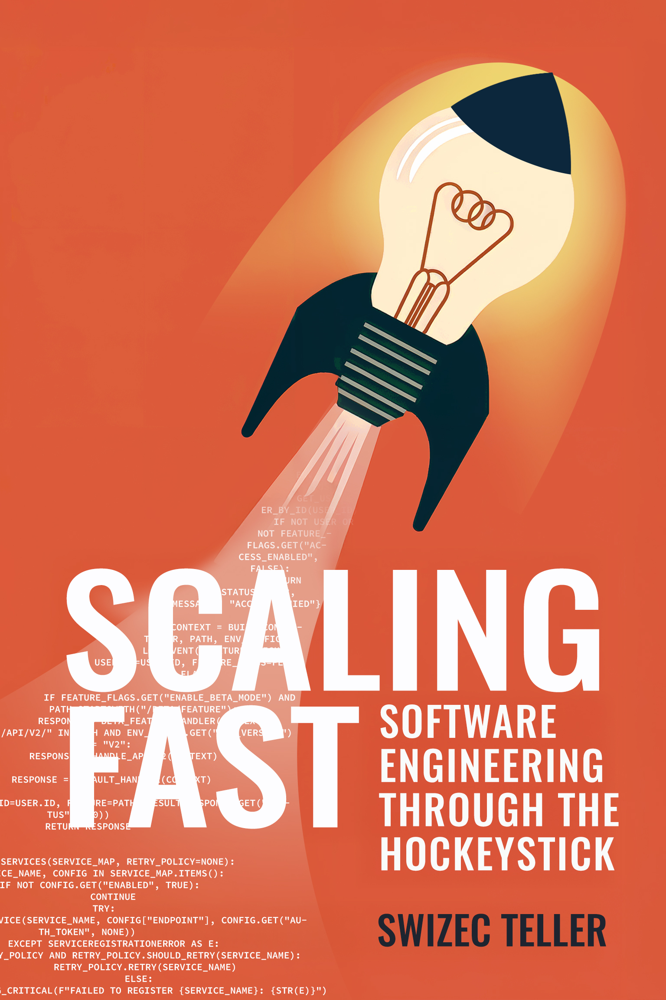

Hockeystick moments are the biggest opportunity of your career. My new book Scaling Fast is your guide.

Rapid growth is exciting and a little scary. Everything changes! From how you work as a team to what it means to write code. Your decisions can build momentum or suffocate your growth with bad code and a team that can't ship.

I wrote [Scaling Fast: Software Engineering Through the Hockeystick](https://scalingfastbook.com) as your guide and after almost 3 years of writing, research, and editing it's now available in paperback and ebook wherever books are sold 🥳

Scaling Fast is based on startup war stories, academic research papers, talking to my mentors, and reading industry insights. It shows you what it takes to survive and thrive through the hockeystick. You'll learn about scaling teams and scaling code, how they influence each other, and why none of it matters if the business is bad.

## What's in the book

[Scaling Fast: Software Engineering Through the Hockeystick](https://scalingfastbook.com) is organized in 3 sections:

- Scaling the Business
- Scaling the Team
- Scaling the Tech

**The business part**, that's to help you evaluate the companies you join, this isn't a business book.

**The team part**, that's key to shaping your everyday. We talk about delegating decisions, empowering engineers, working smooth instead of fast, finishing things all the way to done, good code review culture, and shipping incrementally without risky big bang releases.

**The tech part**, that's my favorite. We talk about good abstractions, architectural complexity, observing your systems break, making steady improvements to your code without huge refactoring sprints, why tests don't solve everything, what's even worth testing, how your team structure impacts what you can do with the code, and why solving today's problem is more important than building for an imagined future.

None of it is about numerical scaling. That's easy in 2025. Computers are fast. The challenge is building complex systems that don't fit in any one person's brain without breaking the business. When you're making 20 million, you can't just stop and rewrite your way to 100 million.

Software engineering when your whole company changes every 6 months is the fun part of this gig. And that's what Scaling Fast is about.

👉 https://scalingfastbook.com

A friend looked at an early copy and said _"Swiz, you wrote a principal engineering book"_. I hope it lives up to that praise.

Questions? Hit reply

Cheers,
\~Swizec

PS: Scaling Fast is everything I learned about startup software engineering since founding my first company back in 2009. Compressed into 240 pages and a few dozen pictures. I think you'll like it. The paperback is fantastic
