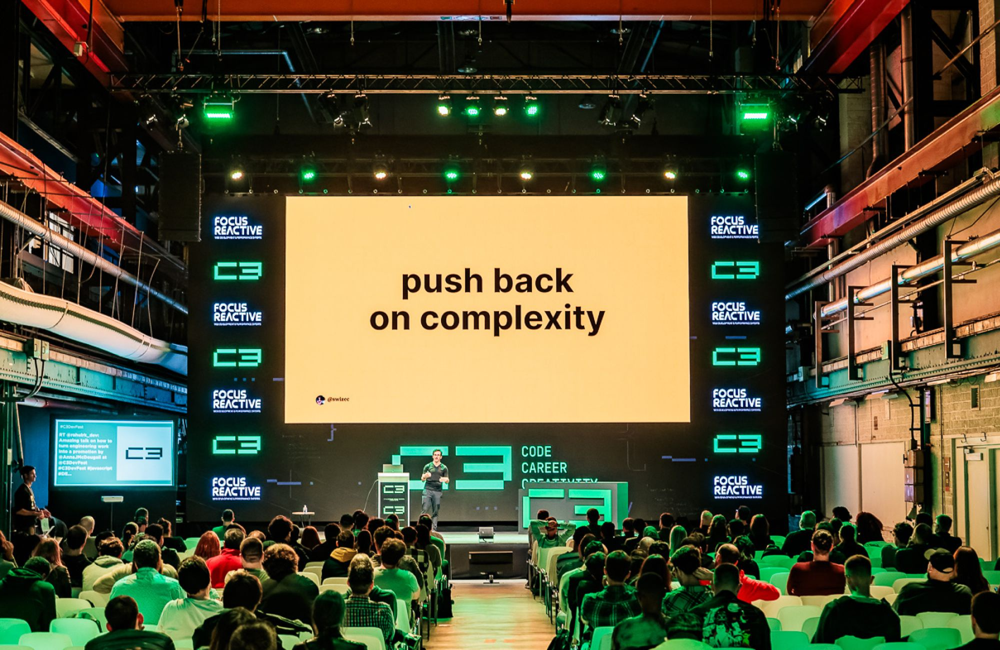
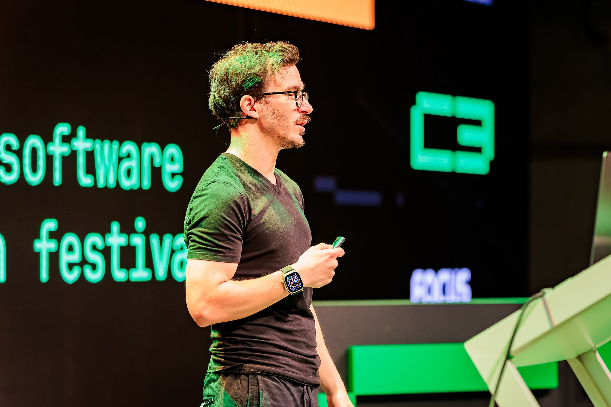

This talk from C3Fest summarizes the key lessons I've learned in the past ~15 years of working in tech startups. It's a high level overview of a new book I'm writing (60% done).

[The talk](https://portal.gitnation.org/contents/scaling-fast-engineering-lessons-from-15-years-of-tech-startups-2285) came out great, if a little packed for 20min. Enjoy ❤️

For a 5pm last-talk-of-the-conference that's a pretty packed room.

## Key points

With links to past articles because ideas take time to develop :)

- if the business isn't working, the rest doesn't matter
- [how you scale the team impacts all else](https://swizec.com/blog/scaling-teams-is-a-technical-challenge/)
- [vertical over horizontal teams](https://swizec.com/blog/get-us-over-the-water-not-build-us-a-bridge/)
- [coordinating at the end is too late](https://swizec.com/blog/coordinating-at-the-end-is-too-late/)
- fast iteration cycles beat careful upfront design
- write boring code
- focus on [architectural complexity](https://swizec.com/blog/why-taming-architectural-complexity-is-paramount/)
- use [vertical components](https://portal.gitnation.org/contents/forget-bad-code-focus-on-the-system) (this one's a talk)
- [separate deployment from delivery](https://swizec.com/blog/how-to-use-feature-flags/)
- [your code is not the goal](https://swizec.com/blog/the-code-is-not-the-goal/), giving users new superpowers is

And here's one more cool pic from the talk.

As a side-note: this was my first time writing out the entire talk beforehand word for word. Tried a new app, [iA Presenter](https://ia.net/presenter), that turns your notes into a teleprompter.

The writing was useful and made the talk better. But I suck at using a teleprompter and the app way overestimates how fast I can read out loud so I had to improvise 😂

Cheers, 
\~Swizec
