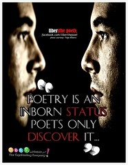

> Poetry is a literary form in which language is used in a concentrated blend of sound and imagery to create an emotional response. ~ Levin (1962)

____

## Poeticness

> Sparkles of whiteness fly in my eyes, The moan of stars swang branches of trees, The heart of time sings in the snowy night. Seconds of Eternity fly in grass, The Clock of rain turns, Death of the Apples, The Equinox penetrates the words.

Is it a real poem? I don't know, but the experiment doesn't look very falsifiable either. Any [automatic poetry](http://en.wikipedia.org/wiki/Surrealist_techniques "Surrealist techniques") generator bumps into the problem that _Readers of \[poetry] are prepared to do considerable interpretative work ... In general, the more the audience is prepared to contribute in responding to a work of art, themore chance there is that a computer's performance may be acknowledged as aesthetically valuable (Boden 1990)_ The implication being "this shit is simple". But that's abusing the concept of poetic license - something we want to avoid and make life harder for ourselves.

## Grammaticality

> A poem must obey linguistic conventions that are prescribed by a given grammar and lexicon. This is perhaps the most obvious requirement that by definition all natural lan- guage artifacts should fulfill. However, in the context of poetry, it is important to state explicitly, as there is the danger of invoking poetic license (see previous section).

Essentially, we are avoiding purely random strings of words. For instance: according to _hyperbaton _(a defined figure of speech) the line "I was in my life alone" is allowed, but "In I life was alone my" is just silly.

## Meaningfulness

****

## Useful definition

Finally we reach a useful definition of poetry:

> A poem is a natural language artifact which simultaneously fulfills the properties of meaningfulness, grammaticality and poeticness. In other words, a text x is a poem if x ∈ P ∩ G ∩ M.

For this definition to be complete, further specification must be done on defining meaningfulness and poeticness - something I hope the authors have published papers on since 2003, otherwise this is an area I hope to tackle in my thesis. Since we can measure the technical aspects of poeticness, this definition favors classical poetry - a good thing, since I personally have always found modern poetry to be somewhat contrived in its desperate attempts to be _art_. Greeting card poetry serves as a good example of poetry fitting our definition.

> Far and away you may be, But the presence of your love is here with me

###### Related articles

- [New: Index of Poems](http://juliecatherinevigna.wordpress.com/2012/03/25/new-index-of-poems/) (juliecatherinevigna.wordpress.com)
- [Science Wednesday: Towards a computational model of poetry generation](http://swizec.com/blog/science-wednesday-towards-a-computational-model-of-poetry-generation/swizec/3855) (swizec.com)
- [Poetry in motion](http://cgdelarey.wordpress.com/2012/03/27/poetry-in-motion/) (cgdelarey.wordpress.com)
- [Explore Poetry in April](http://caterpillartooth.wordpress.com/2012/03/27/explore-poetry-in-april/) (caterpillartooth.wordpress.com)
- [celebrating the amazing poets behind One Stop Poetry {redux}](http://haikulovesongs.wordpress.com/2012/03/27/celebrating-the-amazing-poets-behind-one-stop-poetry-redux/) (haikulovesongs.wordpress.com)
- [Guest Post by G.P.A - Spoken Word is not Poetry](http://alchemyofscrawl.wordpress.com/2012/03/24/guest-post-by-g-p-a-spoken-word-is-not-poetry/) (alchemyofscrawl.wordpress.com)
- [Found/Black Out Poetry Tuesday: Emotions and Sharp Edges](http://rainingink.wordpress.com/2012/03/27/foundblack-out-poetry-tuesday-2/) (rainingink.wordpress.com)

