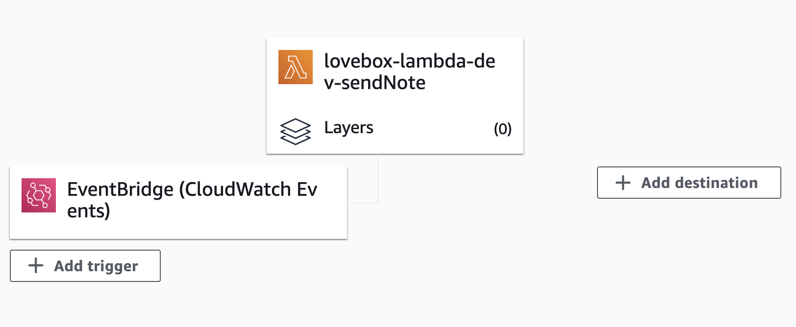

import { ContentUpgrades } from "@swizec/gatsby-theme-course-platform";

We did it! We finished the experiment from a few weeks ago and The Girl can stop making jokes that I stole her present 🎉

https://www.youtube.com/watch?v=2TCJli7t3nE

Here's the plan:

1.  Buy cute IoT gimmick for Valentine's Day ✅
2.  [Reverse engineer its API](https://swizec.com/blog/reverse-engineer-a-graphql-api-to-automate-love-notes-codewithswiz-24) ✅
3.  Build serverless Lambda that sends a picture ✅👆
4.  Move secrets to secrets manager ⌛️
5.  Read photos from S3 ⌛️
6.  Send base64 encoded photos ⌛️
7.  Run daily ⌛️

The Girl was getting upset with me [name|Friend]. Waiting for those last 3 steps since February while I focused on [Serverless Handbook](https://serverlesshandbook.dev).

She waits no more! It's live



You can [see the full code on GitHub](https://github.com/Swizec/lovebox-lambda). Here's what we built:

<ContentUpgrades.ServerlessHandbook />

## Secrets in secrets manager

Never deploy code with secret API keys in the files. You _will_ get hacked and your data _will_ get leaked.

And when we're talking anonymous strangers from the internet can send dick pics to your girl ... nu-uh. All identifying info and API tokens went into the AWS Secrets Manager.

Accessed in code like this:

```typescript
// src/secrets.ts

import { SecretsManager } from "aws-sdk";

const ssm = new SecretsManager({
  region: "us-east-1", // make sure this matches your region
});

export async function getBearerToken() {
  const secret = await ssm
    .getSecretValue({ SecretId: "loveboxBearerToken" })
    .promise();

  const { BEARER_TOKEN } = JSON.parse(secret?.SecretString || "");

  return BEARER_TOKEN;
}
```

Grab the `SecretsManager`, instantiate with our region, write helper function to grab the API token. It talks to secrets secrets manager, retrieves the `loveboxBearerToken` secret, parses the JSON response and returns what we need.

I added my other secrets later.

And we remembered to give our Lambda permissions to read secrets:

```yaml
# serverless.yml
provider:
  # ...
  iamRoleStatements:
    - Effect: "Allow"
      Action:
        - "secretsmanager:GetSecretValue"
      Resource: "arn:aws:secretsmanager:${self:provider.region}:*"
```

Borrowed all this from the [Serverless Handbook chapter on secrets](https://serverlesshandbook.dev/handling-secrets/). No point in memorizing what you can look up 😇

### Using secrets for the GraphQLClient

We need the bearer token to authorize our GraphQL client with the API. Means we have to instantiate with an async function.

But talking to SecretsManager is an API call itself and that could make our Lambda slow. The answer is memoization.

```typescript
let graphQLClient: null | GraphQLClient = null;

async function createGraphQLClient() {
  if (graphQLClient === null) {
    const token = await getBearerToken();

    graphQLClient = new GraphQLClient(
      "https://app-api.loveboxlove.com/v1/graphql",
      {
        headers: {
          Authorization: `Bearer ${token}`,
        },
      }
    );
  }

  return graphQLClient;
}
```

We create a global variable `graphQLClient`. When it's defined `createGraphQLClient` returns the client, when it isn't it first instantiates our client after reading the token from secrets.

This lets us skip the secrets call when our Lambda gets reused ✌️

## Read photos from S3

Reading photos from S3 happens in two steps:

1.  Get list of photos in bucket
2.  Read random photo

### List photos

We start by giving our lambda permissions to read S3.

```yaml
# serverless.yml

provider:
  # ...
  iamRoleStatements:
    # ...
    - Effect: "Allow"
      Action:
        - "s3:listObjects"
      Resource: "arn:aws:s3:::lovebox-stash/*"
```

Yes, the S3 bucket is called `lovebox-stash`.

Then we create a helper function that grabs a list of objects from S3. This part was uneventful, but we had to make sure it works.

```typescript
// src/pictures.ts

import { S3 } from "aws-sdk";

const s3 = new S3({
  apiVersion: "2006-03-01",
});

async function listPictures() {
  const list = await s3
    .listObjects({
      Bucket: "lovebox-stash",
    })
    .promise();

  return list.Contents;
}
```

Instantiate an S3 client, keep it shared between Lambda calls, make a request to S3 to list every object in the bucket.

### Read random photo

Grabbing a random photo is a matter of maths and fetching an S3 object. Like this:

```typescript
// src/pictures.ts

export async function getPicture() {
  const pictures = await listPictures();

  if (pictures) {
    const randomPic = pictures[Math.floor(Math.random() * pictures.length)];

    if (randomPic.Key) {
      const imageData = await s3
        .getObject({
          Bucket: "lovebox-stash",
          Key: randomPic.Key,
        })
        .promise();

      return imageData;
    }
  }

  return null;
}
```

Grab list of photos, pick at random, read data. Ifs help with error handling.

## Send base64 encoded photos

The final `sendPicture` function looks like this:

```typescript
async function sendPicture(picture: S3.GetObjectOutput) {
  const base64 = `data:${picture.ContentType};base64,${picture.Body?.toString(
    "base64"
  )}`;
  const client = await createGraphQLClient();
  const { recipient, deviceId } = await getRecipient();

  const res = await client.request(
    // query,
    {
      base64,
      recipient,
      contentType: ["Image"],
      options: {
        framesBase64: null,
        deviceId,
      },
    }
  );
  console.log(res);
}
```

Get random photo, encode in `base64`, add the mime type. Create authorized GraphQL client, get recipient secrets, send as variables to the GraphQL query.

And you get a happy Swiz


## Run daily

This part's easy 👉 add cron config to `serverless.yml`

```typescript
# serverless.yml

functions:
    sendNote:
        handler: dist/lovebox.sendNote
        events:
            - schedule: rate(1 day)
```

Run daily, at a time of your choosing.

Cheers,<br/>
~Swizec

PS: the [Serverless Handbook](http://serverlesshandbook.dev/) paperback is now $36 on Amazon, not sure why but check it out if you're curious
