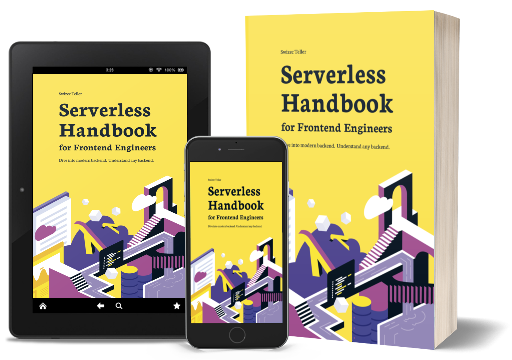
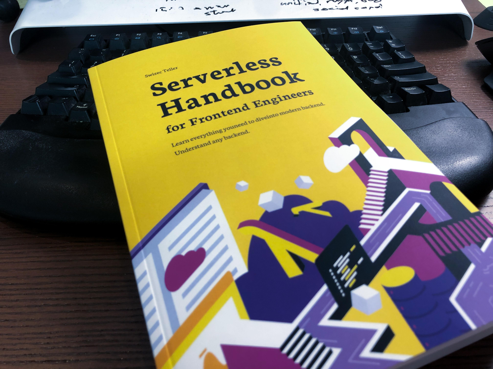

import { ContentUpgrades } from "@swizec/gatsby-theme-course-platform"

Been talking about serverless the past few weeks – for 2 reasons 👇

1.  New book coming out Mar 31st and it's looking bomb
2.  Serverless is the future

## Serverless is the future

While we were focusing on React and state management and the exact best way to put CSS in your JS, the backend has been making strides.

They went from _"Lemme spend 3 days setting up Linux and networks and routing and daemons and all the things every time we need a live URL"_ to `yarn deploy`.

No more sysadmin wizards needed ! Write your code as JavaScript functions, hit deploy, get a URL 😍

**If you can JavaScript, you can backend.**

But diving into modern backend can be daunting. _Any_ change of tech is daunting!

You have to learn new phrases to google, new technologies to understand, entire new mindsets for what's important. And when you uncover all the details, you still have to make them fit together.

It took me _months_ of research, tinkering, side projects, and gnarly production bugs to figure it out. It was a fun challenge!

But lemme tell ya, reading the 20th comment of comment on a StackOverflow answer at 9pm, I wanted to bang my head against the wall.

The number of times I thought _"Wish there was a book about this that doesn't assume I'm some gnarled backend veteran"_ was too damn high!

## Announcing Serverless Handbook for frontend engineers

That's why the book I wish I had publishes Mar 31st 🥳

[Serverless Handbook](https://serverlesshandbook.dev) grew out of that frustration with learning serverless on my own. Figuring it out from scratch, making zero progress, and _knowing_ that this is the future.

The future because it removes many of the worst parts of web development. The future because it empowers _everyone_ to build whole apps.

It isn't just the tech that's changing [name|my friend], it's the tooling. _That's_ what excites me.

Easy to use, fun to collaborate, rock solid, stable servers. No devops required ❤️

### Who it's for

The [Serverless Handbook](https://serverlesshandbook.dev) is a **why and mindset** book aimed at frontend engineers taking their first dive into backend and backend engineers dipping their toes into serverless.

It's not a recipe book.

You won't learn how to cook pasta carbonara only to get stumped by pasta alfredo. You'll learn how pasta works. Any pasta.

Several chapters use tutorials to illustrate a point and get you started. Others use stories and lessons from practice.

In the words of an early reader:

> Serverless Handbook taught me high-leveled topics. I don't like recipe courses unless I'm building the exact same project.
>
> These chapters helped me to feel like I'm not a total noob anymore.
>
> The hand-drawn diagrams and high-leveled descriptions gave me the feeling that I don't have any critical "knowledge gaps" anymore.

Thanks Marek, exactly what I was aiming for ❤️

If you want to _understand_ serverless and backend development [name|my friend], the [Serverless Handbook](https://serverlesshandbook.dev) is for you.

### What's in the book

Serverless Handbook is a 360 page book with code, color illustrations, and gifs. Gotta have gifs!

And the cover is going to look great on your bookshelf. This ain't your grandma's boring tech manual 😛

Watch the [paperback walkthrough](https://youtu.be/WC-mEf4K9as?t=1203)

[https://youtu.be/WC-mEf4K9as?t=1203](https://youtu.be/WC-mEf4K9as?t=1203)

You get 19 chapters that take you from _"What the heck is serverless?"_ all the way to masterfully building and designing your API, knowing the pros & cons, understanding REST vs GraphQL, authentication, secrets, deployment strategies, and how to keep your system robust and reliable. You'll even learn about different databases and when to use them.

With your paperback comes full access to the digital version.

Watch the [chapter walkthrough](https://youtu.be/WC-mEf4K9as?t=1772) for details.

[https://youtu.be/WC-mEf4K9as?t=1772](https://youtu.be/WC-mEf4K9as?t=1772)

Honestly, the Serverless Handbook is worth it even if you never build a serverless anything. Just understanding when to use Postgres vs. Mongo, or REST vs. GraphQL is gold.

You know, the conversations and opinions that take you from code monkey to senior engineer 😉

Coming to an Amazon link near you on Mar 31st.

Questions? Hit reply

Cheers, 
~Swizec

PS: I was going to share a pre-order link today, but my publisher hiccuped. Mar 31st!
