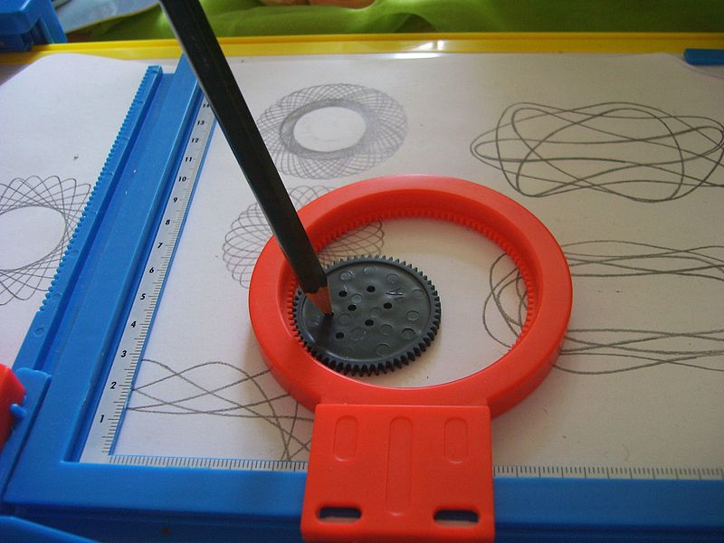

You probably remember spirographs as kid's toys from your youth. I had a simple set that was just a collection of plastic sprockets with holes for pencils.

Endless amounts of fun when I was two or three years old. I think ... I don't really remember much from that time, but I remember having those thingies and loving playing with them. One of my earliest memories even!



Last night I was making an animation example for the d3.js book I'm writing and ended up with the idea of progressively drawing out cool looking parametric equations. Little did I know, those are actually spirographs! Learned something while I was learning something.

&lt;tweet gone missing>

My failure in common knowledge aside, it's possible to animate the drawing of parametric equations with just a few lines of [d3.js](http://d3js.org) code. What I'm about to show you has a pretty big problem, but produces cool looking results "in the lab". Try to guess what the problem is.

## Animating spirographs


We'll make an animation timer and for each tick we'll draw a new step of the spirograph. After the spirograph is finished, we'll stop the timer. To make the animation more interesting to watch, we'll also fake a brush flying around (just a black dot).

We start with some basic html:

```html
<title></title>
<link href="../bootstrap/css/bootstrap.min.css" rel="stylesheet" />

<div id="graph"></div>

<script src="http://d3js.org/d3.v3.min.js"></script>
<script src="timers.js"></script>
```

Then we hop into the javascript to flesh out the actual code.

```javascript
var width = 600,
  height = 600,
  svg = d3
    .select("#graph")
    .append("svg")
    .attr({ width: width, height: height });
```

I found the parametric function in the wikipedia's article on parametric equations. We'll be giving it a simple parameter calculated from the animation timer and it will return a two dimensional position.

```javascript
var position = function (t) {
  var a = 80,
    b = 1,
    c = 1,
    d = 80;

  return {
    x: Math.cos(a * t) - Math.pow(Math.cos(b * t), 3),
    y: Math.sin(c * t) - Math.pow(Math.sin(d * t), 3),
  };
};
```

Tweaking the _a_, _b_, c, and _d_ parameters will change the final shape.

Next we're going to define some scales to help us translate between maths space and our drawing space.

```javascript
var t_scale = d3.scale
    .linear()
    .domain([500, 30000])
    .range([0, 2 * Math.PI]),
  x = d3.scale
    .linear()
    .domain([-2, 2])
    .range([100, width - 100]),
  y = d3.scale
    .linear()
    .domain([-2, 2])
    .range([height - 100, 100]);

var brush = svg.append("circle").attr({ r: 4 }),
  previous = position(0);
```

The `t_scale` is going to translate time into a parameter, `x` and `y` calculate proper positions on the final image using the coordinates returned by the position function.

We also put a simple circle on the image - this will represent the brush - and we need to take note of the previous position so we can draw lines between our current and previous state.

```javascript
var step = function (time) {
  if (time > t_scale.domain()[1]) {
    return true;
  }

  var t = t_scale(time),
    pos = position(t);

  brush.attr({ cx: x(pos.x), cy: y(pos.y) });
  svg.append("line").attr({
    x1: x(previous.x),
    y1: y(previous.y),
    x2: x(pos.x),
    y2: y(pos.y),
    stroke: "steelblue",
    "stroke-width": 1.3,
  });

  previous = pos;
};
```

This is our [step function](http://en.wikipedia.org/wiki/Step_function "Step function"). It draws every consecutive step of the animation by moving the brush and putting a line between the current and previous position. The animation will stop when this function returns _true_ so we make sure the _time_ parameter doesn't go beyond _t_scales_'s domain.

Finally, we simply start the timer.

```javascript
var timer = d3.timer(step, 500);
```

The timer will start running after 500 milliseconds and repeatedly call the `step` function until it returns `true`.

You can check the animation out via [the magic of github pages](http://swizec.github.com/d3.js-book-examples/ch4/timers.html). The final spirograph looks like this:


Figured out the problem yet?

The problem with this approach is that I'm using the animation timer itself as a parameter to the function, which means point density depends on how long you're willing to let the animation run. It will always draw the complete function because of how d3 scales work, but it might look _very_ approximate. Think squares for circles approximate.

Another problem is that using a slower computer, or doing anything that lags the CPU even a little bit while the animation is running will ruin the final picture.

For instance, this is what happens when I switch desktops around while the browser is drawing.


