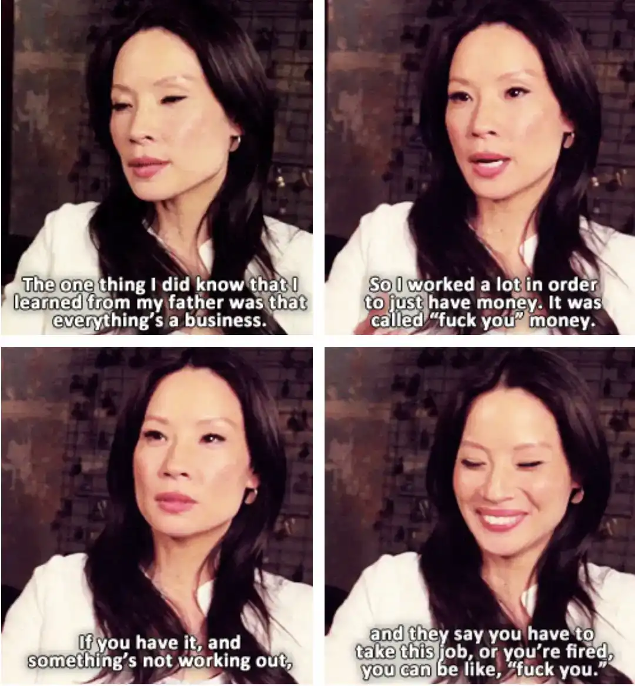

import { ContentUpgrades } from "@swizec/gatsby-theme-course-platform";

Would you take some % of your salary in bitcoin?

https://twitter.com/swyx/status/1311775898958323714

The joke is that compared to pre-IPO equity, bitcoin is predictable and has a known value. But getting your salary in bitcoin feels like a joke and equity is standard in tech 🤔

If you can get post-IPO equity that's a different story.

Public stock has a dollar value, trends you can follow, and teams of hedge fund quants predicting its future. And boy have the markets been good to public tech stock.

Microsoft did 4x in the last 5 years. 😱

If you're at Microsoft, I sure hope you took part of whatever employee stock program they offer. And maybe beer's on you when we meet 😛

## What is equity

> 5.  _Informal_. ownership, especially when considered as the right to share in future profits or appreciation in value.
>
> 6.  the interest of the owner of common stock in a corporation.

When people talk about equity and total compensation, this is what they mean. Ownership of a part of the company you work at.

But not like socialism where workers own the means of production. Like capitalism where workers own shares of the company.

Equity comes in several forms known as [financial instruments](https://en.wikipedia.org/wiki/Financial_instrument). Each gives you different rights and obligations as a share holder.

<ContentUpgrades.SeniorMindset />

Employees can't control this part. Lawyers, investors, and founders make the rules. Read the contract carefully.

[**Options**](<https://en.wikipedia.org/wiki/Option_(finance)>) are the most typical. You get an option to buy company stock at a certain price regardless of current valuation. You're betting value goes up and you can buy for less.

[**RSU**](https://en.wikipedia.org/wiki/Restricted_stock)s – restricted stock units – are what options translate into most often. This is company stock that _you_ own. But there's limitations on what you can do with it. Like a ban on selling without board approval before the company goes public.

[**Common stock**](https://en.wikipedia.org/wiki/Common_stock) is what RSUs turn into after the company goes public. Often, not always. Read your contract. These are the typical shares with no special rights.

[**Preferred stock**](https://en.wikipedia.org/wiki/Preferred_stock) is what investors get. It's company stock they own and get special treatment on top of. Like being paid off first in case the company sells.

Non-public startups grant options or RSUs. The main difference for you is how they're taxed.

Public companies grant common stock. Or they make you _purchase_ stock as part of an employee program.

But then it isn't part of your salary, you're buying as any other market investor. You'll be limited to a trading window either way due to insider trading concerns[^1].

## How equity becomes cash money

Owning equity increases your wealth _but not your riches_.

Being wealthy means you own lots of assets. Being rich means you have lots of income/cashflow.

Modern BigTech valuations make it easy to be wealthy and not afford your rent. If you owned 0.01% of Uber in 2017, you were worth $4.8 million.

But you couldn't use any of it. 🤨

### RSUs and stocks

Owning equity suffers from the gains vs. realized gains problem. You gain wealth any time your company's valuation increases.

Buy 10 MSFT stocks in 2015 for $500, wait 5 years, gain $1630 of wealth.

And before you can enjoy your $1630 windfall, you have to sell. _Selling_ turns gains into realized gains.

Oh and you'll be taxed on that sale. Capital gains are untaxed, _realized_ gains are taxed[^2].

### Options

In 2017 you didn't have Uber _stock_, you had options. Employees of most tech companies own stock options.

You have to _exercise_ your options before selling. That means buying your stock with cash money.

That's right my friend, nothing comes for free. Even tech stock. Yes you've worked hard for your equity, but what you got were options.

Say you were granted 1000 options at $10. That adds to your total comp. Huzzah!

How much? That depends.

1000 options at $10 means you'll have to _pay the company_ $10,000 to turn your options into RSUs or common stock. Hope you saved 😉

Say your company did great and stock is now valued at $50. Congratz you're rich! Pay $10,000 and get $50,000.

_"A-ha"_, the IRS says, _"you made \\\\$40,000 in salary just now! Pay us"_

Your total comp package now has a number attached. This number is taxed.

If you're lucky, the company is now public, you can sell that brand new common stock, pay taxes, and have plenty left over.

But the IRS doesn't care about realized vs paper gains. When you exercise your stock, the delta counts as income. Whether it's cash money or not.

💩

### Vesting and exercise windows

Companies use various machinations on top of RSUs and options to keep you around and make it more or less likely you'll ever see any of that money.

Ideally the company would give you a shitload of options, keep you around for 3 or 4 years, then have you leave without exercising those options. They get a great employee _and_ keep all of the company.

**Vesting** is what keeps you around. You get 100,000 options, yes, _but over 4 years_. Nothing for the first year, then 25%. Known as The Cliff.

After The Cliff, you get part of your options every month. After 4 years you reach 100% of your 100,000 options grant.

You can exercise options as soon as you get them. Or wait until the end. Up to you and the details in your contract.

**Exercise window** specifies how long after leaving a job you can buy your options and turn them into RSUs or stocks. The company would like you not to buy. You want to wait until a liquidation event like an IPO or a sale.

30 days is standard these days. 10 years is becoming the norm in employee friendly companies. Read your contract carefully.

**Reverse-vesting** is done when companies grant RSUs instead of options. You insta-exercise your options and enter a reverse-vesting agreement with the company. _You_ own the shares and your company has an option to buy at price for anything you haven't vested yet.

Same as normal vesting in effect, but the tax implications are friendlier. You don't get a huge windfall after 4 years to be taxed on.

### Preferred shares

Preferred shares mean investors get paid first. If your company sells low, has a bad IPO, or goes bankrupt, the investors eat first.

If there's anything left, you get the scraps.

## To take cash or to take equity 🤔

https://twitter.com/Swizec/status/1292499800600920064

Now the big question, should you take cash or equity?

It depends my friend. You should run the numbers. These numbers:

1.  How much cash are they offering?
2.  How much cash could I get elsewhere?
3.  How much equity?
4.  How much dilution to expect?
5.  How much public equity could I get?
6.  How much can I expect the company to grow?

Think like an investor. Your investment is one of opportunity cost. How much are you losing by working _here_ instead of _there_?

Let's say you're the sort of engineer who could work at a big public tech company.

Those pay around [\\\\$160,000 cash/year](https://www.levels.fyi/company/Facebook/salaries/Software-Engineer/). With an additional $100,000/year in common stock. Remember this is stock sellable on the public market _right now_.

A startup offers $100,000/year plus 0.5% of the company.

With the usual 4 year vesting you're taking a $240,000 cash pay cut compared to Facebook. That's your base investment in the company.

Say it's a seed-stage company valued at $10,000,000. Your 0.5% is worth $25,000 right now. You can't sell it.

With each round of funding, your percentage goes down and your value goes up. If all goes well.

Over those 4 years, assuming no raises, your equity has to go from $25,000 to $240,000 just to make up the cash you're losing. Make that $640,000 to cover the BigTech stock grant.

Do _you_ think this startup is worth investing $640,000 into? Will you make _realized gains_ of at least that or more? Think hard.

And remember, if you get cash, it's yours _right now_. You can invest it, you can use it, you can build a fuck you fund. Compound interest is no joke.

Run the numbers, make sure you're not building a financial hole you'll never patch. Google "returns calculator" and plug your nubmers.

**At the very least make sure the cash you're getting covers your living expenses and your retirement savings.**

Happy Friday ❤️

Cheers, 
~Swizec

[^1] as an employee of a public company you have insight into its operations. The higher up you go, the more insight you get. To avoid insider trading, the SEC asks employees to limit their trading to pre-defined time windows. You decide _"I'm buying X per month"_ for a year in advance. Or in April say _"I'm selling Y in October"_. That avoids trading in reaction to insider info.

[^2] specific details on stock taxation depend on where you live. In USA you get different tax rates for assets sold within 1 year of purchase and later. No taxes on holding without selling.

PS: I am not a financial expert and I do not play one on the internet. This is what I've learned over the past 12 years of working at/on/with startups and reading about these topics. Please talk to an expert before life-changing decisions.
