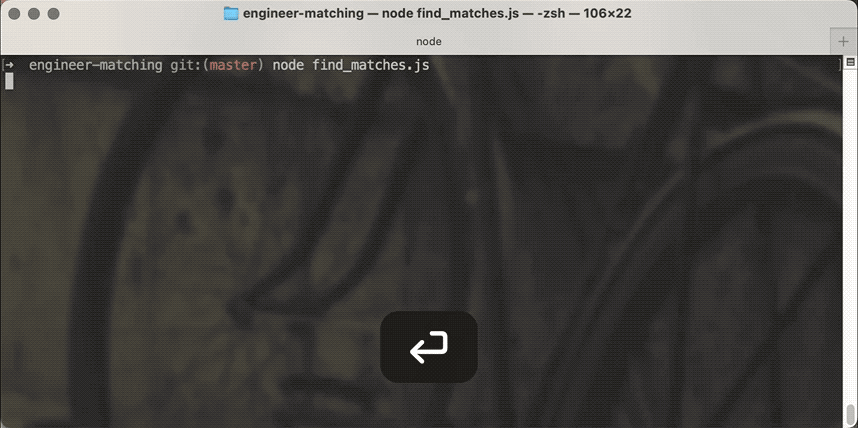
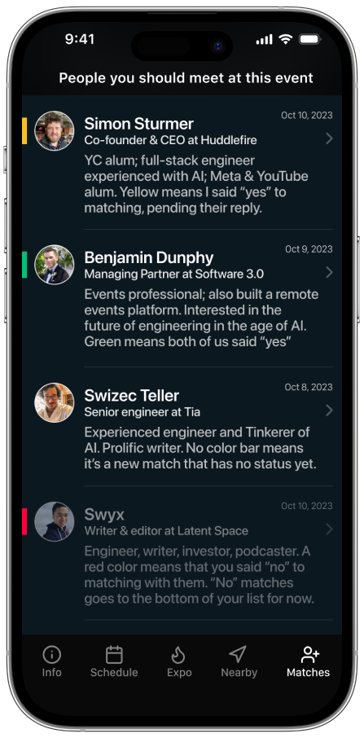

A while back I shared how you can build [semantic search in an afternoon](https://swizec.com/blog/build-semantic-search-in-an-afternoon-yep/) with modern tech. Pretty sweet, right?

That article used a large CSV file as its "database", which is about the slowest most inefficient tool you can use. Reading a huge CSV file into memory, sorting all rows, then picking 5 and throwing away everything else 😂 You can see the slowness of that technique in my [SwizBot built on swizec.com articles](https://swizec.com/blog/how-i-turned-15-years-of-writing-into-a-chatbot/). Every response takes forever.

Last week I tried something faster – pgvector on Supabase!



_PS: you can [read and share this online](https://swizec.com/blog/similarity-search-with-pgvector-and-supabase/)_

## What we're building

That gif shows a similarity search between conference attendees. We're building a tool for [AI Engineer Summit](https://www.ai.engineer/summit) to make the conference more interesting.

Everyone coming to the conference answers a few questions. What are you looking for, what gets you fired up about AI, why are you here?

We find people with matching interests and, if you both say yes, make a warm intro. Go talk to Swizec about building prototypes with LLMs. It's gonna be great.

Here's a mockup of what the UI will look like. [Simon](https://twitter.com/sstur_)'s building that single-handedly because he's awesome ❤️



## What's pgvector? Supabase??

[pgvector](https://github.com/pgvector/pgvector) is a Postgres plugin that adds vector support to Postgres, the best general database out there. It adds a couple new query operators and lets you efficiently store and query vectors as part of a regular database table.

[Supabase](https://supabase.com) is a hosted Postgres provider popular with the serverless crowd. Supabase manages the hosting, offers a nice management UI, and lets you access data through their SDK or a regular Postgres client using SQL queries.

## Building a pgvector similarity search

I built all the code you're about to see using [markdown programming](https://swizec.com/blog/programming-in-markdown/) with ChatGPT. You could optimize parts of the code by hand, but it's fine for the amount of data we've got.

The technique works in 3 steps:

0.  Prep the Supabase DB for pgvector
1.  Compute and store embeddings for every attendee's responses
2.  Find similar attendees with a vector similarity search

All based on OpenAI embeddings. It cost me about $1 to run this for a few thousand rows of data.

### Prep the Supabase DB for pgvector

Supabase comes pre-installed with the [pgvector](https://github.com/pgvector/pgvector) plugin. You have to enable the plugin and create an embeddings table.

Query to enable the plugin:

```sql
CREATE EXTENSION vector;
```

Any Postgres server should support this after you install pgvector on the system.

With pgvector enabled, you create an embeddings table like this:

```sql
create table
  public."UserEmbedding" (
    id serial,
    "userProfileId" text not null,
    embedding extensions.vector null,
    constraint UserEmbedding_pkey primary key (id),
    constraint UserEmbedding_userProfileId_key unique ("userProfileId"),
    constraint UserEmbedding_userProfileId_fkey foreign key ("userProfileId") references "UserProfile" (id) on delete restrict
  ) tablespace pg_default;
```

The query creates a `UserEmbedding` table with an auto-incrementing `id` field, a unique `userProfileId` field that points at the `UserProfile` table, and an `embedding` vector field.

We'll add more vector columns in the future so we can run different types of comparisons. The `embedding` column name needs a better name too.

### Compute and store embeddings for every attendee

We'll need embedding vectors for each attendee to run similarity queries. Working with the assumption that giving similar answers to survey questions means you have similar interests.

The code first connects to the DB and inits an OpenAI client.

```javascript
const { Client } = require("pg")
const OpenAI = require("openai")

const db = new Client({
  connectionString: process.env.SUPABASE_URL,
})

const openai = new OpenAI(process.env.OPENAI_API_KEY)

await db.connect()
```

Then it reads a list of users and their answers from the DB:

```javascript
const res = await db.query(
  `SELECT * FROM "UserProfile" JOIN "SurveyAnswer" ON "UserProfile".id = "SurveyAnswer"."userProfileId"`
)
```

The result is an array of rows, one per survey answer. Each user answers multiple questions so we'll process them multiple times. It's fine :)

For each user we:

1.  Collect all answers into a string
2.  Compute an embedding
3.  Upsert the embedding into `UserEmbeddings`

```javascript
for (const row of res.rows) {
  const answers = res.rows
    .filter((r) => r.userProfileId === row.userProfileId)
    .map((r) => `${r.question}: ${r.answer}`)
    .join(" ")

  console.log(`Processing ${row.userProfileId}...`)

  const embeddingRes = await openai.embeddings.create({
    model: "text-embedding-ada-002",
    input: answers,
  })

  const embedding = embeddingRes.data[0].embedding

  const upsertQuery = `
  INSERT INTO "UserEmbedding" ("userProfileId", embedding)
  VALUES ($1, $2) 
  ON CONFLICT ("userProfileId")
    DO UPDATE SET embedding = EXCLUDED.embedding
`

  await db.query(upsertQuery, [row.userProfileId, JSON.stringify(embedding)])
}
```

You have to stringify the embedding vector because pgvector expects vectors to start with an `[` and the [node-postgres](https://node-postgres.com) library converts JavaScript arrays into Postgres sets by default. Those start with `{`.

Using `ON CONFLICT DO UPDATE` turns our insert into an upsert.

Even better would've been to avoid processing each user multiple times ¯\_(ツ)\_/¯

### Run a vector similarity search

Once you've got a database table populated with vectors, you can leverage the full power of pgvector. The biggest benefit is that you can use JOINs to read your other data all in 1 query.

ChatGPT came up with this function to find the 5 most similar attendees to a given `userProfileId`. The function reads and prints matches and their answers so we can evaluate the result.

```javascript
const findSimilarUsers = async (userProfileId) => {
  try {
    await client.connect()

    // Find the top 5 nearest neighbors based on embeddings
    const nearestQuery = `
      SELECT * FROM "UserEmbedding"
      WHERE "userProfileId" != $1
      ORDER BY embedding <-> (
        SELECT embedding FROM "UserEmbedding" WHERE "userProfileId" = $1
      ) LIMIT 5;
    `

    const res = await client.query(nearestQuery, [userProfileId])
    const similarUsers = res.rows

    for (const user of similarUsers) {
      const infoQuery = `
        SELECT "UserProfile".id, "UserProfile"."firstName", "UserProfile"."lastName", "SurveyAnswer".question, "SurveyAnswer".answer
        FROM "UserProfile"
        INNER JOIN "SurveyAnswer" ON "UserProfile".id = "SurveyAnswer"."userProfileId"
        WHERE "UserProfile".id = $1;
      `

      const userInfo = await client.query(infoQuery, [user.userProfileId])
      console.log(`First Name: ${userInfo.rows[0].firstName}`)
      console.log("Survey Answers:")
      userInfo.rows.forEach((row) => {
        console.log(`  ${row.question}: ${row.answer}`)
      })
      console.log("--------------------------------------------------")
    }
  } catch (err) {
    console.error("Error:", err)
  } finally {
    await client.end()
  }
}
```

First query holds the pgvector magic. That `<->` operator means [euclidean distance](https://en.wikipedia.org/wiki/Euclidean_distance) between vectors. You can use `<#>` for negative inner product and `<=>` for [cosine distance](https://en.wikipedia.org/wiki/Cosine_similarity).

That means you can read `SELECT * FROM "UserEmbedding" WHERE ... ORDER BY embedding <-> (SELECT embedding ...) LIMIT 5` as select all properties from the first 5 results from `UserEmbedding` where `userProfileId` _isn't_ the input ordered by distance between `embedding` vectors in `UserEmbedding`.

And it's fast! 😍

If default performance isn't fast enough for you, pgvector supports indexing on vector columns. That gives you another few orders of magnitude.

## Biggest benefit of pgvector

I've heard rumors that "pgvector doesn't scale", but I think that kicks in once you have millions of rows. Most of us don't have that problem.

The biggest benefit is that pgvector lets you keep vector data next to your other business data. This allows you to run JOINs (like you see above) and all sorts of queries without worrying about access patterns or writing additional code. A great benefit in the beginning of any project!

Keeping data together also cuts down on overhead. Any performance benefit you get from using a pure vector database is likely to be overshadowed by what you lose in pulling from multiple data sources and joining data with code.

At least while your data is small.

## The result

Using me as an example, you get these matches:

    First Name: Rajeev
    Survey Answers:
      BUILDING_WHAT: Getting started on the AI engineering journey!
      WANT_TO_LEARN: Using LLMs for solving business problems
      WANT_TO_HEAR:
    --------------------------------------------------
    First Name: Garth
    Survey Answers:
      BUILDING_WHAT:
      WANT_TO_LEARN: Practical ways to build AI flows to help businesses become more successful by utilizing AI bots and LLMs.
      WANT_TO_HEAR:
    --------------------------------------------------
    First Name: Naga
    Survey Answers:
      BUILDING_WHAT: None
      WANT_TO_LEARN: Learning about LLMs, AI Agents, Tools etc
      WANT_TO_HEAR:
    --------------------------------------------------
    First Name: David
    Survey Answers:
      BUILDING_WHAT: Personal Tutor
      WANT_TO_LEARN: Advancement of AI agents, LLM finetuning, and Open Source LLM performance.
      WANT_TO_HEAR:
    --------------------------------------------------
    First Name: Scott
    Survey Answers:
      BUILDING_WHAT: Trying to generate better content with LLMs
      WANT_TO_LEARN: How to be a better AI Engineer
      WANT_TO_HEAR:

Looks good. As a fellow newb, I'd love to chat with these folks. 👍

Will I see you at [the conference](https://www.ai.engineer/summit)? Heck I'll buy you a beer if we get matched ... or even if we don't, the beer's free ;)

Cheers,<br/>
~Swizec
