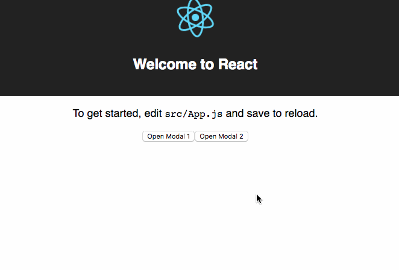
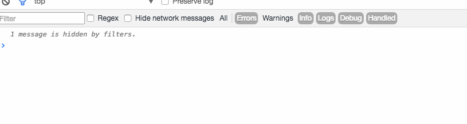

Continuing from yesterday&#x27;s article about [using MobX with create-react-app](link), we&#x27;re going to build a simple MobX-driven modal. Why? Because I just did it at The Day Job™, and I think it&#x27;s neat.


If you don&#x27;t think it&#x27;s neat, that&#x27;s okay. It&#x27;s neat anyway.


Ingredients:


- [create-react-app](https://github.com/facebookincubator/create-react-app)
- [MobX](https://github.com/mobxjs/mobx) and [MobX React](https://github.com/mobxjs/mobx-react)
- [simple-react-modal](https://github.com/legitcode/modal)


You can see the full code on GitHub [here](https://github.com/Swizec/mobx-modal). There&#x27;s a link to a compiled&amp;hosted version. I&#x27;m still figuring out why the component inception from the gif doesn&#x27;t work after compiling. [Let me know](mailto:swizec@swizec.com) if you have any ideas.


We&#x27;re going to build a modals system that lets you:


- easily open a modal from anywhere in the code
- specify general modal styling/behavior just once
- define modal contents at call point
- tie modals to URLs if needed


All of this might sound easy to you, but it&#x27;s harder than it looks. It _sounds_ easy, and it&#x27;s frustrating as hell every damn time you do it. I&#x27;ve done it more times than I dare count.


MobX with React has been the easiest and most flexiblest approach I&#x27;ve ever used.


You start with a store.


```javascript
// src/App.js for example purposes
class Store {
  @observable modal = {
    show: false,
    body: null,
  };

  @action showModal(body) {
    this.modal.show = true;
    this.modal.body = body;
  }

  @action closeModal() {
    this.modal.show = false;
    this.modal.body = null;
  }
}
```


Your real life data store would be bigger and have more properties and more actions. This is an example.


We have an `@observable` property `modal`, which has a boolean to denote whether the modal is shown, and a variable for the modal body. Ideally, it&#x27;s a React component, but you can use anything that React&#x27;s engine knows how to render.


MobX uses the `@observable` decorator to create deep getters and setters for object properties. This allows the MobX engine to know when properties are dereferenced (read or set), and run relevant observers.


We use the `@action` decorator to say that a function is an action. I don&#x27;t know if this does anything practical, but it makes your code better.


If you only change store properties in actions, then you can model your application as a state machine. If you can model your application as a state machine, then you can understand what it&#x27;s doing and your life will be easier.


Limiting yourself to performing changes in actions increases boilerplateiness a little tiny bit, and gives you this in return:





Trust me, you want it. ?


In `App.js`, you add a helper function or two. These aren&#x27;t necessary, but make the markup code cleaner. You&#x27;ll see.


```javascript
// src/App.js

@observer
class App extends Component {
    store = new Store();

        // this is useful for debugging only
    componentDidMount() {
        window.store = this.store;
    }

    openModal1() {
        this.store.showModal(<strong>Strong Hello</strong>);
    }

    openModal2() {
        this.store.showModal(<app>);
    }
</app>
```


Note that your `App` must be an `@observer`. This allows the MobX engine to infer which data store changes are interesting to your component.


In our example, the `openModal` functions invoke the `this.store.showModal` action and give it some JSX as the modal body. That&#x27;s the nice thing about HTML as a first-class citizen: You can pass it around any way you want. Neat ?


For the modal component itself, we&#x27;re using `simple-react-modal` because it&#x27;s got a clean API and makes it easy to override the styling. Ask your designer; I&#x27;m sure they want custom styling if they can get it.


```javascript
// src/App.js -> render()

<modal
  show={this.store.modal.show}
  closeonouterclick={true}
  onclose={this.store.closeModal.bind(this.store)}
>
  <a onclick={this.store.closeModal.bind(this.store)} style={closeStyle}>
    X
  </a>

  {this.store.modal.body}
</modal>;
```


We&#x27;re deferring to `simple-react-modal` to provide the `Modal` component and take care of the basic styling. Dark backdrop, centered white rectangle, that sort of thing.


We tell it to show itself via the `show` prop, which we feed straight from our data store. To close our modal, we use the `store.closeModal` action, which sets `show` to `false`. Isn&#x27;t that cool? Flipping a boolean makes a modal show or hide.


For full flexibility, we use `this.store.modal.body` to render the modal&#x27;s body. React makes it easy to store just about anything in that property. Even `<App />` itself… but only in debug mode ?


And… yeah… that&#x27;s about it, really. You can open modals from anywhere in your application that has access to the data store. Call `store.showModal(<stuff>)`, and it shows up. Call `store.closeModal()`, and it goes away.


You could tie it to your routing and make it so users can refresh the page and keep the modal. I wish more webapps did that.


PS: if you put the store in `window`, you can call actions in your browser console and see how your app reacts.