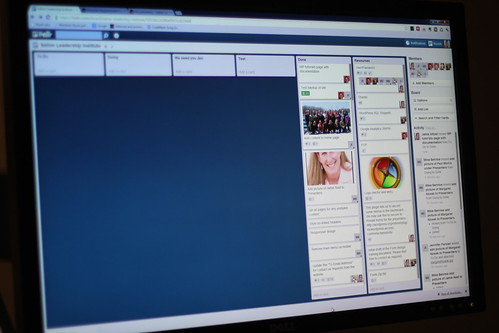

 Single [page](http://en.wikipedia.org/wiki/Web_page "Web page") [web apps](http://en.wikipedia.org/wiki/Web_application "Web application") are the promised land of modern javascript MVC frameworks like Backbone or Ember. Deliver a dynamic experience right to the browser, they said, use the [server](http://en.wikipedia.org/wiki/Server_%28computing%29 "Server (computing)") like a smart database, they said. Your site will be quicker and your users will love it, they said. Page loads in the blink of a second, static content via [CDN](http://en.wikipedia.org/wiki/Content_delivery_network "Content delivery network"), no more flickery full page reloads ... they said. All of those promises are true. Servers should handle data. They're very good at that and having a central authority to handle [data consistency](http://en.wikipedia.org/wiki/Data_consistency "Data consistency") amongst clients is perhaps the simplest distributed system architecture one can think of. Sure, it gets a bit complicate when _"A server"_ becomes a few tens of boxes spread out in data centers across the globe, but that's still not the client's problem. Conversely, clients are _exceptionally_ good at presenting data! It's practically all they do. They give some data to the user, then they sit quietly in the user's face ~~waiting~~screaming to be poked so they can send some changes back to the server. This separation makes sense. Makes organising teams easier, separating talent becomes a walk in the park, it's even friendlier for the user who doesn't have to wait for a signal to travel halfway around the world just to open a menu! Win-win-win!

## Not really.

\_**\_**\_\_\_\_\*\*\*\*\*\*\*\*\_\_

###### Related articles

- [Web app development questions](http://stackoverflow.com/questions/13323384/web-app-development-questions)
- [The Disastrous Fragmentation Of Web Apps](http://www.i-programmer.info/professional-programmer/i-programmer/4982-the-disasterous-fragmentation-of-web-apps.html)
- [Why Page Size Matters even more for Mobile Web Apps](http://blog.dynatrace.com/2012/09/26/why-page-size-matters-even-more-for-mobile-web-apps/)
- [Mention Launches Social Media and Web Monitoring App to Take On Google Alerts](http://betakit.com/2012/10/31/mention-launches-social-media-and-web-monitoring-app-to-take-on-google-alerts)

