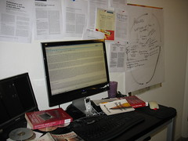

- [:12](http://www.flickr.com/photos/21369373@N00/2414420607)

  Image by [leeleblanc](http://www.flickr.com/photos/21369373@N00/2414420607) via Flickr

Wet, late and hungry I arrived at the IJS venue where I&#x27;ll be staying all day listening to odd people talking about interesting stuff - very interesting I hope. Just so you know, I have a valid excuse for being late and missing the event&#x27;s introduction and everything, but let&#x27;s not get into that now (just so you know, I didn&#x27;t oversleep). Right now I&#x27;m listening to Dusan Omercevic, I believe, talking about openID. Don&#x27;t really know what&#x27;s going on since I missed about half his lecture :D **10:23** Currently we&#x27;re discussing what the biggest problem of openID is and why it will never be used as a service but rather as a technology. Apparently the crux of the matter is that users like simplicity and corporations want huge databases of their users. Personally I think this will effectively kill openID, because every site or group of sites will have their own openID and users will still end up having twenty different usernames and passwords ... except they&#x27;ll be called openID&#x27;s. **10:45** We&#x27;ve reached the other portion of this openID talk and it&#x27;s ... not very interesting. A lot of technical stuff, which is just discouraging me from using this protocol. I still don&#x27;t exactly understand why I should. Coding a regular login system is easy as hell, this just seems needlessly complex for probably around 90% web devs out there. **11:28** Very interesting invitation to try along this guy&#x27;s hacking techniques on our websites. Should be useful to test Chlorine Boards. Hope I don&#x27;t do too much damage, &#x27;cause I don&#x27;t have anywhere else to test than production websites. **12:12** Wow I think I need a new pair of trousers &#x27;cause I just shat brix! The methods for doing crazy fun things on other people&#x27;s websites that Ga
