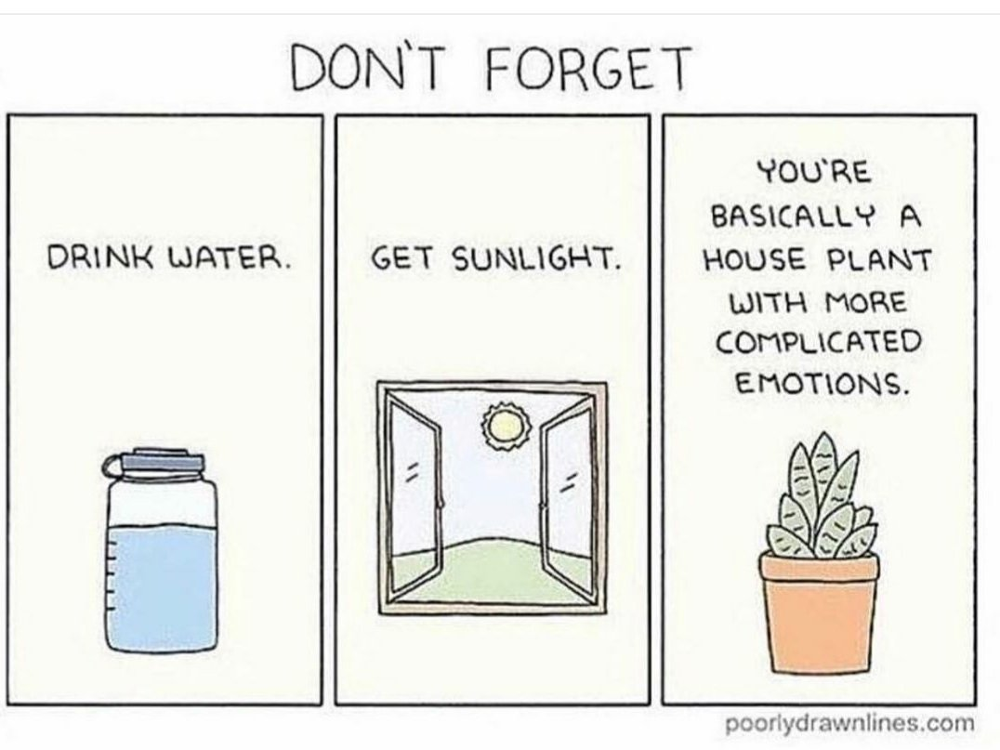

Fellow reader Nathan asked how exercise/diet/sleep affects your coding career and as a total nerd, I have opinions.

> Have you written any blog posts about how exercise/good diet/sleep affects your productivity/career? Could be interesting to hear about that from a ”Silicon Valley” person’s perspective.
> (From your perspective, and from other accomplished people at startups, FAANGS, etc., how do people who work in Silicon Valley view fitness/eating right/sleep? Is it a non-priority, super important, etc., etc.)
> Also some data (or your thoughts) on amount of caffeine intake, amount of sleep, amount of exercise effects on your perceived level of productivity could be interesting as well :).

For background: I used to be deep in the productivity and self-hacking scene ~10 years ago while writing [Why programmers work at night](https://leanpub.com/nightowls).

The field, especially online, is full of gymbro science, techbro experiments with N=1, and inconclusive results that don't generalize. The nutritional research papers you can find all suffer from methodology problems, small sample sizes, funding bias, and difficulty controlling variables.

You'll find a paper to support any position you want to take. Most research is aimed at [hospitalized] diabetes patients, which you are probably not.

Modern consensus seems to be: This stuff is super individualized. Try a bunch of things and see what works for you. Observe yourself and adjust.

Also, you are a plant with complex emotions.

## The "silicon valley" approach to health

There's broadly two camps:

1.  The billionaire techbro who wants to live 1000 years with six-pack abs
2.  The techie with the body of a 70 year old at 30

First group is the loudest. These are the people going crazy about glucose monitors, growth hormone supplements, electrolyte shite, weird workout regimes, crazy diets, and making life miserable.

They love to buy things so you'll hear a lot of marketing aimed at these people. Don't mention "diet" in San Francisco because everyone has heard of every weird diet and their friend tried it once and grew a 6th toe and that was bad.

Second group is the most common. Sitting all day staring at a screen eating takeout is bad for you. Surprise.

Many people have gym memberships (everyone), few go regularly.

## Do you need all the things people are selling

No.

Supplements give you expensive pee. That's about it. Eat a balanced diet instead. A veg, a carb, and a protein at every meal and you'll be fine. Avoid mystery sauces and ingredients built in a lab.

If you're getting cramps, add electrolytes. If you're feeling brainfog, you may be thirsty.

## Does sleep make you more productive?

Yes.

Your brain works better on enough sleep. "enough" is personal, try different things.

Research shows that sleep gives you better mood regulation, improves memory, helps you focus, reduces hunger cravings, raises your effective IQ ... Basically sleep makes you not act like a cranky baby.

Great book about this, which I've yet to read: [Why we sleep](https://en.wikipedia.org/wiki/Why_We_Sleep)

## Does exercise help?

Yes.

You are a monkey evolved to live outdoors and _do_ things. Hard physical things. Sitting on a chair staring at screens will make you cranky.

In [Driven to Distraction](https://www.penguinrandomhouse.com/books/209384/driven-to-distraction-revised-by-edward-m-hallowell-md-and-john-j-ratey-md/), the authors argue that the rise in ADHD tendencies can in part be explained by our modern environments. They just don't provide the stimulation our minds and bodies need so we become fidgety and unable to focus.

Exercise has been shown to have effects similar to medication for ADHD and depression. The author of Driven to Distraction likens "one dose of rigorous exercise" to taking a small dose combo of prozac and aderall.

Other research shows that running helps with neurogenesis for adults – growing new neurons in the brain.

## Does good nutrition help?

I don't know.

It seems obvious that being hangry is no good. You're short-tempered and no fun to work with.

And stuffing yourself full of pizza may make you sleepy. That makes working more difficult.

I've seen great engineers who are super careful about their diet and I've seen great engineers who eat like crap. I think as long as you're getting enough food, your brain will be fine.

But nutrition has a big impact on your athletic performance and physique, if you care about that.

## Caffeine?

Yes, I love it. Many people do fine without.

## The big secret

None of this stuff can make you smarter or more productive.

But it can help you go at 100% more consistently.

Experiment. Get some sun, eat clean, hydrate.

Cheers, 
~Swizec
