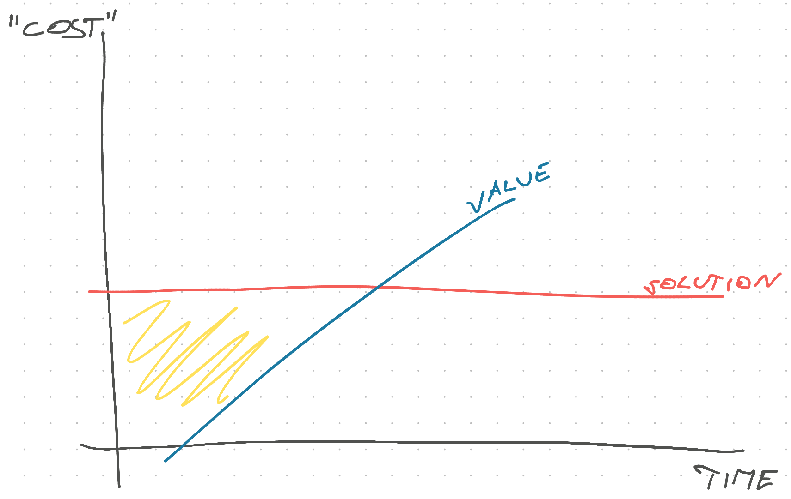

Here's a trap engineers fall into all the time.

You are asked to solve a problem and you think _"Ah yes! The general case for this is so and so and to make the solution work forever in all cases we'll need to ..."_.

Engineering is programming over time, right? Not always! Sometimes you need to solve today's problem and move on.

For example – our PM wanted to prove a hunch with an A/B test on the corporate site. We could descend upon this project, that we don't own, and design a generic A/B testing framework that works with Gatsby and our headless CMS and all our product testing infrastructure. _Or_ we can add a `useEffect` to one button. 🤔

The team's eyes lit up when discussing the first option. The PM's eyes lit up when discussing the second.

Guess which approach we took.

Yep, we built the `useEffect` in one afternoon and moved on. Turns out the team that owns our marketing site is building a more robust A/B testing solution anyway. Should be ready in a few weeks 🤞

## Cost vs benefit

What we're getting at here is return on investment. What is the goal and how much does it cost to get there?

This is roughly how I think about this.

You have different solutions that take a certain amount of time or money – the cost. Your solution line goes higher or lower on the graph. The solution will provide value after a starting gap.

The area between these two lines represents my fuzzy understanding of ROI – how much value does a solution need to provide to justify the initial investment.

Value and cost are fuzzy concepts here. Cost can be time, effort, maintenance burden, or even money. Value can be dollars in the bank, lower future cost, or data that your PM can use to win an argument.

Yes value can even be "I had fun building this and it looks great on my CV", but please save that for side projects :)

## Why engineers get this wrong

As engineers we love solving big fun problems. And we hate solving the same problem twice.

So we look for the most comprehensive generalest version of an ask and solve for that. Why build a hammer if you can [build a hammer factory](https://gwern.net/doc/cs/2005-09-30-smith-whyihateframeworks.html) that creates any hammer you could ever want?

But that's a much harder problem! By the time you're ready to test the hammer factory, I've already fed 5 people.

Remember: Your customer doesn't care about the hammer, they want to eat dinner but the chair's broken. Make sure you ask _why_ they need a hammer factory factory.

Cheers, 
~Swizec

PS: like 90% of what I do as tech lead is to pull talented engineers who want to flex (including myself) away from shiny problems and onto the task at hand
