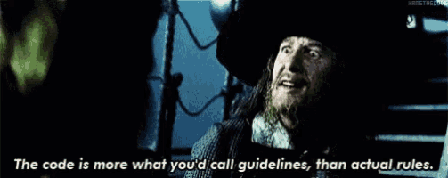

Whenever I talk about sprints, someone mentions Shape Up and how it's so much better. Same thing, different name 🤷

Shape Up suggests 9 week iteration cycles followed by 3 week cool-down periods for self-directed work. This is great!

So you have a 9 week \[business] sprint followed by a 3 week \[technical] sprint. How is that different?

Ignore the names, **focus on the iteration cycles**.

## Iteration cycles work

All these methodologies are exactly the same idea. It’s all about _"Hey we shouldn’t lock ourselves in the basement for months and code in silence with zero input from users or stakeholders. What if we build things, show them, get feedback, and iterate?"_

[Kick the can style](https://swizec.com/blog/writing-software-is-like-kicking-a-can/)

And yes sprints when done well offer a mix of intensity followed by cool down. That's just basic burnout management – [Peak Performance](https://swizec.com/blog/the-passion-paradox/) is a good book on this.

To grow you need periods of high intensity followed by periods of recovery and consolidation. Any athlete can tell you this. It's even how we build successful systems – [Ball of Mud first, fix later](https://swizec.com/blog/big-ball-of-mud-the-worlds-most-popular-software-architecture/).

AND when you get it right, there’s plenty of time for self-directed work. You _need_ slack in the system otherwise it breaks down. This is just basic lean :) ([or queue theory](https://swizec.com/blog/why-you-need-a-task-queue/))

Yes, yes there is also kanban. The same thing applies: Successful projects will have iteration cycles and unsuccessful projects will [linger In Progress for months](https://swizec.com/blog/workinprogress-kills-your-progress/).

## Well-done sprints are nice

All the best engineers I know create iteration cycles and ask for feedback every week or two. Even if it's under 1 kanban ticket that takes 9 weeks.

The benefit of sprints is teaching this behavior to less experienced engineers (and stakeholders). They:

- fall into polishing mode,
- are [learning how to break down projects into shippable steps](https://swizec.com/blog/how-do-you-break-down-a-large-project/),
- are still getting used to the idea of [ham sandwich vs caviar](https://swizec.com/blog/yes-caviar-is-great-heres-a-ham-sandwich/)
- need help limiting work-in-progress
- can use a structured time box to build good habits

Plus sprints are not dogmatic. They're guidelines.

Do 1 week, do 3 weeks, 9 weeks is fine. The point is to ship regularly and get feedback.

And hey guess what, projects can span multiple sprints. It's fine. At least you ship _something_ :)

Cheers, 
\~Swizec
