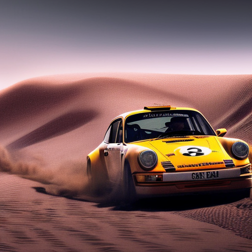
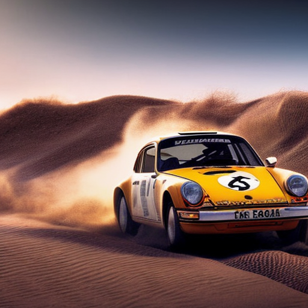
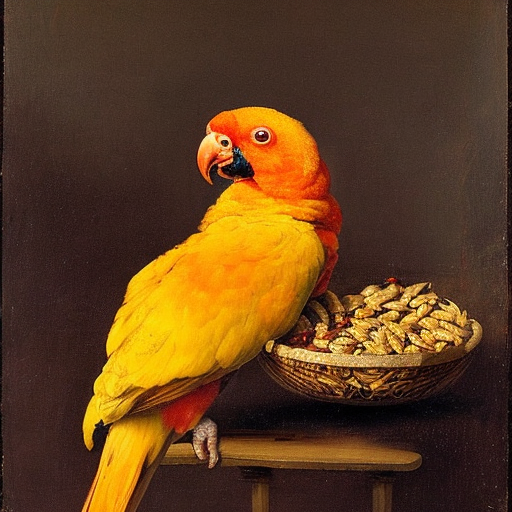
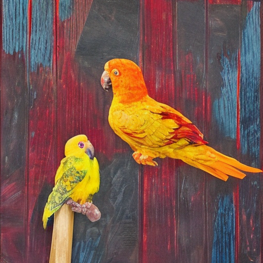
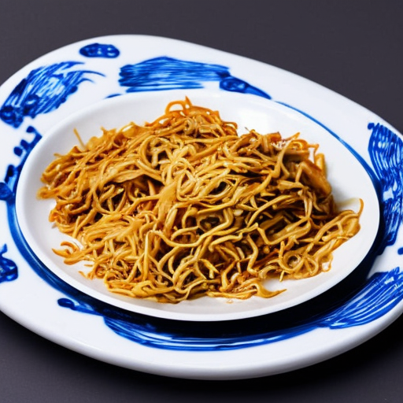

When's the last time a piece of tech blew your mind?

https://twitter.com/Swizec/status/1594200652699570176

For me it's the new M2 iPad Pro. I got one this weekend to replace the old iPad from when I was [looking for the perfect light work device](https://swizec.com/blog/looking-for-the-perfect-light-work-device/). The iPad + pencil + magic keyboard combo has become my main daily driver. It's where I do all my writing, emails, light doomscrolling, business management, and gentle examples coding.

The new iPad has more processing power than my work laptop 🤯

8-core CPU, 10-core GPU, and 16-core "neural engine" which I think is a GPU optimized for neural networks. In a 494 gram package with no active cooling, half the thickness of my pinky finger, and a battery that feels like it lasts forever.

Sure, the big fat laptop has more GPU and bigger RAM, but the fans make lots of noise and the laptop weighs 2177 grams. Cosplaying as a desktop machine most of its days.

## Stress testing the new iPad with stable diffusion

The iPad's biggest holdback is its operating system. Optimized for mobile devices and machines with far less power, the OS won't let you push the limits.

Thomas on twitter suggested I try [Draw Things](https://apps.apple.com/us/app/draw-things-ai-generation/id6444050820), an AI drawing tool powered by on-device [Stable Diffusion](https://en.wikipedia.org/wiki/Stable_Diffusion), a generative art model.

https://twitter.com/tshddx/status/1594144125716004865

And ... wow. For 2 hours, I couldn't stop. The iPad even started getting warm 😁

First I tried a silly prompt: "young racing driver winning the championship by van gogh"

https://twitter.com/Swizec/status/1594164733141057536

Pretty impressive. Then the prompt engineering started. You have to tell these models what you want in a lot of detail. Simple english, lots of adjectives, strong descriptions. Vibes don't work. The more explicit you can be, the better.

Eventually I got a decent picture of a Porsche 911 racing in the desert.

The trick is to iterate fast on low settings – this is 30 "iterations" – then when you like the prompt, punch up the values.

The pre-trained Stable Diffusion 1.5 model that I'm using is great with cars. You can try any make and model and get a recognizable result. Descriptive car names don't work. Better to say "BMW M3" than "sporty saloon car".

I think that's down to the training data.

Animals are more of a struggle. Species don't work, describing the features you want is better.

Playing with different styles is nice. This one is a "by rembrandt", but when I tried another artist, the AI instead decided to replace the bowl of food with another bird 🤨

But that's to be expected. The AI has no idea what it's doing. These images are created by using an image of pure noise then removing noise step by step and saying "Does this look like what I want?".

The very essence of Michelangelo's _"Oh statue of david? Easy. Take a block of marble and remove anything that isn't the statue of david"_

## What can you do with this?

I don't know. But here's a passable bowl of chinese food

Right now the big problem is that these images require lots of cherry picking and iteration. You can't trust the AI to run on its own. And that's limiting.

Cheers, 
~Swizec

PS: I wanna try running this on an AWS Lambda, that would be fun
