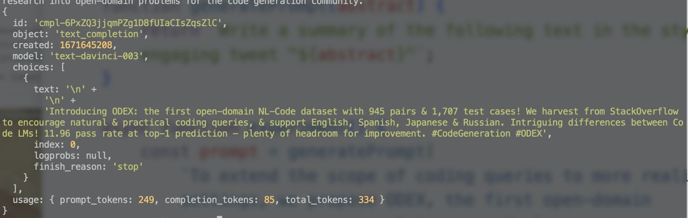
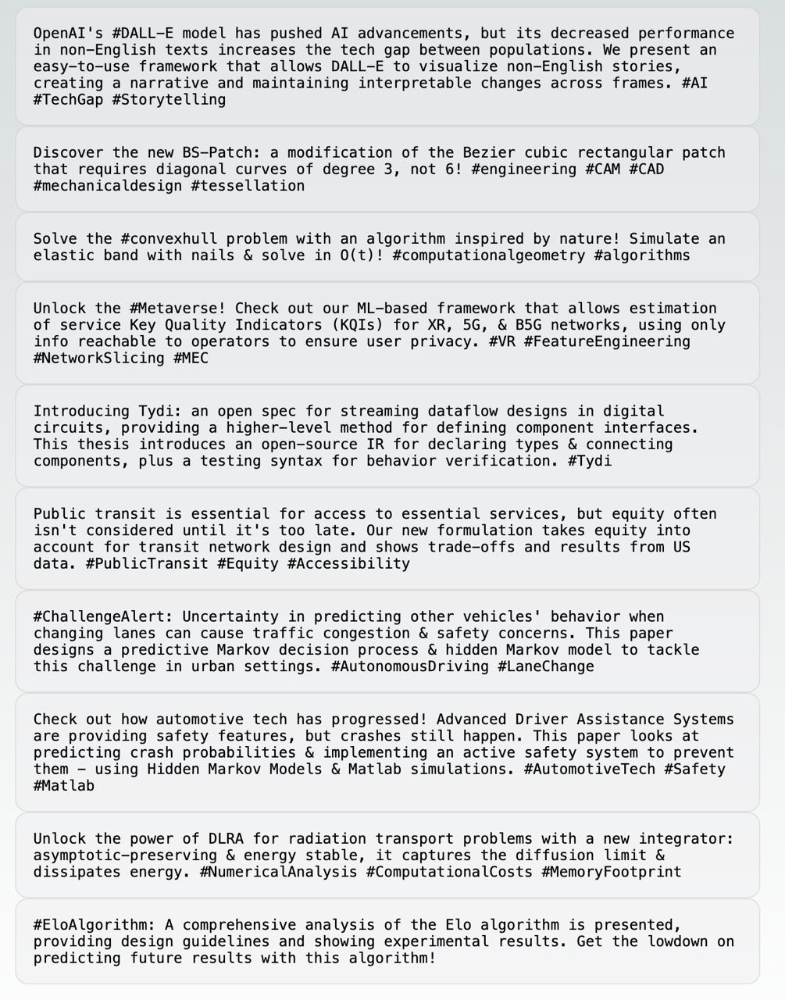

Where do you start work on a new project? At your desk, ha! But what do you work on first?

The obvious answer is to start at the beginning.

Build the foundation, write a placeholder page, make a hello world, then add the rest. This works. Easy task, gets the juices flowing, sets you up for future work.

But what if you aren't sure? What if there's a risk your project can't be done? What if you're training monkeys?

Start with _that_. Eat the frog as they say.

### Prototype the least certainty first

My favorite approach is to build a quick and dirty prototype of the hardest part of the project. Like when I [started exploring OpenAI and ChatGPT](https://swizec.com/blog/building-apps-with-openai-and-chatgpt/) – I didn't start with the routing navigation, beautiful styling, or even a webpage at all.

The first experiments looked like this:

Can OpenAI do what I want? What do API calls look like?

Then I tried out what [Async React with NextJS 13](https://swizec.com/blog/async-react-with-nextjs-13/) feels like. Can the new approach work for this? Do I like it? What happens when you summarize a whole bunch of papers at once?

Looks like shit but answers my question: this can work.

### But why make it hard?

Starting easy builds momentum and that's fantastic productivity advice that _works_. Ask anyone.

Where it breaks down is training monkeys in a circus.

You know you can build a platform for monkeys to stand on. Plenty exist. You know you can build a flaming hoop for them to jump through. Plenty exist. You even know you can get a monkey.

But can you train the monkey to jump through the hoop? 🤔

Without the trained monkey, you have no spectacle. Nobody's gonna come watch a bunch of monkeys standing around a fire.

All that time spent building the platforms and the flames – wasted. Wouldn't you rather do the hard thing first?

Cheers, 
~Swizec

PS: this analogy comes from the CEO of Google X, a research lab, via [Quit](https://www.penguinrandomhouse.com/books/692752/quit-by-annie-duke/), a great book by Annie Duke

I didn't even realize that was my approach until she spelled it out across 3 chapters 😆
