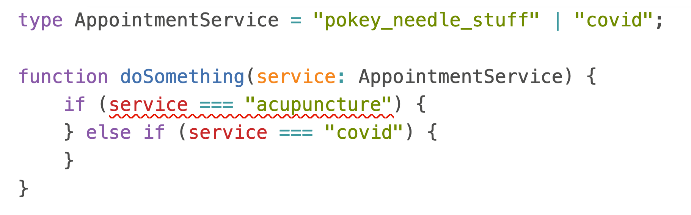

You've seen this pattern before – CONSTANT = 'constant' – common in dynamic languages.

Please stop. It's a kludge.

https://twitter.com/Swizec/status/1438976051573575688

## Why SHOUTING

Shouting constants hail from a time when programming languages didn't have constants. You used ALL_CAPS to tell other programmers to treat this variable as a constant.

Now it's common practice.

Global constants like configuration variables are ALL_CAPS, local constants like `const foo` are camelCase or snake_case. Every language community is different. JavaScript likes camels, Python and Ruby like snakes 🤷‍♀️

## Why SHOUTING = 'shouting'

Global constants like this are a poor man's type system. You see them a lot in early Redux tutorials, some XState tutorials, and other places where different areas of your codebase have to share a string value.

The goal is to avoid typos, get IDE support for code completion, and ensure code changes together. Plus if you rename a value you totally don't have to go make changes everywhere.

### Sounds like a good idea at first

Say you're building an appointment booking system and appointments have names for different services. You start like this:

```javascript
function doSomething(appointmentService) {
  if (appointmentService === "acupuncture") {
    // special treatment
  } else if (appointmentService === "covid") {
    // very special treatment
  }
}
```

Those `'acupuncture'` and `'covid'` strings look suspicious. You'll use them in a different function and then how do you ensure that it isn't `'acupuncture'` in this method and `'acpuncture'` in another?

_"A-ha!"_, you think, _"I'll make a shared constant! That way they're gonna stay the same everywhere!"_


You make a new globals file.

```javascript
// globals.js
const ACUPUNCTURE = "acupuncture";
const COVID = "covid";

// elsewhere
import { ACUPUNCTURE, COVID } from "globals";

function doSomething(appointmentService) {
  if (appointmentService === ACUPUNCTURE) {
    // special treatment
  } else if (appointmentService === COVID) {
    // very special treatment
  }
}
```

Problem solved, right? No.

## Why it doesn't work

That looks like it solves the problem. But all you've achieved is create extra work.

Let me explain.

When you rename `acupuncture` to `pokey_needle_stuff`, for example, will you keep the constant name as `ACUPUNCTURE`? You could, but the confusion that would cause with anyone new entering the codebase ... oof

Best keep the value and constant in sync. You now have to change **4 occurrences** of "acupuncture" in even our smol example. A 4x increase in work 🤔

_"But Swiz, they're easier to find!"_

Are they? `git grep "'acupuncture'"` works the same as `git grep ACUPUNCTURE`.

_"Come on Swiz, at least I get undefined errors."_

Yes, if you run the code. Hope you have 100% test coverage otherwise it's a runtime error in production 🤞

_"Wait won't the compiler tell me stuff's undefined?"_

Not in a dynamic language. You need static analysis for that.

_"Okay, but at least it helps with code completion right?"_

Does it? How would your editor know that the `appointmentService` argument represents a specific bag of strings? It doesn't even know that's a string!

And how do other programmers on your team know _anything_ about `appointmentService` and what to expect from reading the code?

Unless you import the constants nobody knows anything about them. Not your IDE, not you, not others.

Yes once you import the correct constant, you get code completion for that whole file. Big whoop. 🙄

## Use the type system

If you don't have a type system, use plain strings. At least they're less work.

For TypeScript string union types fit best. Elsewhere you might use an enum of some sort.

```typescript
type AppointmentService = "acupuncture" | "covid";

function doSomething(service: AppointmentService) {
  if (service === "acupuncture") {
    // special treatment
  } else if (service === "covid") {
    // very special treatment
  }
}
```

You get:

- every programmer knows that `service` is a specific kind of string
- your IDE knows what values to expect
- change or drop a value and you get squiggly lines
- build errors, no unit tests required ✌️
- autocomplete
- no extra work

Look!




😍

You can add `| string` to `AppointmentService`, if you need an else statement that captures anything. You lose a lot of the IDE wonderfulness, but other programmers and future you know what to expect.

Cheers,<br/>
~Swizec

PS: yes a typed language gives you squiggly lines and build errors with the SHOUTING approach, but you miss out on the communicate-with-others aspect. Lean into your tools my friend
